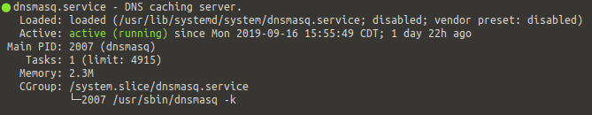
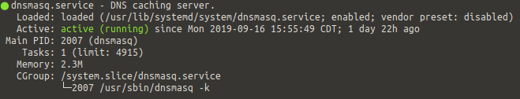
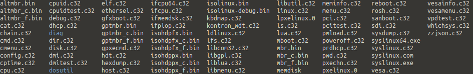
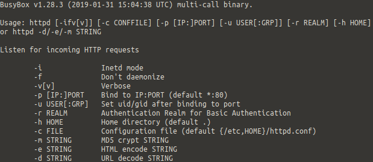

# Instalación y configuración de PXE con dnsmasq


## Resumen

El presente documento describe los procedimientos y fundamentos básicos para instalar 
un servidor PXE en un sistema Fedora 30, mediante las herramientas DNSMASQ (servidor DNS, 
DHCP, TFTP) y BusyBox (servidor HTTP).

## Instalación de dnsmasq

[Dnsmasq](http://www.thekelleys.org.uk/dnsmasq/doc.html) es un programa que provee varios 
servicios para redes locales pequeñas: DNS, DHCP, aununcio de routers y booteo en red. 
De estos servicios los que son de interés para este procedimiento son los siguientes:

<span style="color: #990819;">*Servicios que proveerá dnsmasq*</span> 

- DHCP

- DNS

- TFTP

Se procede a instalar el paquete dnsmasq desde el repositorio local de Fedora.

``` bash
dnf install dnsmasq
```

```admonish note title=" "
Es importante corroborar que no exista un servicio que proporcione DNS, DHCP o TFTP en 
el servidor actualmente, ya que dnsmasq realizará estas funciones, en caso contrario, 
estos paquetes deben ser desinstalados o realizar ajustes para que permitan la convivencia 
con el servicio.
```


### Configuración de dnsmasq

Una vez instalado el paquete se va a reemplazar el archivo de configuración por defecto 
de dnsmasq, ubicado en : **/etc/dnsmasq.conf** por uno personalizado, por lo cual se 
realiza un respaldo del anterior, para conservarlo de futura referencia.

```admonish tip title=" "
En caso de desear más información de la sintaxis del archivo de configuración de dnsmasq, 
ver la página del manual correspondiente.[^1]
```

```bash
mv /etc/dnsmasq.conf /etc/dnsmasq.conf.old
```

``` admonish tip title=" "
El nombre del archivo de respaldo puede ser cambiado, así como su ubicación.
```

Una vez respaldado el archivo de configuración previo, se crea uno nuevo.

```bash
vim /etc/dnsmasq.conf
```

Y se coloca el siguiente contenido en él

``` admonish caution title=" "
Reemplaza las interfaces y direcciones por las que se usarán en el servidor.
```

<span style="color: #990819;">*/etc/dnsmasq.conf*</span> 

```bash
Unresolved directive in pxe.adoc - include::example$dnsmasq.conf[]
```

```admonish important title=" "
La opción **tftp-root** corresponde a una ruta en la cual se colocarán los archivos de 
arranque para los clientes PXE. La ruta debe existir y puede ser diferente.
```

```admonish important title=" "
En CentOS 6.10 se deben hacer cambios en la sintaxis del archivo de configuración. 
Específicamente se debe remover la opción *tag:x86PC* del parámetro de configuración 
**pxe-service**. Asimismo se debe quitar el parámetro **host-record**.
```

Una vez colocado esto dentro del documento **/etc/dnsmasq.conf** se guardan los cambios 
y se reinicia el servicio.

``` bash
systemctl restart dnsmasq
```

Se revisa el estado del servicio

``` bash
systemctl status dnsmasq
```



<span style="color: #990819;">*Figure 1. Estado del servicio dnsmasq tras reinciarlo*</span> 

Si el servicio no reporta errores de configuración, se procede a habilitarlo para que se 
inicie al arrancar el sistema, mediante el comando:

```bash
systemctl enable dnsmasq
```

El cual debe reportar la siguiente salida:

```bash
Created symlink /etc/systemd/system/multi-user.target.wants/dnsmasq.service → /usr/lib/systemd/system/dnsmasq.service.
```

Y si se revisa el estado del servicio nuevamente se puede observar que está habilitado.



<span style="color: #990819;">*Figure 2. Estado del servicio dnsmasq tras habilitarlo*</span> 

Con el servicio dnsmasq configurado y habilitado, se prosigue a la siguiente etapa.


## Instalación de los archivos de arranque Syslinux

El proyecto [syslinux](https://www.syslinux.org/old/index.php) provee archivos de arranque 
ligeros para ser usados en dispositivos floppy (SYSLINUX), arranque en red (PXELINUX), entre 
otras cosas. Estas imágenes serán usadas por el sistema de arranque en red para proveer a
los clientes de una imagen en la cual se puedan basar para instalar los sistemas operativos 
que se van a poner a su alcance.

Se va a instalar el paquete syslinux en el sistema, mediante el comando:

```bash
dnf install syslinux
```


### Ubicación de los archivos de arraque Syslinux

Los archivos de arranque se encuentran en la ruta **/usr/share/syslinux/**

```bash
ls /usr/share/syslinux
```



<span style="color: #990819;">*Figure 3. Archivos de arranque syslinux*</span> 

Los archivos se copiarán a la carpeta que previamente se creó para el parámetro de 
configuración de dnsmasq: **tftp-root**

```bash
cp -r /usr/share/syslinux/* /var/ftpd/boot
```

Una vez con los archivos en la ruta correcta, se configura el menú que los clientes verán 
cuando quieran arrancar por red.


## Configuración de los menús de PXE

El proceso de arranque por PXE sigue el siguiente orden:

1.  El cliente solicita a un servidor DHCP una dirección IP.

2.  El servidor envía en la petición de dirección de DHCP, además de la dirección 
    y otros parámetros configurados, las opciones correspondientes a PXE, como quién 
    es el servidor PXE.

3.  El cliente solicita una imagen de arranque al servidor PXE.

4.  El servidor PXE envía una imagen de arranque al cliente.

5.  El cliente ejecuta la imagen y busca según la imagen que descargó un menú de opciones 
    en el servidor PXE.

El sistema PXELINUX, ya ejecutándose del lado del ciente realiza peticiones con nombres 
de menú al servidor PXE. Los nombres que le solicita siguen un estándar y van por orden 
de la siguiente manera:

1.  El UUID del cliente.

2.  La dirección MAC del cliente.

3.  La dirección IP del cliente en hexadecimal, recortando esta cadena en un caracter 
    hasta llegar al último.

4.  En caso de que todos hayan fallado, finalmente busca un archivo llamado `default`.

El proceso se ve de la siguiente manera:

```bash
    /mybootdir/pxelinux.cfg/b8945908-d6a6-41a9-611d-74a6ab80b83d
    /mybootdir/pxelinux.cfg/01-88-99-aa-bb-cc-dd
    /mybootdir/pxelinux.cfg/C0A8025B
    /mybootdir/pxelinux.cfg/C0A8025
    /mybootdir/pxelinux.cfg/C0A802
    /mybootdir/pxelinux.cfg/C0A80
    /mybootdir/pxelinux.cfg/C0A8
    /mybootdir/pxelinux.cfg/C0A
    /mybootdir/pxelinux.cfg/C0
    /mybootdir/pxelinux.cfg/C
    /mybootdir/pxelinux.cfg/default
```

En este caso dado que se configuró el servidor DHCP, se conoce la dirección IP exacta que 
tendrá el cliente cuando le sea asignada una, por lo que el archivo con el menú que verá 
el cliente tendrá por nombre el valor hexadecimal de la dirección asignada: `0A0164E6`.

Los menús se deben ubicar en el directorio **pxelinux.cfg** en la raíz de **tftp-root**.

```bash
mkdir /var/ftpd/boot/pxelinux.cfg/
```

Se crea un archivo llamado **0A0164E6** en la carpeta creada.

``` bash
touch /var/ftpd/boot/pxelinux.cfg/0A0164E6
```

Se procede a editar el archivo de configuración para los clientes que van a arrancar 
mediante PXE. La sintaxis que debe llevar el archivo se puede consultar 
[aquí](https://wiki.syslinux.org/wiki/index.php?title=PXELINUX).

```bash
vim /var/ftpd/boot/pxelinux.cfg/0A0A64E6
```

En el archivo se va a colocar el siguiente contenido:

```admonish caution title=" "
Las opciones correspondientes a **syslog** y **ks** dependen de la dirección y la ruta 
desde la cual se va a instalar remotamente el sistema operativo en los clientes. Los 
valores se deben reemplazar por los apropiados. La ruta correspondiente a **ks** es en 
la cual se alojará el script de automatización de la instalación, si todavía no se tiene 
definida, se puede dejar en blanco hasta llegar a la
[sección de configuración de BusyBox](#configuración-de-busybox)
```

<span style="color: #990819;">*/var/ftpd/boot/pxelinux.cfg/0A0A64E6*</span> 

```bash
Unresolved directive in pxe.adoc - include::example$0A0A64E6.txt[]
```

```admonish note title=" "
Las rutas de los parámetros **KERNEL** y **APPEND** son relativas a la ruta donde se colocó 
la raíz de el servidor tftp con la variable **tftp-root** en la configuración de dnsmasq 
y donde se copiaron los archivos de syslinux.
```

Una vez con los archivos en la ruta adecuada y el archivo default (o el archivo correspondiente 
a la dirección MAC del cliente o clientes a configurar) se procede a colocar los archivos 
necesarios para la instalación del sistema operativo.


## Preparación para los archivos de instalación de CentOS

Para poder realizar la instalación por red se requiere que los archivos correspondientes 
a la imagen de inicio y el kernel de linux estén disponibles a los clientes que desean 
comenzar con la instalación del sistema operativo. Se van a colocar esos archivos, así
como los correspondientes a las imágenes de instalación en una carpeta accesible a los clientes.


### Creación de carpetas para la instalación en red

Para comenzar la instalación por PXE se requieren la imagen del kernel y de initrd, las 
cuales obtendremos del iso oficial de CentOS. Correspondiente a la versión que se desea 
instalar en los clientes. En este caso la [versión 6.1](http://mirror.math.princeton.edu/pub/centos/6.10/isos/x86_64/CentOS-6.10-x86_64-minimal.iso).

Se monta la imagen de disco en la ruta **/mnt**

```admonish note title=" "
Reemplazar la ruta de la imagen descargada por la ruta correspondiente en el equipo.
```

```bash
mount -o loop /ruta/a/imagencentos.iso /mnt
```

Una vez con la imagen montada, se crea una carpeta en la raíz del folder correspondiente 
a la ruta declarada para **tftp-root** en la configuración de dnsmasq. Estas carpetas 
son para alojar la imagen de booteo y el kernel.

```admonish tip title=" "
Conviene hacer un directorio separado para cada distribución que se pretenda instalar, para tener una mejor organización de
los archivos que se van a entregar mediante PXE.
```

```bash
mkdir /var/ftpd/boot/centos6
```

Una vez con la carpeta creada se mueven los archivos **vmlinuz** y **initrd.img** a la 
ruta definida.

```bash
cp /mnt/images/pxeboot/vmlinuz /var/ftpd/boot/centos6
cp /mnt/images/pxeboot/initrd.img /var/ftpd/boot/centos6
```

Dado que se van a entregar los archivos mediante tftp, es necesario colocar permisos 
adecuados a la carpeta y subcarpetas que contienen archivos a entregar a los clientes. 
Se modifican los permisos de las carpetas para reflejar esto.

```bash
chmod -R 755 /var/ftpd/boot
```

Una vez con los archivos en las ubicaciones necesarias, así como con los permisos adecuados, 
se procede a la siguiente sección.


### Creación de carpetas para repositorio local

Se crean carpetas alojando los archivos necesarios para instalar CentOS. La ruta será 
compartida mediante un servidor http en la siguiente sección.

```bash
mkdir -p /var/ftp/pub/
```

Se copian los archivos previamente montados a la carpeta.

```bash
cp -r /mnt/* /var/ftp/pub/
```

Se modifican los privilegios para poder hacerlos disponibles a clientes que los solciten.

```bash
chmod -R 755 /var/ftp/pub/
```

Ya con los archivos creados, se procede a crear un script de configuración automática para 
los clientes que se instalarán con CentOS mediante PXE.


### Creación de script de kickstart

El script de [Kickstart](https://access.redhat.com/documentation/en-us/red_hat_enterprise_linux/6/html/installation_guide/ch-kickstart2) 
es una herramienta proporcionada por Red Hat, permite la automatización de la instalación
de sistemas basados en Red Hat. En este manual se usa la versión correspondiente a Red Hat (o CentOS 6).

```admonish tip title=" "
Una lista completa de las opciones de Kickstart puede ser encontrada 
[aquí.](https://access.redhat.com/documentation/en-us/red_hat_enterprise_linux/6/html/installation_guide/s1-kickstart2-options)
```

Se va a crear una carpeta donde se va a alojar el archivo de kickstart para hacerlo 
disponible a los clientes.

```bash
mkdir /var/ftp/kickstart
```

En la carpeta se creará un documento con el siguiente nombre y contenido:

``` bash
vim /var/ftp/kickstart/ks-preprocesamiento.cfg
```

```admonish warning title=" "
Reemplaza las direcciones por las previamente definidas en tu entorno
```

```admonish caution title=" "
Las opciones **zerombr** y **part** causarán que el cliente formatee automáticamente su 
disco duro, no usar en entornos de producción sin las debidas precauciones.
```

<span style="color: #990819;">*/var/ftp/kickstart/ks-preprocesamiento.cfg*</span> 

```bash
Unresolved directive in pxe.adoc - include::example$ks-preprocesamiento.cfg[]
```

Tras guardar el archivo es necesario modificar los permisos para igualmente hacer 
accesible el archivo a los clientes.

``` bash
chmod -R 755 /var/ftp/kickstart/
```

Una vez concluido, se procede a la siguiente sección.


## Instalación de BusyBox

[Busybox](https://busybox.net/about.html) es un conjunto de utilerías y aplicaciones de 
UNIX que se empacan en un mismo ejecutable, es de particular interés para este manual el 
uso de una utilería en particular, el programa [httpd](https://openwrt.org/docs/guide-user/services/webserver/http.httpd) 
contenido en busybox que provee un servidor http.

Se instala busybox desde el repositorio.

```bash
dnf install busybox
```

La sintaxis de uso para el programa es la siguiente:

```bash
busybox httpd --help
```



<span style="color: #990819;">*Figure 4. Uso de busybox*</span> 


### Configuración de BusyBox

Por defecto el programa httpd busca el archivo **/etc/httpd.conf** para leer las opciones
relacionadas con el programa, se usará este archivo para proporcionar opciones adicionales 
al programa.

```bash
vim /etc/httpd.conf
```

Y se coloca el siguiente contenido en él.

```admonish caution title=" "
El archivo de configuración en este caso restringe acceso al servidor web sólamente a los 
usuarios de la red por la cual se pretende distribuir archivos por PXE y otras direcciones 
para realizar pruebas del servidor web. Reemplazar por las direcciones correspondientes 
a su entorno.
```

<span style="color: #990819;">*/etc/httpd.conf*</span> 

```bash
Unresolved directive in pxe.adoc - include::example$httpd.conf[]
```

Para ejecutar el servidor web se ejecuta el comando

```bash
busybox httpd -vv -f -p 80 -h /var/ftp -c /etc/httpd.conf
```

```admonish note title=" " 
Las opciones **-f**, **-vv**, **-p**, **-c** son opcionales en el caso de que se ocupen 
los puertos por defecto, se colocan para ilustrar. La ruta indicada en la opción **-h** 
es la raíz del directorio donde se alojaron las carpetas de kickstart y de los archivos 
de instalación.
```

Ya con BusyBox instalado y la habilidad de ejecutar el servidor http para distribuir los 
archivos necesarios para los clientes, se continúa con la configuración.


## Configuración de Rsyslog

Ya con el servidor DHCP, HTTP, PXE instalado en el sistema, se puede proceder a la última 
etapa, configurar el servidor de logs del sistema para que pueda recibir logs remotos.

[Rsyslog](http://man7.org/linux/man-pages/man8/rsyslogd.8.html) es una utilería de sistema 
que proporciona soporte para el registro de mensajes, los registros de los clientes que 
se instalen serán almacenados de manera remota por el servidor Rsyslog, permitiendo 
diagnosticar el proceso de instalación mientras este transcurre.

```admonish note title=" "
Dado que el servicio de logs ha sido centralizado en los sistemas que cuentan con systemd, 
el manual está enfocado en estos sistemas. Al momento de agregar los registros remotos al 
diario local, se debe hacer considerando [las opciones que puede mandar rsyslog](https://www.rsyslog.com/doc/master/configuration/properties.html) 
y ajustando estas a [los parámetros que recibe journal](https://www.freedesktop.org/software/systemd/man/systemd.journal-fields.html).
```

``` admonish tip title=" "
Los parámetros de configuración `name` en el template y en input, así como el nombre de 
las reglas, pueden ser cambiados. Ajustar la dirección IP y el puerto para la configuración 
local.
```

<span style="color: #990819;">*/etc/rsyslog.conf*</span> 

```bash
Unresolved directive in pxe.adoc - include::example$rsyslog.conf[]
```

[^1]: <http://www.thekelleys.org.uk/dnsmasq/docs/dnsmasq-man.html>
