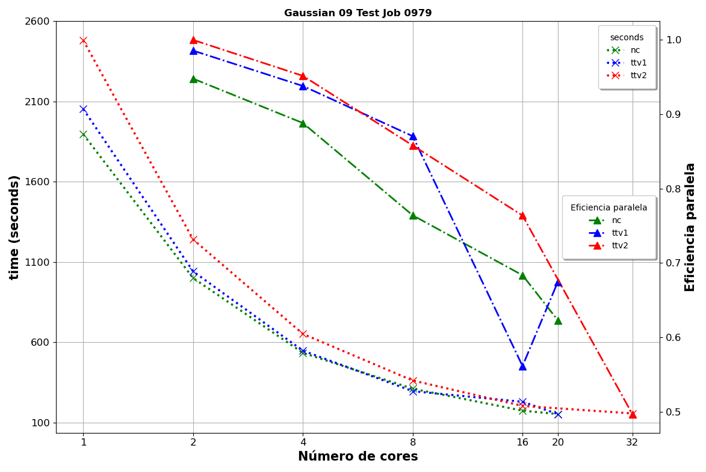
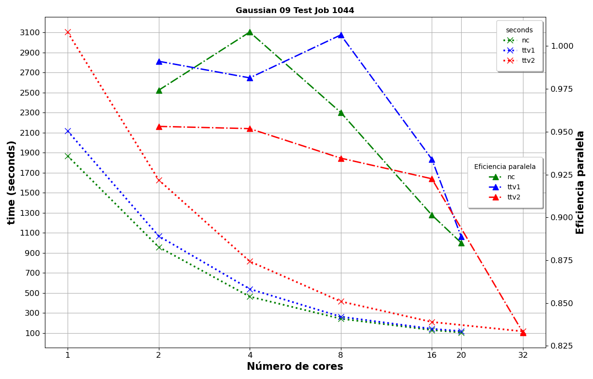

# Gaussian


## Descripción

[Gaussian](http://gaussian.com/) es un paquete de química computacional con varios métodos para calcular
propiedades de sistemas moleculares y periódicos, usando descripciones mecánico-cuánticas estándar para
las funciones de onda o la densidad electrónica.

- Esta trabajo se realizo con Gaussian 09-sse4.

- Benchmarks: test979 y test 1044


## Gaussian Execution Environment

Gaussian localiza ejecutables y crea archivos temporales en directorios especificados por varias
variables de entorno. El usuario es responsable de definir dos de ellos:

`g09root` : indica el directorio donde reside el subdirectorio g09.

`GAUSS_SCRDIR` :Indica el directorio que se debe utilizar para los archivos temporales.


## Parallel Gaussian

Hay dos niveles de paralelización en Gaussian: memoria compartida y distribuida. Tenga en cuenta que la
versión disponible en Yoltla no tiene el componente de paralelización de Linda para la ejecución
distribuida de Gaussian. Sin embargo, la ejecución paralela está disponible dentro de un solo nodo,
utilizando el parámetro `%NProcShared` en el archivo de entrada de Gaussian. Por ejemplo, para ejecutar
con nodos de 20 núcleos, agregue la siguiente línea en la parte superior de su archivo de entrada
gaussiana:

```bash
%NProcShared=20
```

Algunos trabajos, pueden consumir grandes recursos de memoria. Para trabajos muy grandes, podría
considerar establecer el parámetro de Gaussian09, `%Mem` , que afecta la cantidad de memoria disponible
para producir un buen rendimiento general.

Al determinar un valor para la variable `%Mem`, permita al menos un valor de 500 MB de memoria total.
De lo contrario, el job tendrá problemas, posiblemente morirá y, en algunos casos, hará que el nodo se
caiga.

```admonish note title=" "
La versión de Gaussian instalada en Yoltla sólo permite utilizar paralelización de memoria
compartida, por lo que los trabajos que utilicen esta aplicación, deberán enviarse a particiones con un
sólo nodo.
```


## Gaussian Performance

`Gaussian` no tiene una variable de performance como tal, en cambio muestra estadísticas de recursos
utilizados como el tiempo de cpu o memoria utilizada. Para este trabajo, para medir el performance y la
eficiencia paralela de `Gaussian`, usaremos el tiempo de cpu para calcular los tiempos de ejecución.

<span style="color: #990819;">*Ejemplo de salida exitosa de Gaussian*</span>

```bash
Job cpu time:       0 days  0 hours 48 minutes 26.9 seconds.
File lengths (MBytes):  RWF=    182 Int=      0 D2E=      0 Chk=     13 Scr=      1
Normal termination of Gaussian 09 at Mon Aug  1 19:00:15 2022.
```


## Eficiencia Paralela

La única forma confiable de ver si un trabajo escala de manera eficiente es compararlo. Comparar un
trabajo significa ejecutar un trabajo de prueba breve y representativo varias veces en diferentes
números de CPU para encontrar un punto óptimo.

A partir de estos datos, se puede calcular la **eficiencia paralela**. Esto se define cómo:

**E = (1/P) \* (T<sub>1</sub>/T<sub>P</sub>)**

- **P** = Numero de procesadores

- **T<sub>1</sub>** = tiempo óptimo para el algoritmo en un procesador

- **T<sub>P</sub>** = tiempo para algoritmo paralelo en P procesadores

Como regla general, los trabajos que se ejecutan con una gran cantidad de núcleos deben tener
una eficiencia paralela superior o igual a 0,7.


## Test Jobs

Un extenso conjunto de test jobs es proporcionado por Gaussian, junto con sus correspondientes
archivos de salida. Los archivos de entrada se encuentran en el directorio `g09root/g09/tests/com`.

Los archivos de entrada de trabajos de prueba tienen nombres con el formato `test_nnnn_.com`.
El archivo `g09root/g09/tests/tests.idx` enumera lo que hace cada trabajo de prueba.


### test0979 (Junio 2022)

Test0979: NBO test with f functions



<span style="color: #990819;">*Table 1. Performance Test 0979*</span>

<table border="1">
<thead>

<tr>
<th rowspan="2"># Cores</th>
<th colspan="2">
CPU’s Nodos nc<br>
20 Cores x 2.50GHz Intel Xeón<br>
E5-2670v2<br>
64GB RAM<br>
Infiniband FDR10/FDR
</th>
<th colspan="2">
CPU’s Nodos ttv1[1-58]<br>
20 Cores x 2.60GHz Intel Xeón<br>
E5-2660v3<br>
128GB RAM<br>
Infiniband FDR10/FDR
</th>
<th colspan="2">
CPU’s Nodos ttv2[59-104]<br>
32 Cores x 2.10GHz Intel Xeón<br>
E5-2683v4<br>
256GB RAM<br>
Infiniband FDR10/FDR
</th>
</tr>

<tr>
<th>time (seconds)</th>
<th>Eficiencia Paralela %</th>
<th>time (seconds)</th>
<th>Eficiencia Paralela %</th>
<th>time (seconds)</th>
<th>Eficiencia Paralela %</th>
</tr>

</thead>
<tbody>

<tr>
<td>1</td><td>1895.314</td><td>100.0 %</td><td>2052.557</td><td>100.0 %</td><td>2480.583</td><td>100.0 %</td>
</tr>

<tr>
<td>2</td><td>999.707</td><td>94.8 %</td><td>1041.206</td><td>98.6 %</td><td>1240.281</td><td>100.0 %</td>
</tr>

<tr><td>4</td><td>533.439</td><td>88.8 %</td><td>546.997</td><td>93.8 %</td><td>651.619</td><td>95.2 %</td>
</tr>

<tr>
<td>8</td><td>310.036</td><td>76.4 %</td><td>294.713</td><td>87.1 %</td><td>361.331</td><td>85.8 %</td>
</tr>

<tr>
<td>16</td><td>173.288</td><td>68.4 %</td><td>228.473</td><td>56.1 %</td><td>202.973</td><td>76.4 %</td>
</tr>

<tr>
<td>20</td><td>152.121</td><td>62.3 %</td><td>152.093</td><td>67.5 %</td><td></td><td></td>
</tr>

<tr>
<td>32</td><td></td><td></td><td></td><td></td><td>156.012</td><td>49.7 %</td>
</tr>

</tbody>
</table>

Para este Benchmarks, observamos un uso eficiente de los recursos entre 8 y 16 cores de cada partición.


### test1044 (Junio 2022)

Test1044: TD 50-50 with PCM test



<span style="color: #990819;">*Table 2. Performance Test 1044*</span>

<table border="1">
<thead>

<tr>
<th rowspan="2"># Cores</th>
<th colspan="2">
CPU’s Nodos nc<br>
20 Cores x 2.50GHz Intel Xeón<br>
E5-2670v2<br>
64GB RAM<br>
Infiniband FDR10/FDR
</th>
<th colspan="2">
CPU’s Nodos ttv1[1-58]<br>
20 Cores x 2.60GHz Intel Xeón<br>
E5-2660v3<br>
128GB RAM<br>
Infiniband FDR10/FDR
</th>
<th colspan="2">
CPU’s Nodos ttv2[59-104]<br>
32 Cores x 2.10GHz Intel Xeón<br>
E5-2683v4<br>
256GB RAM<br>
Infiniband FDR10/FDR
</th>
</tr>

<tr>
<th>time (seconds)</th>
<th>Eficiencia Paralela %</th>
<th>time (seconds)</th>
<th>Eficiencia Paralela %</th>
<th>time (seconds)</th>
<th>Eficiencia Paralela %</th>
</tr>

</thead>
<tbody>

<tr>
<td>1</td><td>1868.443</td><td>100.0 %</td><td>2117.750</td><td>100.0 %</td><td>3104.160</td><td>100.0 %</td>
</tr>

<tr>
<td>2</td><td>958.971</td><td>97.4 %</td><td>1068.356</td><td>99.1 %</td><td>1628.442</td><td>95.3 %</td>
</tr>

<tr>
<td>4</td><td>463.332</td><td>100.8 %</td><td>539.453</td><td>98.1 %</td><td>815.336</td><td>95.2 %</td>
</tr>

<tr>
<td>8</td><td>242.975</td><td>96.1 %</td><td>263.012</td><td>100.6 %</td><td>415.186</td><td>93.5 %</td>
</tr>

<tr>
<td>16</td><td>129.552</td><td>90.1 %</td><td>141.716</td><td>93.4 %</td><td>210.299</td><td>92.3 %</td>
</tr>

<tr>
<td>20</td><td>105.539</td><td>88.5 %</td><td>119.133</td><td>88.9 %</td><td></td><td></td>
</tr>

<tr>
<td>32</td><td></td><td></td><td></td><td></td><td>116.476</td><td>83.3 %</td>
</tr>

</tbody>
</table>

Para este Benchmarks, observamos que Gaussian hace un uso eficiente de los recursos disponibles
escalando apropiadamente.


## Referencias

[Gaussian Main Site](http://gaussian.com/)

[Link 0 Commands](https://gaussian.com/link0/)

[Running Gaussian](https://gaussian.com/running/)

[RUNNING GAUSSIAN 09 JOBS MORE EFFICIENTLY](https://nusit.nus.edu.sg/services/hpc-newsletter/running-gaussian-09-jobs-more-efficiently/)
