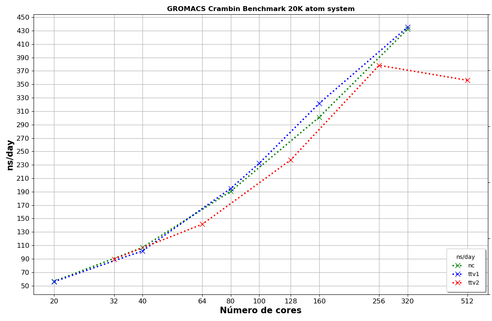
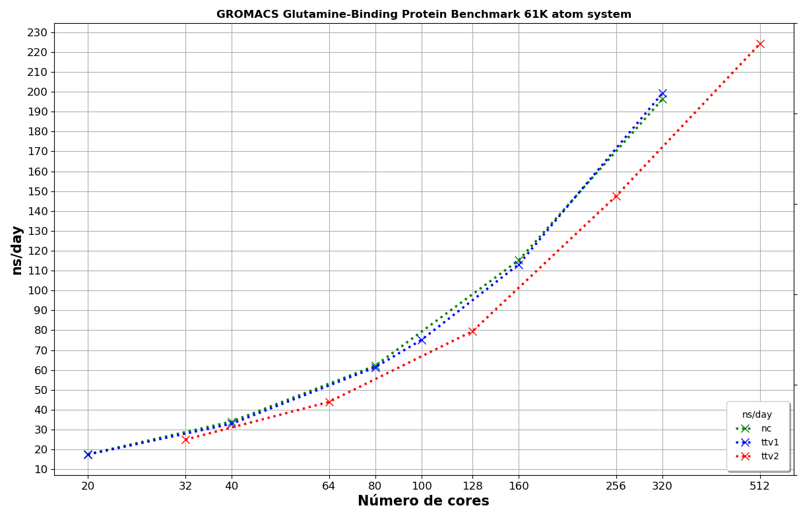
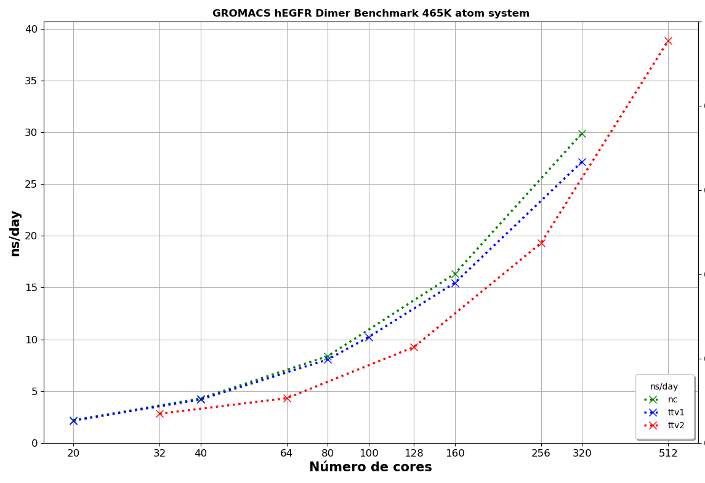
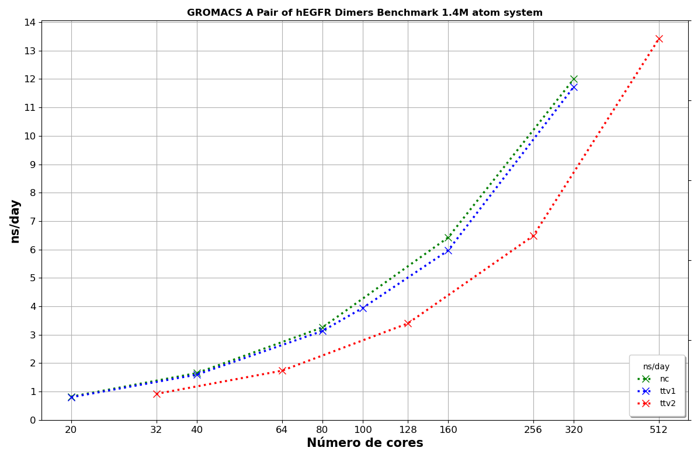
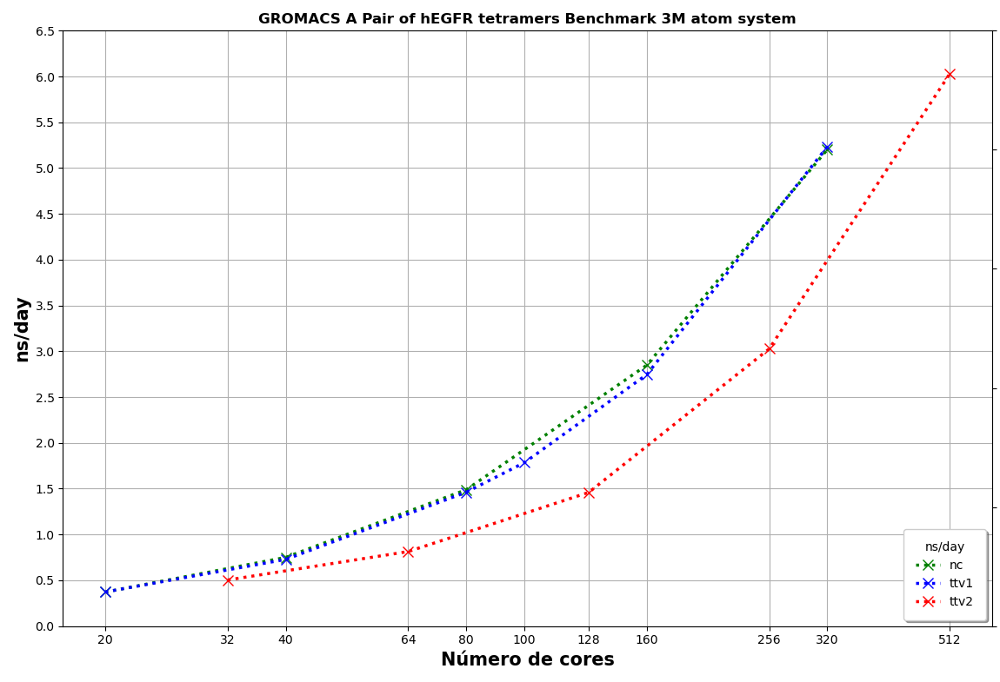
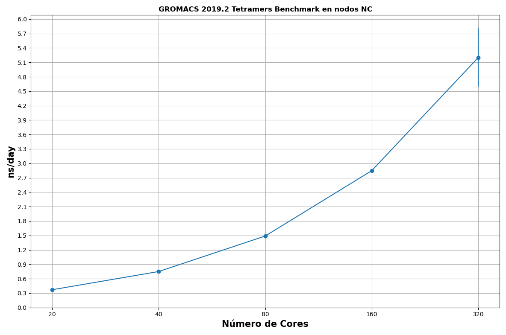
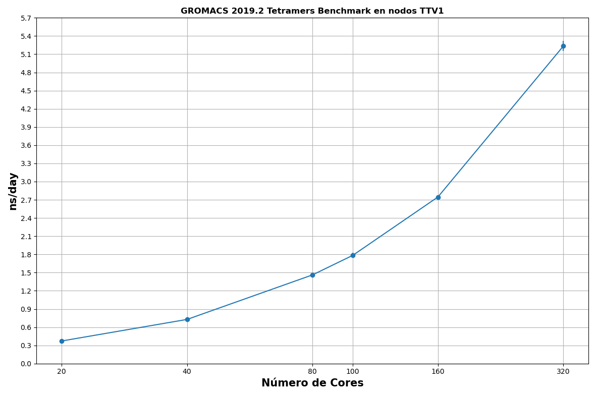
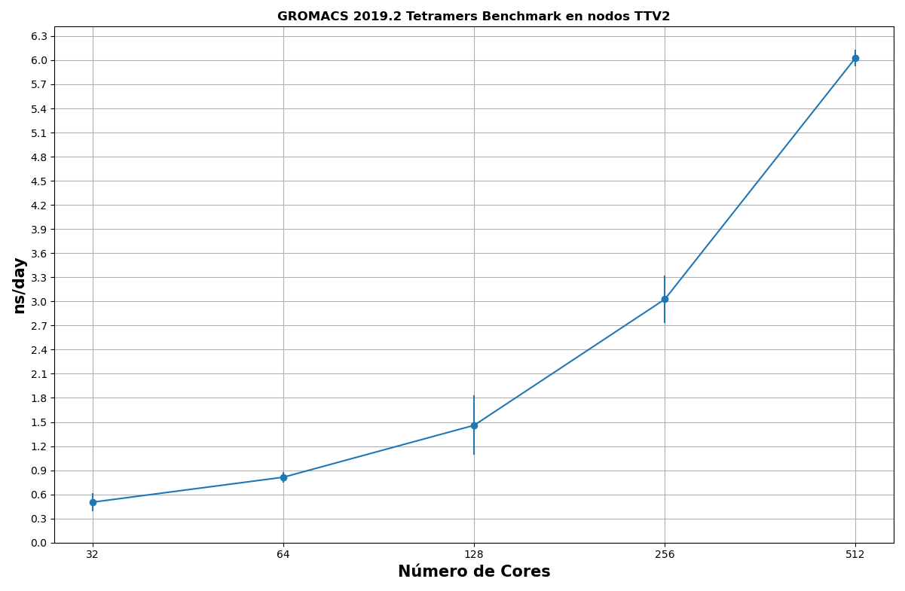
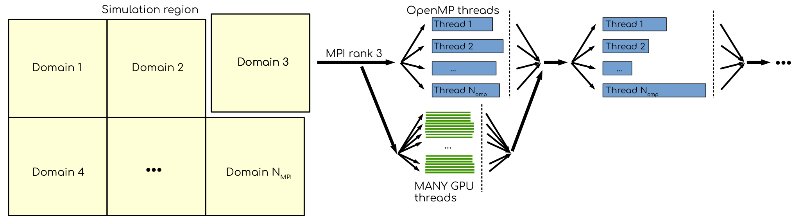
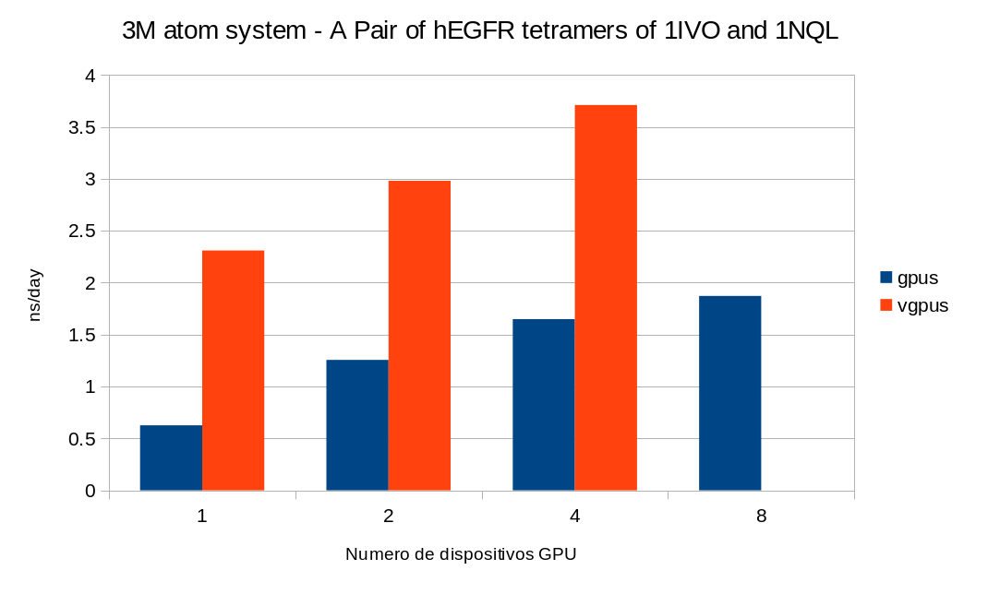

# Gromacs


## Descripción

[GROMACS](http://www.gromacs.org/)
(GROningen MAchine for Chemical Simulations) es un paquete versátil para realizar
dinámicas moleculares, es decir, simular las ecuaciones newtonianas de movimiento para sistemas con
cientos a millones de partículas. Está diseñado principalmente para moléculas bioquímicas como
proteínas y lípidos que tienen muchas interacciones de enlace complicadas, pero dado que GROMACS
es extremadamente rápido para calcular las interacciones de no enlace (que generalmente dominan las
simulaciones), muchos grupos también lo utilizan para la investigación de sistemas no biológicos, por
ejemplo, polímeros. Fue diseñado por la Universidad de Groningen.

- Este trabajo se realizo con Gromacs 2019.2

- Benchmarks: HECBioSim Benchmarks


## GROMACS Performance

Obtener el mejor rendimiento de `mdrun` con `GROMACS` no es una tarea sencilla. Los desarrolladores
de GROMACS mantienen una larga sección en su guía de usuario dedicada a
[mdrun-performance](https://manual.gromacs.org/documentation/current/user-guide/mdrun-performance.html)
que explica todas las opciones/parámetros y estrategias relevantes.

No existe un \"configuración única\", los mejores parámetros para elegir dependen en gran
medida del tamaño del sistema (número de partículas, así como el tamaño y forma de la caja de
simulación) y los parámetros de simulación (puntos de corte, uso de método Particle-Mesh-Ewald
(PME), etc).

GROMACS imprime información y estadísticas de rendimiento al final del archivo `md.log`, lo
que es útil para identificar cuellos de botella. Esta sección a menudo contiene notas sobre cómo
mejorar aún más el rendimiento.


### ns/day

<span style="color: #990819;">*Ejemplo de salida de GROMACS*</span>

```bash
                    Core t (s)   Wall t (s)        (%)
            Time:   218690.066      427.139    51198.8
                        (ns/day)    (hour/ns)
    Performance:        4.046        5.932
    Finished mdrun on rank 0 Wed Jun  1 09:15:49 2022
```

El rendimiento de la simulación en `GROMACS` normalmente se cuantifica por el número de nanosegundos
de trayectoria `MD` que se pueden simular en un día (`ns/day`).


### Energy

Gromacs muestra un informe del promedio obtenido de los cálculos de la simulación.

<span style="color: #990819;">*Ejemplo de salida de `GROMACS`*</span>

```bash
            <======  ###############  ==>
            <====  A V E R A G E S  ====>
            <==  ###############  ======>

            Statistics over 50001 steps using 501 frames

       Energies (kJ/mol)
               Bond            U-B    Proper Dih.  Improper Dih.      CMAP Dih.
        5.52000e+02    1.57644e+03    1.06317e+03    8.87639e+01   -2.89592e+02
              LJ-14     Coulomb-14        LJ (SR)   Coulomb (SR)   Coul. recip.
        4.65351e+02    8.13606e+03    3.78319e+04   -3.03779e+05    9.12092e+02
          Potential    Kinetic En.   Total Energy  Conserved En.    Temperature
       -2.53443e+05    4.93182e+04   -2.04125e+05   -2.03721e+05    3.00077e+02
     Pressure (bar)   Constr. rmsd
       -3.29630e+00    0.00000e+00
```

Los valores de energía están en kcal/mol. Para este trabajo, solo nos interesa evaluar que la variable
`Total Energy` llegue a ciertos valores esperados para cada simulación.


## Eficiencia paralela

La eficiencia de un sistema paralelo describe la fracción del tiempo que utilizan los procesadores para
un cálculo determinado. Se define como:

<span style="color: #990819;">*Calculo de eficiencia paralela:*</span>

```bash
            Tiempo de ejecución usando un procesador             ts
    E(n)= -----------------------------------------------   = ------
            N * Tiempo de ejecución usando N procesadores      N * tN
```


En general, los trabajos paralelos deberían escalar al menos un 70 % de eficiencia. Para Gromacs, la
eficiencia de un trabajo paralelo se puede calcular con el parámetro de tiempo `Wall t (s)` (tiempo de
ejecución en segundos) o el parámetro `ns/day`. Para este trabajo usaremos el valor `Wall t (s)` para
calcular la eficiencia paralela.

Dado que la evaluación comparativa en un solo núcleo a menudo puede llevar mucho tiempo y la escala
dentro de un nodo es generalmente muy buena, para los propósitos del Yoltla es suficiente hacer este
cálculo por nodo, en lugar de por CPU. La eficiencia paralela quedaría del siguiente manera :
(donde N son el numero de cores, para este trabajo usaremos 1 proceso por core disponible).

<span style="color: #990819;">*Calculo de eficiencia paralela por nodo*</span>

```bash
            Wall time donde N = 1
    ------------------------------------- * 100 = Eficiencia
            N * Wall time en N nodos
```

Idealmente, el rendimiento aumenta linealmente con el número de núcleos de CPU.


## Obtener un buen rendimiento de mdrun

Aquí ofrecemos una descripción general de los esquemas de paralelización y aceleración empleados en este
trabajo por GROMACS. El objetivo es proporcionar una comprensión de los mecanismos subyacentes que hacen
de GROMACS uno de los paquetes de dinámica molecular más rápidos.

El sistema de compilación GROMACS y la herramienta `gmx_mdrun` tienen mucha inteligencia integrada y
configurable para detectar el hardware y hacer un uso bastante efectivo de él.


### Distribución del trabajo por paralelización en GROMACS

Los algoritmos de
[`gmx mdrun`](https://manual.gromacs.org/documentation/current/onlinehelp/gmx-mdrun.html#gmx-mdrun)
y sus implementaciones son los más relevantes a la hora de elegir cómo hacer
un buen uso del hardware. Los más importantes de estos son:


#### Descomposición de Dominio

El algoritmo de descomposición de dominios (DD) descompone el componente (de corto alcance) de
las interacciones no vinculadas en dominios que comparten localidad espacial, lo que permite el uso de
algoritmos eficientes. Cada dominio maneja todas las interacciones partícula-partícula (PP) de sus
miembros y se asigna a un solo proceso MPI. Dentro de un proceso de PP, los subprocesos de OpenMP
pueden compartir la carga de trabajo y parte del trabajo se puede descargar a una GPU. El rango PP
también maneja cualquier interacción enlazada para los miembros de su dominio. Una GPU puede
realizar trabajo para más de un proceso de PP, pero normalmente es más eficiente usar un solo proceso
de PP por GPU y que ese proceso tenga miles de partículas. Cuando el trabajo de un proceso de PP se
realiza en la CPU, mdrun hará un uso extensivo de las capacidades SIMD del núcleo. Hay varios
opciones de
[línea de comandos](https://manual.gromacs.org/documentation/current/user-guide/mdrun-performance.html#controlling-the-domain-decomposition-algorithm)
para controlar el comportamiento del algoritmo DD.


#### Malla de partículas Ewald

El algoritmo Ewald de malla de partículas (PME) se encarga del componente de largo alcance de las
interacciones no enlazadas. Todos, o solo un subconjunto de procesos pueden participar en el trabajo
para calcular el componente de largo alcance. Debido a que el algoritmo usa una FFT 3D que requiere
comunicación global, su eficiencia paralela empeora a medida que participan más procesos, lo que
puede significar que es más rápido usar solo un subconjunto de procesos (por ejemplo, de una cuarta
parte a la mitad de los procesos). Si hay procesos de PME separados, los procesos restantes manejan el
trabajo de PP. De lo contrario, todos los procesos trabajan tanto en PP como en PME.


### Ejecutando mdrun en más de un nodo

De forma predeterminada, `gmx_mdrun` inspeccionará el hardware disponible en tiempo de ejecución y
hará todo lo posible para hacer un uso bastante eficiente de todo el nodo. El archivo de registro, stdout
y stderr se utilizan para imprimir diagnósticos que informan al usuario sobre las elecciones realizadas y
las posibles consecuencias.
Hay varios parámetros de línea de comandos disponibles para modificar el comportamiento
predeterminado, para este trabajo se usaron los siguientes :

- `-nb`

    Se utiliza para establecer dónde ejecutar las interacciones no vinculadas de corto alcance. Se puede
    configurar en \"automático\", \"cpu\", \"gpu\". El valor predeterminado es \"automático\", que utiliza una
    GPU compatible si está disponible. La configuración de \"cpu\" requiere que no se utilice GPU. La
    configuración de \"gpu\" requiere que una GPU compatible esté disponible y se utilizará.

- `-ntomp`

    El número total de subprocesos de OpenMP por rango. El valor predeterminado, 0, iniciará un
    subproceso en cada núcleo disponible. Alternativamente, mdrun respetará la variable de entorno del
    sistema adecuada (por ejemplo, *OMP_NUM_THREADS*) si está configurada. Tenga en cuenta que la
    cantidad máxima de subprocesos de OpenMP (por rango), por razones de eficiencia, está limitada a 64.
    Si bien rara vez es beneficioso usar una cantidad de subprocesos superior a esta. Para este trabajo se
    utilizo el valor predeterminado.

- `-dlb`

    Se puede configurar en \"automatic\", \"no\" o \"yes\". El valor predeterminado es \"automatic\". Es
    necesario realizar un equilibrio de carga dinámico entre los procesos de MPI para maximizar el
    rendimiento. Esto es particularmente importante para sistemas moleculares con partículas heterogéneas
    o densidad de interacción. Cuando se supera un cierto umbral de pérdida de rendimiento, DLB se activa
    y cambia las partículas entre los procesos para mejorar el rendimiento. Para este trabajo se utilizo el
    valor "yes".

- `-npme`

    Numero de procesos MPI dedicados al calculo PME. El valor predeterminado, -1, dedicará procesos
    solo si el número total de subprocesos es de al menos 12, y utilizará alrededor de una cuarta parte de
    los procesos. Para este trabajo se utilizo una cuarta parte de los procesos dedicados a PME


## The HECBioSim Benchmarks (Junio 2022)

El conjunto de pruebas
[HECBioSim](https://www.hecbiosim.ac.uk/access-hpc/benchmarks)
consiste en un conjunto de pruebas comparativas simples para una
serie de motores de dinámica molecular (MD) populares, cada uno de los cuales se establece en un
recuento de átomos diferente.

Los siguientes sistemas se han configurado para representar ejemplos de los tipos de simulaciones que
los científicos de biosimulación harían en producción.

1.  **20K atom system**:

    - 3NIR Crambin

    - Total number of atoms: 19,605

    - Protein atoms: 642

    - Water atoms: 18,963

    - Input parameters: [20k_HBS.mdp](https://docs.bioexcel.eu/gromacs_bpg/en/master/cookbook/benchmarks/20k_HBS.html)

2.  **61K atom system**:

    - 1WDN Glutamine-Binding Protein

    - Total number of atoms = 61,153

    - Protein atoms = 3,555

    - Water atoms = 57,957 Ions = 1

3.  **465K atom system**:

    - hEGFR Dimer of 1IVO and 1NQL

    - Total number of atoms: 465,399

    - Protein atoms: 21,749

    - Lipid atoms: 134,268

    - Water atoms: 309,087

    - Ions: 295

    - Input parameters: [465k_HBS.mdp](https://docs.bioexcel.eu/gromacs_bpg/en/master/cookbook/benchmarks/465k_HBS.html)

4.  **1.4M atom system**:

    - A Pair of hEGFR Dimers of 1IVO and 1NQL

    - Total number of atoms = 1,403,182

    - Protein atoms = 43,498

    - Lipid atoms = 235,304

    - Water atoms = 1,123,392

    - Ions = 986

5.  **3M atom system**

    - A Pair of hEGFR tetramers of 1IVO and 1NQL

    - Total number of atoms = 2,997,924

    - Protein atoms = 86,996

    - Lipid atoms = 867,784

    - Water atoms = 2,041,230

    - Ions = 1,914

Los siguientes resultados, son el promedio de 20 ejecuciones por Benchmark.


### 20K atom system -- 3NIR Crambin

La simulación debe llegar a un valor `Total Energy` cercano a: `-204107.0`

<span style="color: #990819;">*Figure 1. Performance 20K atom system: Crambin Benchmark*</span>



\
<span style="color: #990819;">*Table 1. Performance 20K atom system: Crambin Benchmark*</span>

<div class="tabla-scroll">
<table style="text-align: center;">
<thead>

<tr>
<th rowspan="2"># Nodos</th>
<th colspan="3">
CPU’s Nodos nc<br>
20 Cores x 2.50GHz Intel Xeón E5-2670v2<br>
64GB RAM<br>
Infiniband FDR10/FDR
</th>
<th colspan="3">
CPU’s Nodos ttv1[1-58]<br>
20 Cores x 2.60GHz Intel Xeón E5-2660v3<br>
128GB RAM<br>
Infiniband FDR10/FDR
</th>
<th colspan="3">
CPU’s Nodos ttv2[59-104]<br>
32 Cores x 2.10GHz Intel Xeon E5-2683v4<br>
256GB RAM<br>
Infiniband FDR10/FDR
</th>
</tr>

<tr>
<th>ns/day</th>
<th>Wall t(s)</th>
<th>Eficiencia Paralela %</th>
<th>ns/day</th>
<th>Wall t(s)</th>
<th>Eficiencia Paralela %</th>
<th>ns/day</th>
<th>Wall t(s)</th>
<th>Eficiencia Paralela %</th>
</tr>

</thead>
<tbody>

<tr>
<td>1</td><td>56.508</td><td>152.91</td><td>100 %</td><td>56.01</td><td>154.26</td>	<td>100 %</td><td>89.634</td><td>97.39</td><td>100 %</td>
</tr>

<tr>
<td>2</td><td>106.903</td><td>80.82</td><td>94 %</td><td>101.78</td><td>85.12</td><td>90 %</td><td>141.643</td><td>61.00</td><td>79 %</td>
</tr>

<tr>
<td>4</td><td>190.727</td><td>45.30</td><td>84 %</td><td>194.970</td><td>44.36</td><td>86 %</td><td>237.384</td><td>36.56</td><td>66 %</td>
</tr>

<tr>
<td>5</td><td></td><td></td><td></td><td>232.410</td><td>37.25</td><td>82 %</td><td></td><td></td><td></td>
</tr>

<tr>
<td>8</td><td>301.061</td><td>29.48</td><td>64 %</td><td>321.602</td><td>26.87</td><td>71 %</td><td>378.348</td><td>22.83</td><td>53 %</td>
</tr>

<tr>
<td>16</td><td>432.181</td><td>19.33</td><td>49 %</td><td>435.212</td><td>18.92</td><td>50 %</td><td>356.081</td><td>24.44</td><td>24 %</td>
</tr>

</tbody>
</table>
</div>


### 61K atom system - 1WDN Glutamine-Binding Protein

La simulación debe llegar a un valor `Total Energy` cercano a: `-724598.0`

<span style="color: #990819;">*Figure 2. Performance 61K atom system: Glutamine-Binding Benchmark*</span>



\
<span style="color: #990819;">*Table 2. Performance 61K atom system: Glutamine-Binding Benchmark*</span>

<div class="tabla-scroll">
<table style="text-align: center;">
<thead>

<tr>
<th rowspan="2"><strong># Nodos</strong></th>
<th colspan="3">
<strong>CPU's Nodos nc</strong><br>
20 Cores x 2.50GHz Intel Xeon E5-2670v2<br>
64GB RAM<br>
Infiniband FDR10/FDR
</th>
<th colspan="3">
<strong>CPU's Nodos ttv1[1-58]</strong><br>
20 Cores x 2.60GHz Intel Xeon E5-2660v3<br>
128GB RAM<br>
Infiniband FDR10/FDR
</th>
<th colspan="3">
<strong>CPU's Nodos ttv2[59-104]</strong><br>
32 Cores x 2.10GHz Intel Xeon E5-2683v4<br>
256GB RAM<br>
Infiniband FDR10/FDR
</th>
</tr>

<tr>
<th><strong>ns/day</strong></th>
<th><strong>Wall t(s)</strong></th>
<th><strong>Eficiencia Paralela %</strong></th>
<th><strong>ns/day</strong></th>
<th><strong>Wall t(s)</strong></th>
<th><strong>Eficiencia Paralela %</strong></th>
<th><strong>ns/day</strong></th>
<th><strong>Wall t(s)</strong></th>
<th><strong>Eficiencia Paralela %</strong></th>
</tr>

</thead>
<tbody>

<tr>
<td>1</td><td>17.591</td><td>491.16</td><td>100 %</td><td>17.465</td><td>494.74</td><td>100 %</td><td>24.933</td><td>352.65</td><td>100 %</td>
</tr>

<tr>
<td>2</td><td>34.035</td><td>253.86</td><td>96 %</td><td>32.912</td><td>262.57</td><td>94 %</td><td>43.914</td><td>196.76</td><td>89 %</td>
</tr>

<tr>
<td>4</td><td>62.133</td><td>139.06</td><td>88 %</td><td>61.312</td><td>140.92</td><td>87 %</td><td>79.514</td><td>109.18</td><td>80 %</td>
</tr>

<tr>
<td>5</td><td></td><td></td><td></td><td>75.118</td><td>115.03</td><td>85 %</td><td></td><td></td><td></td>
</tr>

<tr>
<td>8</td><td>115.214</td><td>75.02</td><td>81 %</td><td>113.176</td><td>76.34</td><td>81 %</td><td>147.549</td><td>58.55</td><td>75 %</td>
</tr>

<tr>
<td>16</td><td>196.275</td><td>44.20</td><td>69 %</td><td>199.261</td><td>43.41</td><td>71 %</td><td>224.141</td><td>38.69</td><td>56 %</td>
</tr>

</tbody>
</table>
</div>


### 465K atom system - hEGFR Dimer of 1IVO and 1NQL

La simulación debe llegar a un valor `Total Energy` cercano a: `-3.32892e+06`

<span style="color: #990819;">*Figure 3. Performance 465K atom system: hEGFR Dimer Benchmark*</span>



\
<span style="color: #990819;">*Table 3. Performance 465K atom system: hEGFR Dimer Benchmark*</span>

<div class="tabla-scroll">
<table style="text-align: center;">
<thead>

<tr>
<th rowspan="2"><strong># Nodos</strong></th>
<th colspan="3">
<strong>CPU's Nodos nc</strong><br>
20 Cores x 2.50GHz Intel Xeon E5-2670v2<br>
64GB RAM<br>
Infiniband FDR10/FDR
</th>
<th colspan="3">
<strong>CPU's Nodos ttv1[1-58]</strong><br>
20 Cores x 2.60GHz Intel Xeon E5-2660v3<br>
128GB RAM<br>
Infiniband FDR10/FDR
</th>
<th colspan="3">
<strong>CPU's Nodos ttv2[59-104]</strong><br>
32 Cores x 2.10GHz Intel Xeon E5-2683v4<br>
256GB RAM<br>
Infiniband FDR10/FDR
</th>

</tr>
<tr>
<th><strong>ns/day</strong></th>
<th><strong>Wall t(s)</strong></th>
<th><strong>Eficiencia Paralela %</strong></th>
<th><strong>ns/day</strong></th>
<th><strong>Wall t(s)</strong></th>
<th><strong>Eficiencia Paralela %</strong></th>
<th><strong>ns/day</strong></th>
<th><strong>Wall t(s)</strong></th>
<th><strong>Eficiencia Paralela %</strong></th>
</tr>

</thead>
<tbody>

<tr>
<td>1</td><td>2.182</td><td>792.51</td><td>100 %</td><td>2.158</td><td>803.93</td><td>100 %</td><td>2.823</td><td>589.62</td><td>100 %</td>
</tr>

<tr>
<td>2</td><td>4.291</td><td>402.45</td><td>98 %</td><td>4.199</td><td>413.36</td><td>97 %</td><td>4.318</td><td>371.02</td><td>79 %</td>
</tr>

<tr>
<td>4</td><td>8.376</td><td>205.96</td><td>95 %</td><td>8.055</td><td>216.56</td><td>92 %</td><td>9.264</td><td>185.84</td><td>78 %</td>
</tr>

<tr>
<td>5</td><td></td><td></td><td></td><td>10.232</td><td>168.98</td><td>95 %</td><td></td><td></td><td></td>
</tr>

<tr>
<td>8</td><td>16.347</td><td>105.68</td><td>92 %</td><td>15.463</td><td>113.18</td><td>88 %</td><td>19.312</td><td>89.015</td><td>82 %</td>
</tr>

<tr>
<td>16</td><td>29.912</td><td>57.49</td><td>86 %</td><td>27.162</td><td>61.83</td><td>81 %</td><td>38.853</td><td>44.59</td><td>81 %</td>
</tr>

</tbody>
</table>
</div>


### 1.4M atom system - A Pair of hEGFR Dimers of 1IVO and 1NQL

La simulación debe llegar a un valor `Total Energy` cercano a: `-1.20733e+07`

<span style="color: #990819;">*Figure 4. Performance 1.4M atom system: A Pair of hEGFR Dimer Benchmark*</span>



\
<span style="color: #990819;">*Table 4. Performance 1.4M atom system: A Pair of hEGFR Dimer Benchmark*</span>

<div class="tabla-scroll">
<table style="text-align: center;">
<thead>

<tr>
<th rowspan="2"><strong># Nodos</strong></th>
<th colspan="3">
<strong>CPU's Nodos nc</strong><br>
20 Cores x 2.50GHz Intel Xeon E5-2670v2<br>
64GB RAM<br>
Infiniband FDR10/FDR
</th>
<th colspan="3">
<strong>CPU's Nodos ttv1[1-58]</strong><br>
20 Cores x 2.60GHz Intel Xeon E5-2660v3<br>
128GB RAM<br>
Infiniband FDR10/FDR
</th>
<th colspan="3">
<strong>CPU's Nodos ttv2[59-104]</strong><br>
32 Cores x 2.10GHz Intel Xeon E5-2683v4<br>
256GB RAM<br>
Infiniband FDR10/FDR
</th>
</tr>

<tr>
<th><strong>ns/day</strong></th>
<th><strong>Wall t(s)</strong></th>
<th><strong>Eficiencia Paralela %</strong></th>
<th><strong>ns/day</strong></th>
<th><strong>Wall t(s)</strong></th>
<th><strong>Eficiencia Paralela %</strong></th>
<th><strong>ns/day</strong></th>
<th><strong>Wall t(s)</strong></th>
<th><strong>Eficiencia Paralela %</strong></th>
</tr>

</thead>
<tbody>

<tr>
<td>1</td><td>0.820</td><td>2109.12</td><td>100 %</td><td>0.800</td><td>2169.86</td><td>100 %</td><td>0.918</td><td>1664.99</td><td>100 %</td>
</tr>

<tr>
<td>2</td><td>1.650</td><td>1046.09</td><td>99 %</td><td>1.594</td><td>1094.46</td><td>99 %</td><td>1.734</td><td>1004.19</td><td>82 %</td>
</tr>

<tr>
<td>4</td><td>3.257</td><td>530.41</td><td>98 %</td><td>3.131</td><td>554.92</td><td>97 %</td><td>3.395</td><td>536.28</td><td>77 %</td>
</tr>

<tr>
<td>5</td><td></td><td></td><td></td><td>3.947</td><td>438.29</td><td>99 %</td><td></td><td></td><td></td>
</tr>

<tr>
<td>8</td><td>6.422</td><td>269.21</td><td>97 %</td><td>5.966</td><td>282.81</td><td>95 %</td><td>6.483</td><td>269.53</td><td>76 %</td>
</tr>

<tr>
<td>16</td><td>12.00</td><td>143.01</td><td>92 %</td><td>11.724</td><td>147.57</td><td>91 %</td><td>13.423</td><td>128.21</td><td>80 %</td>
</tr>

</tbody>
</table>
</div>


### 3M atom system - A Pair of hEGFR tetramers of 1IVO and 1NQL

La simulación debe llegar a un valor `Total Energy` cercano a: `-2.09831e+07`

<span style="color: #990819;">*Figure 5. Performance 3M atom system: Tetramers Benchmark*</span>



\
<span style="color: #990819;">*Table 5. Performance 3M atom system: Tetramers Benchmark*</span>

<div class="tabla-scroll">
<table style="text-align: center;">
<thead>

<tr>
<th rowspan="2"><strong># Nodos</strong></th>
<th colspan="3">
<strong>CPU's Nodos nc</strong><br>
20 Cores x 2.50GHz Intel Xeon E5-2670v2<br>
64GB RAM<br>
Infiniband FDR10/FDR
</th>
<th colspan="3">
<strong>CPU's Nodos ttv1[1-58]</strong><br>
20 Cores x 2.60GHz Intel Xeon E5-2660v3<br>
128GB RAM<br>
Infiniband FDR10/FDR
</th>
<th colspan="3">
<strong>CPU's Nodos ttv2[59-104]</strong><br>
32 Cores x 2.10GHz Intel Xeon E5-2683v4<br>
256GB RAM<br>
Infiniband FDR10/FDR
</th>
</tr>

<tr>
<th><strong>ns/day</strong></th>
<th><strong>Wall t(s)</strong></th>
<th><strong>Eficiencia Paralela %</strong></th>
<th><strong>ns/day</strong></th>
<th><strong>Wall t(s)</strong></th>
<th><strong>Eficiencia Paralela %</strong></th>
<th><strong>ns/day</strong></th>
<th><strong>Wall t(s)</strong></th>
<th><strong>Eficiencia Paralela %</strong></th>
</tr>

</thead>
<tbody>

<tr>
<td>1</td><td>0.371</td><td>4663.00</td><td>100 %</td><td>0.372</td><td>4643.84</td><td>100 %</td><td>0.503</td><td>3913.65</td><td>100 %</td>
</tr>

<tr>
<td>2</td><td>0.750</td><td>2300.71</td><td>99 %</td><td>0.727</td><td>2352.36</td><td>98 %</td><td>0.813</td><td>2138.54</td><td>91 %</td>
</tr>

<tr>
<td>4</td><td>1.489</td><td>1160.10</td><td>99 %</td><td>1.461</td><td>1176.60</td><td>97 %</td><td>1.459</td><td>1096.09</td><td>89 %</td>
</tr>

<tr>
<td>5</td><td></td><td></td><td></td><td>1.785</td><td>980.53</td><td>94 %</td><td></td><td></td><td></td>
</tr>

<tr>
<td>8</td><td>2.848</td><td>607.68</td><td>95 %</td><td>2.746</td><td>621.83</td><td>93 %</td><td>3.027</td><td>548.42</td><td>88 %</td>
</tr>

<tr>
<td>16</td><td>5.202</td><td>313.81</td><td>92 %</td><td>5.234</td><td>335.36</td><td>86 %</td><td>6.029</td><td>287.27</td><td>84 %</td>
</tr>

</tbody>
</table>
</div>


#### Performance Tetramers Benchmark en nodos NC

<span style="color: #990819;">*Figure 6. Performance Tetramers Benchmark en nodos NC*</span>



\
<span style="color: #990819;">*Table 6. Performance Tetramers Benchmark en nodos NC*</span>

<div class="tabla-scroll">
<table border="1">
<thead>

<tr>
<th rowspan="3"># Nodos</th>
<th colspan="6">
CPU's Nodos nc<br>
20 Cores x 2.50GHz Intel Xeón E5-2670v2<br>
64GB RAM<br>
Infiniband FDR10/FDR
</th>
</tr>

<tr>
<th rowspan="2">No. Ejecuciones</th>
<th colspan="4">ns/day</th>
<th rowspan="2">Wallclock (s) Promedio</th>
</tr>

<tr>
<th>Promedio</th>
<th>Mínimo</th>
<th>Máximo</th>
<th>Desviación Estándar</th>
</tr>

</thead>
<tbody>

<tr>
<td>1</td><td>20</td><td>0.371</td><td>0.368</td><td>0.375</td><td>0.0027</td><td>4663</td>
</tr>

<tr>
<td>2</td><td>20</td><td>0.750</td><td>0.748</td><td>0.753</td><td>0.0017</td><td>2300</td>
</tr>

<tr>
<td>4</td><td>20</td><td>1.489</td><td>1.474</td><td>1.507</td><td>0.0108</td><td>1160</td>
</tr>

<tr>
<td>8</td><td>20</td><td>2.848</td><td>2.792</td><td>2.880</td><td>0.0337</td><td>607</td>
</tr>

<tr>
<td>16</td><td>20</td><td>5.202</td><td>4.146</td><td>5.580</td><td>0.6101</td><td>313</td>
</tr>

</tbody>
</table>
</div>

#### Performance Tetramers Benchmark en nodos TTV1

<span style="color: #990819;">*Figure 7. Performance Tetramers Benchmark en nodos TTV1*</span>



\
<span style="color: #990819;">*Table 7. Performance Tetramers Benchmark en nodos TTV1*</span>

<div class="tabla-scroll">
<table border="1">
<thead>

<tr>
<th rowspan="3"># Nodos</th>
<th colspan="6">
CPU's Nodos ttv1<br>
20 Cores x 2.60GHz Intel Xeón E5-2660v3<br>
128GB RAM<br>
Infiniband FDR10/FDR
</th>
</tr>

<tr>
<th rowspan="2">No. Ejecuciones</th>
<th colspan="4">ns/day</th>
<th rowspan="2">Wallclock (s) Promedio</th>
</tr>

<tr>
<th>Promedio</th>
<th>Mínimo</th>
<th>Máximo</th>
<th>Desviación Estándar</th>
</tr>

</thead>
<tbody>

<tr>
<td>1</td><td>20</td><td>0.372</td><td>0.368</td><td>0.380</td><td>0.0040</td><td>4643</td>
</tr>

<tr>
<td>2</td><td>20</td><td>0.727</td><td>0.706</td><td>0.742</td><td>0.0162</td><td>2352</td>
</tr>

<tr>
<td>4</td><td>20</td><td>1.461</td><td>1.431</td><td>1.472</td><td>0.0155</td><td>1176</td>
</tr>

<tr>
<td>5</t><td>20</td><td>1.785</td><td>1.731</td><td>1.824</td><td>0.0396</td><td>980</td>
</tr>

<tr>
<td>8</td><td>20</td><td>2.746</td><td>2.724</td><td>2.793</td><td>0.0276</td><td>621</td>
</tr>

<tr>
<td>16</td><td>20</td><td>5.234</td><td>5.125</td><td>5.377</td><td>0.0832</td><td>335</td>
</tr>

</tbody>
</table>
</div>


#### Performance Tetramers Benchmark en nodos TTV2

<span style="color: #990819;">*Figure 8. Performance Tetramers Benchmark en nodos TTv2*</span>



\
<span style="color: #990819;">*Table 8. Performance Tetramers Benchmark en nodos TTv2*</span>

<div class="tabla-scroll">
<table border="1">
<thead>

<tr>
<th rowspan="3"># Nodos</th>
<th colspan="6">
CPU's Nodos ttv2<br>
232 Cores x 2.10GHz Intel Xeón E5-2683v4<br>
256GB RAM<br>
Infiniband FDR10/FDR
</th>
</tr>

<tr>
<th rowspan="2">No. Ejecuciones</th>
<th colspan="4">ns/day</th>
<th rowspan="2">Wallclock (s) Promedio</th>
</tr>

<tr>
<th>Promedio</th>
<th>Mínimo</th>
<th>Máximo</th>
<th>Desviación Estándar</th>
</tr>

</thead>
<tbody>

<tr>
<td>1</td><td>20</td><td>0.503</td><td>0.404</td><td>0.647</td><td>0.1095</td><td>3913</td>
</tr>

<tr>
<td>2</td><td>20</td><td>0.813</td><td>0.730</td><td>0.937</td><td>0.0626</td><td>2138</td>
</tr>

<tr>
<td>4</td><td>20</td><td>1.459</td><td>0.653</td><td>1.792</td><td>0.3698</td><td>1096</td>
</tr>

<tr>
<td>8</td><td>20</td><td>3.027</td><td>2.403</td><td>3.309</td><td>0.2944</td><td>548</td>
</tr>

<tr>
<td>6</td><td>20</td><td>6.029</td><td>5.831</td><td>6.105</td><td>0.1013</td><td>287</td>
</tr>

</tbody>
</table>
</div>

## Gromacs en GPU

De forma predeterminada, GROMACS lanza un rango de procesos por GPU. En este trabajo
exploraremos la paralización haciendo uso de más procesos thread-mpi,

En GROMACS, hay dos formas de explorar el paralelismo en una CPU. El primero utiliza la
descomposición de dominios: el volumen de simulación se divide en varias regiones, llamadas
dominios. Cada dominio se asigna a un proceso MPI. Los procesos se comunican cuando es necesario.
En segundo lugar, una forma más granular es mediante el uso de subprocesos (hilos) OpenMP, que se
generan dentro de los procesos cuando hay un paralelismo adicional para explorar. De hecho, cada
dominio contiene más de una partícula, cada una de las cuales puede propagarse independientemente
en un hilo independiente.

En GROMACS podemos utilizar GPUS para explotar aun más este paralelismo. Muchos
subprocesos de GPU pueden acelerar significativamente la evaluación de tareas de cómputo intensivo.
Sin embargo, para aprovecharlo al máximo, el dominio debe contener miles o decenas de miles de
partículas.



En entornos HPC es común tener más de una GPU en un solo nodo. Para usarlos, podemos
aprovechar la maquinaria de descomposición de dominios. De hecho, GROMACS ya está configurado
para que las comunicaciones entre procesos sean mínimas. Entonces, las GPU se asignarán a un
respectivo proceso y realizarán todos los cálculos para un solo dominio.

Para realizar este paralelismo utilizaremos el siguiente script:

<span style="color: #990819;">*Ejemplo de script de slurm para utilizar Gromacs con gpu's en el cluster Yoltla.*</span>

```bash
#!/bin/bash
#SBATCH --ntasks=4
#SBATCH --ntasks-per-node=4
#SBATCH --cpus-per-task=9
#SBATCH --time=2:0:0
#SBATCH --nodes=1
#SBATCH --partition=vgpus
#SBATCH --gres=gpu:4

module load gromacs/2019.2

export OMP_NUM_THREADS=$SLURM_CPUS_PER_TASK

options=”-s benchmark.tpr -nb gpu”
options+="-ntomp $SLURM_CPUS_PER_TASK -pin on -pinstride 1"
options+=”-pme gpu -bonded gpu -dlb yes -npme 1”

mpiexec.hydra -bootstrap slurm gmx_mpi mdrun $options
```

Opciones:

- `-pin`

    Se puede establecer en \"automático\", \"activado\" o \"desactivado\" para controlar si mdrun intentará
    establecer la afinidad de los subprocesos con los núcleos.

- `-pinstride`

    Establece cómo deben distribuirse entre los núcleos (1 significa consecutivos). especifica el número de
    núcleos a los que mdrun debe anclar sus subprocesos.

- `-pme`

    Se utiliza para establecer dónde ejecutar las interacciones no vinculadas de largo alcance. Se puede
    configurar en \"automático\", \"cpu\", \"gpu\". El valor predeterminado es \"automático\", que utiliza una
    GPU compatible si está disponible. La configuración de \"gpu\" requiere que haya una GPU compatible
    disponible. No se admiten varios rangos de PME con PME en GPU, por lo que si se usa más de una
    GPU para el cálculo de PME, npme debe establecerse en 1.

- `-bonded`

    Se utiliza para establecer dónde ejecutar las interacciones vinculadas que forman parte de la carga de
    trabajo de PP para un dominio. Se puede configurar en \"automático\", \"cpu\", \"gpu\". El valor
    predeterminado es \"automático\", que usa una GPU CUDA compatible solo cuando hay una disponible,
    una GPU maneja interacciones de corto alcance y la CPU maneja el trabajo de interacción de largo
    alcance (electrostática o LJ). El trabajo de las interacciones vinculadas tiene lugar en la misma GPU
    que las interacciones de corto alcance y no se puede asignar de forma independiente. La configuración
    de \"gpu\" requiere que una GPU compatible esté disponible y se utilizará.

Si no se especifica las opciones `pin` y `pinstride` puede salir el siguiente error:

*Non-default thread affinity set, disabling internal thread affinity*

Esto significa que los subprocesos no están anclados a los núcleos. Entonces,
la ejecución puede saltar de un núcleo a otro y de un dominio NUMA a otro. Esto puede ser muy
ineficiente, porque la ubicación de los datos se romperá. para resolver esto, uno puede hacer cumplir la
fijación de subprocesos usando y opciones de `-pin on`, `-pinstride 1`. La primera opción impone la
fijación de subprocesos, la segunda establece cómo deben distribuirse entre los núcleos (1 significa
consecutivos).


### 3M atom system - A Pair of hEGFR tetramers of 1IVO and 1NQL (Junio 2022)

La simulación debe llegar a un valor `Total Energy` cercano a: `-2.09831e+07`

<span style="color: #990819;">*Figure 9. Performance Tetramers Benchmark en GPUS*</span>



\
<span style="color: #990819;">*Table 9. Performance Tetramers Benchmark en GPUS*</span>

<div class="tabla-scroll">
<table border="1">
<thead>

<tr>
<th rowspan="2"># GPU devices</th>
<th colspan="2">
Nodos GPUS Tesla K20<br>
20 Cores<br>
64GB RAM<br>
Infiniband FDR10/FDR
</th>
<th colspan="2">
Nodos nc con GPUS V100<br>
36 Cores<br>
256GB RAM<br>
Infiniband FDR10/FDR
</th>
</tr>

<tr>
<th>ns/days</th>
<th>Wall time (s)</th>
<th>ns/days</th>
<th>Wall time (s)</th>
</tr>

</thead>
<tbody>

<tr>
<td>1</td><td>0.626</td><td>3068.796</td><td>2.31</td><td>549.212</td>
</tr>

<tr>
<td>2</td><td>1.256</td><td>2046.388</td><td>2.981</td><td>470.666</td>
</tr>

<tr>
<td>4</td><td>1.649</td><td>1097.792</td><td>3.711</td><td>439.652</td>
</tr>

<tr>
<td>8</td><td>1.872</td><td>987.119</td><td></td><td></td>
</tr>

</tbody>
</table>
</div>

Observamos una aceleración considerable en la particiones vgpus obteniendo un performance
en 4 gpus superior al uso de 8 nodos de las particiones cpu.

De la gráfica anterior, se puede notar que dependiendo de la configuración, la aceleración
obtenida de un nodo con múltiples GPU's puede variar mucho. Las configuraciones anterior es
tentativas solo para demostrar su uso. Se recomienda a los usuarios que realicen una optimización
exhaustiva para obtener valores óptimos de esta configuración para aprovechar la máxima aceleración
posible.


## Rerencias

[Gromacs](http://www.gromacs.org/)

[The HECBioSim Benchmarks](https://www.hecbiosim.ac.uk/access-hpc/benchmarks)

[mdrun performance](https://manual.gromacs.org/documentation/current/user-guide/mdrun-performance.html)

[Performance Cookbook](https://docs.bioexcel.eu/gromacs_bpg/en/master/cookbook/cookbook.html)

[GROMACS GPU performance](https://enccs.github.io/gromacs-gpu-performance/)

[GPU accelerated calculation of PME](https://manual.gromacs.org/documentation/2018.1/user-guide/mdrun-performance.html#gpu-accelerated-calculation-of-pme)


