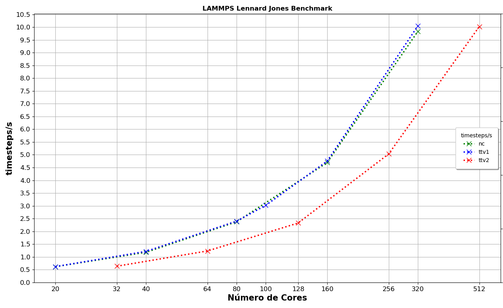
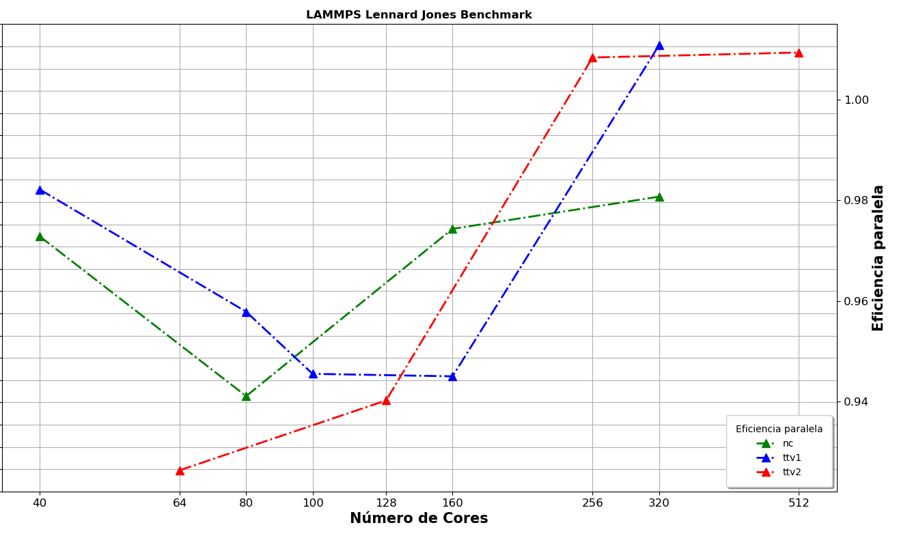
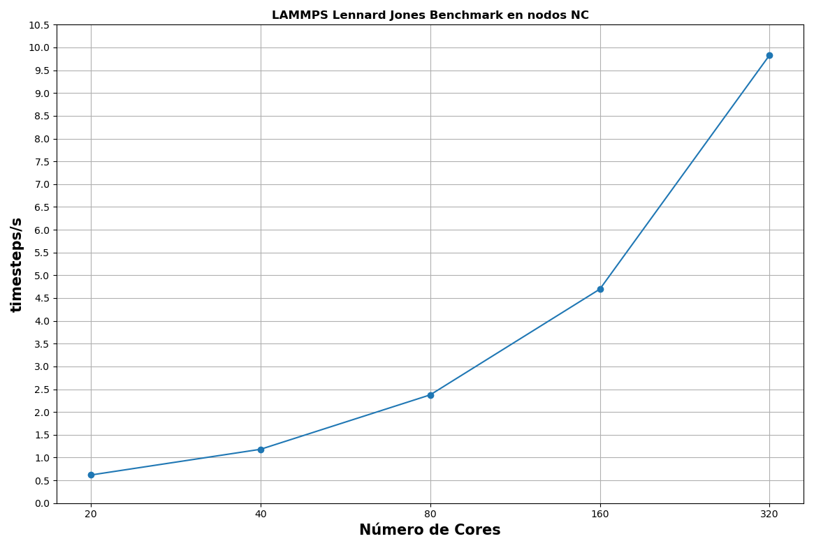
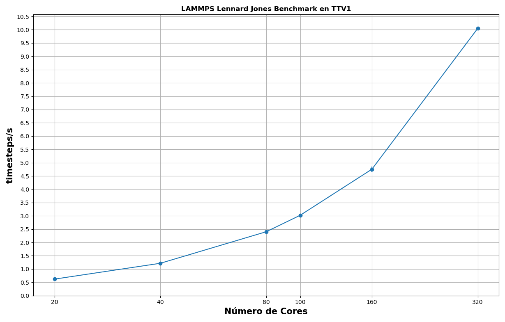
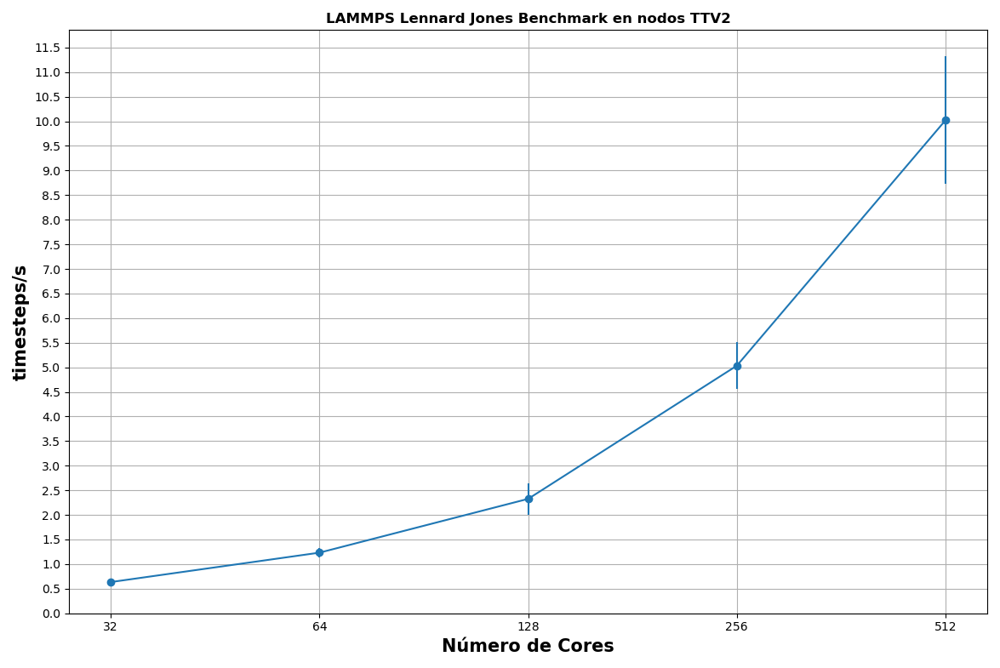
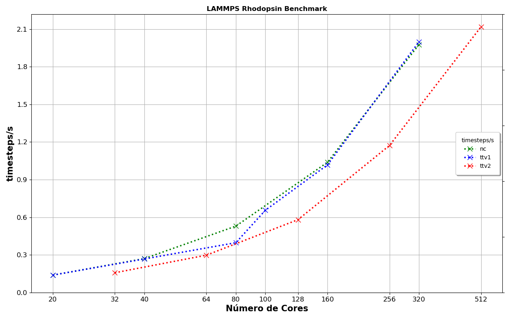
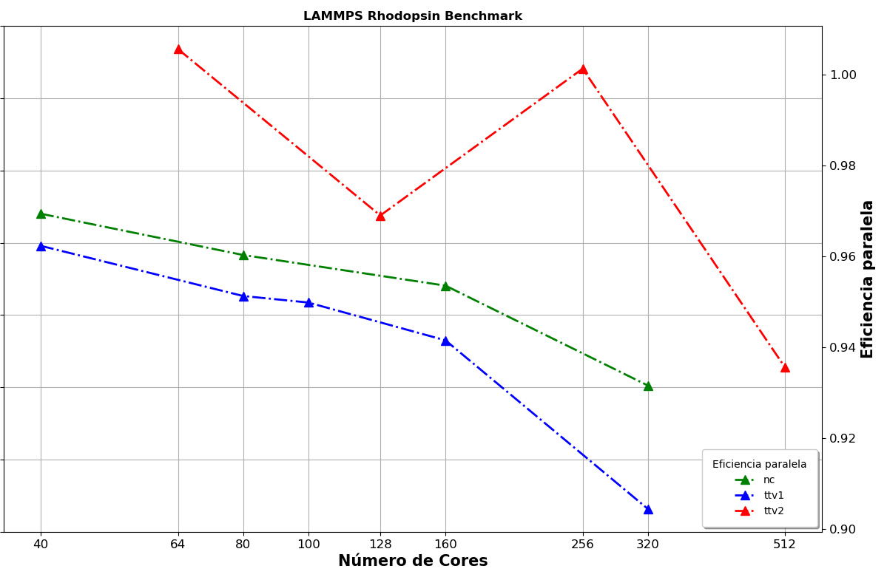
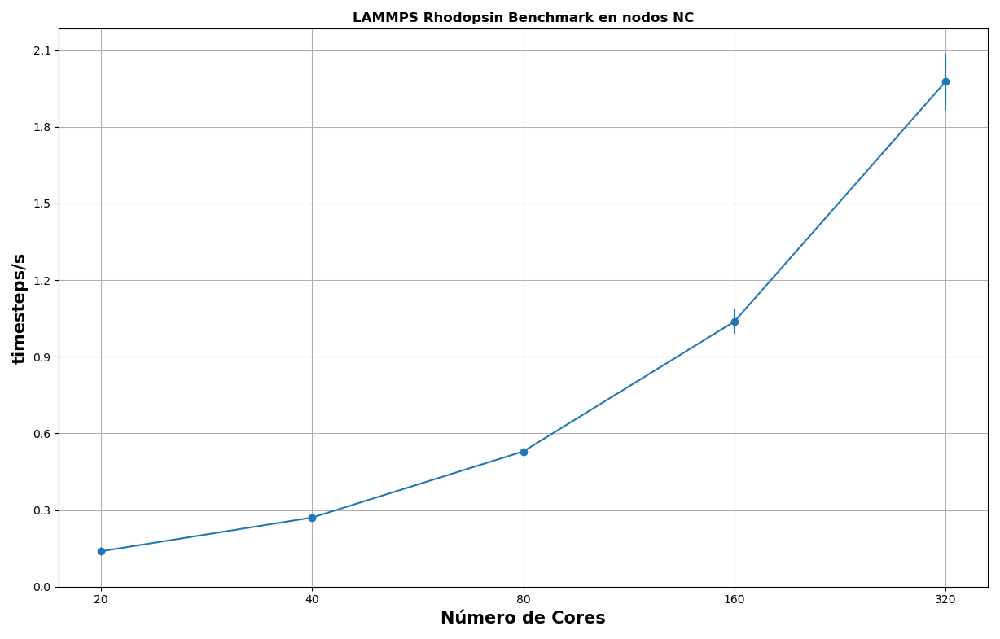
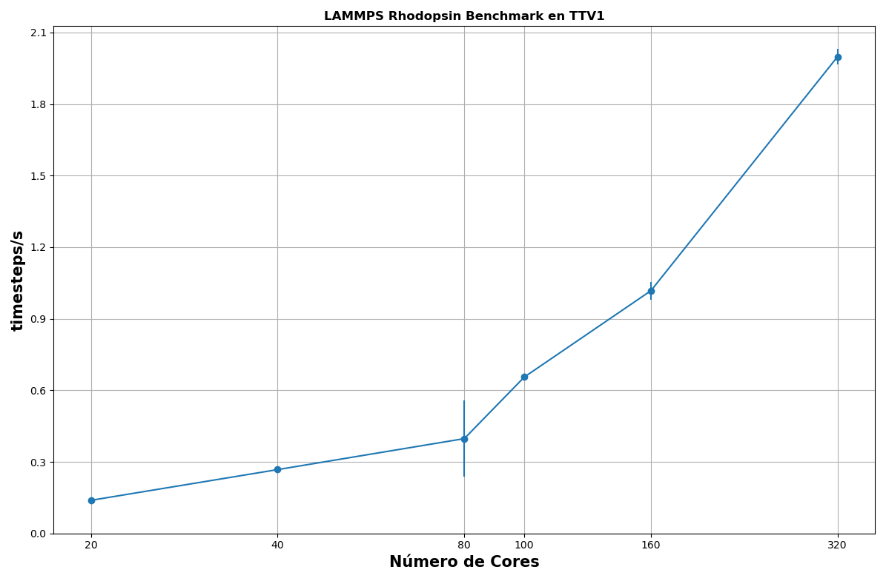
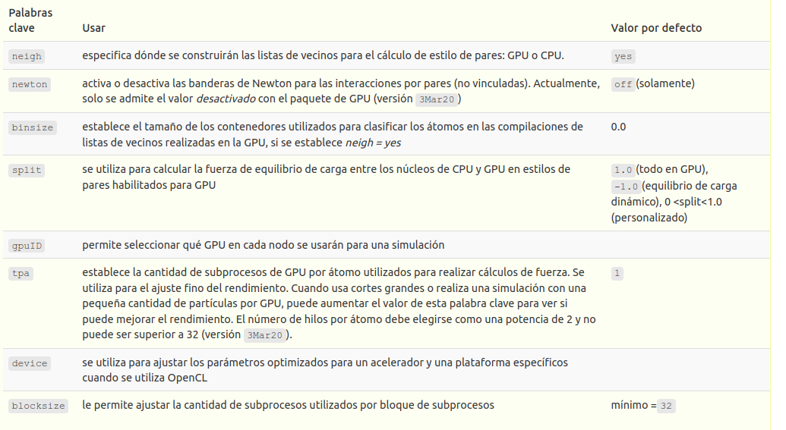

# Lammps


## Descripción

[LAMMPS](https://www.lammps.org/#gsc.tab=0) es un código clásico de dinámica molecular 
y un acrónimo de Simulador masivo paralelo atómico/molecular a gran escala. Fue desarrollado 
en Sandia National Laboratories, una instalación del Departamento de Energía de EE.UU. Es un 
código de fuente abierta, distribuido libremente bajo los términos de la Licencia Pública GNU (GPL).

LAMMPS tiene potencial para materiales blandos (biomoléculas, polímeros) y materiales en
estado sólido (metales, semiconductores) y sistemas mesoscópicos o de grano grueso. Puede usarse
para modelar átomos o, más genéricamente, como un simulador de partículas paralelas a escala
atómica, meso o continua.

LAMMPS se ejecuta en procesadores individuales o en paralelo usando técnicas de paso de
mensajes y una descomposición espacial del dominio de simulación. El código está diseñado para que
sea fácil de modificar o ampliar con nuevas funciones.

- Este trabajo se realizo con LAMMPS 2021.

- Benchmarks: LennardJones, Rhodopsin protein


## Lammps Performance

La salida de `LAMMPS` contiene la mayor parte de la información importante como la versión `LAMMPS`,
la cantidad de procesadores utilizados para las ejecuciones, el diseño del procesador, los pasos
termodinámicos y algunos tiempos. El encabezado de su archivo de salida debe ser algo similar a esto:

```bash
LAMMPS (27 Oct 2021)
OMP_NUM_THREADS environment is not set. Defaulting to 1 thread. (src/src/comm.cpp:98)
    using 1 OpenMP thread(s) per MPI task
```

Cuando concluye la ejecución, `LAMMPS` imprime el estado termodinámico final y el tiempo total de
ejecución de la simulación. También agrega estadísticas sobre el tiempo de CPU y los requisitos de
almacenamiento para la simulación. A continuación se muestra un conjunto de estadísticas de ejemplo:

```bash
Loop time of 8239.53 on 20 procs for 5000 steps with 32969632 atoms

Performance: 262.151 tau/day, 0.607 timesteps/s
99.6% CPU use with 20 MPI tasks x 1 OpenMP threads

MPI task timing breakdown:
Section |  min time  |  avg time  |  max time  |%varavg| %total
---------------------------------------------------------------
Pair    | 6398.2     | 6545.5     | 6683.2     | 102.8 | 79.44
Neigh   | 668.8      | 677.36     | 685.02     |  18.5 |  8.22
Comm    | 207.73     | 354.11     | 505.47     | 466.9 |  4.30
Output  | 0.053933   | 0.058277   | 0.083162   |   2.5 |  0.00
Modify  | 586.63     | 599.92     | 605.73     |  22.8 |  7.28
Other   |            | 62.55      |            |       |  0.76

Nlocal:    1.64848e+06 ave   1.649e+06 max 1.64775e+06 min
Histogram: 1 0 1 2 3 2 6 1 2 2
Nghost:        255852.0 ave      256205 max      255576 min
Histogram: 1 1 0 5 7 4 1 0 0 1
Neighs:    6.18259e+07 ave 6.19671e+07 max 6.16968e+07 min
Histogram: 2 2 1 3 4 1 3 0 2 2

Total # of neighbors = 1.2365179e+09
Ave neighs/atom = 37.504753
Neighbor list builds = 250
Dangerous builds not checked
Total wall time: 2:17:24
```

Las palabras clave útiles para buscar incluyen:

- Loop time:Esto muestra el tiempo total en segundos para que se ejecute la simulación. Usamos
  este valor para calcular la eficiencia paralela
  (fuente: [manual LAMMPS](https://lammps.sandia.gov/doc/Manual.html) ).

- Performance: Esto se proporciona por conveniencia para ayudar a predecir cuánto tiempo
  llevará ejecutar una simulación física deseada. Para medir el performance de LAMMPS usaremos el valor en
  unidades de timesteps/s (pasos de la simulación que puede hacer en un segundo).

- CPU use: Esto proporciona la utilización de CPU por tarea MPI; debe estar cerca del 100%.
  Los números más bajos corresponden a retrasos debido a E/S de archivos o utilización
  insuficiente de procesos.

- Desglose de tiempo: Tabla de desglose de tiempo para el tiempo de ejecución de la CPU.

```bash
MPI task timing breakdown:
Section |  min time  |  avg time  |  max time  |%varavg| %total
---------------------------------------------------------------
Pair    | 6398.2     | 6545.5     | 6683.2     | 102.8 | 79.44
Neigh   | 668.8      | 677.36     | 685.02     |  18.5 |  8.22
Comm    | 207.73     | 354.11     | 505.47     | 466.9 |  4.30
Output  | 0.053933   | 0.058277   | 0.083162   |   2.5 |  0.00
Modify  | 586.63     | 599.92     | 605.73     |  22.8 |  7.28
Other   |            | 62.55      |            |       |  0.76
```

La tabla anterior muestra los tiempos que tardan las principales categorías de una ejecución
de LAMMPS. Se proporciona una breve descripción de estas categorías en el
[manual LAMMPS](https://lammps.sandia.gov/doc/Run_output.html). Esto
ayuda a identificar dónde pasa la mayor parte del tiempo de computo :

- Pair = Tiempo necesario para calcular las interacciones por pares entre los átomos (cálculos de
  fuerza no ligada).

- Bond = Tiempo necesario para calcular interacciones enlazadas: enlaces, ángulos, etc.

- Kspace = Tiempo necesario para calcular interacciones de largo alcance: Ewald, PPPM, MSM

- Neigh = Tiempo necesario para calcular nuevas listas de vecinos para cada átomo

- Comm = Tiempo dedicado a la comunicación entre procesadores de átomos y sus propiedades

- Output = Tiempo necesario para generar los archivos de posición de reinicio, posición del
  átomo, velocidad y fuerza

- Modify= Tiempo necesario para calcular arreglos y cálculos invocados por arreglos

- Other = todo el tiempo restante


### Total Energy

`LAMMPS` muestra un informe de datos termodinámicos en su salida y los archivos de registro.

<span style="color: #990819;">*Ejemplo de salida de `LAMMPS`*</span>

```bash
Step Time Temp Press PotEng KinEng TotEng Density
        0            0         1.44   -5.0196693   -6.7733681    2.1599999   -4.6133681       0.8442
    2500         12.5    0.6978031    0.7483168    -5.666924    1.0467046   -4.6202194       0.8442
    5000           25   0.69755252   0.74836107    -5.666874    1.0463287   -4.6205453       0.8442
```

El formato de salida puede ser controlado con la variable `thermo` y `thermo_style` presentes en el
archivo de entrada de `LAMMPS`.

- `thermo N`

  - N = salida termodinámica cada N `timesteps`

  - N puede ser una variable

- `thermo_style args`

  - args = lista de argumentos para un estilo particular

Para este trabajo, modificamos los archivos de entrada con el siguiente formato:

<span style="color: #990819;">*Variables presentes en el archivo de entrada de `LAMMPS`*</span>

```
.
variable        t index 5000
.
.
variable        interval equal $t/2
.
.
thermo ${interval}
thermo_style custom step time  temp press pe ke etotal density
```

El intervalo de salida es igual a la mitad de los `timesteps` totales para evitar un cuello de botella
en las operaciones de entrada/salida de `LAMMPS`.

Las variables usadas en `thermo_style` son las siguientes:

- cutom: para indicar que se pasara una lista de palabras clave

- step: muestra el `timestep` actual. Columna STEP

- time: tiempo de simulación. Columna TIME

- temp: temperatura. Columna TEMP

- press: presión. Columna PRESS

- pe: energía potencial total. Colimna PotEng

- ke: energía cinética. Columna KinEng

- etotal: total de energía (pe + ke). Columna TotEng

- density: densidad de masa del sistema. Columna Density

En este trabajo nos interesa evaluar que la variable `TotEng` llegue a ciertos valores
esperados para el ultimo `timesteps` de cada simulación.


## Eficiencia paralela

La única forma confiable de ver si un trabajo escala de manera eficiente es compararlo. Comparar un
trabajo significa ejecutar un trabajo de prueba breve y representativo varias veces en diferentes
números de CPU para encontrar un punto óptimo.

A partir de estos datos, se puede calcular la **eficiencia paralela**. Esto se define cómo:

**E = (1/P) \* (T<sub>1</sub>/T<sub>P</sub>)**

- P = Numero de procesadores

- T<sub>1</sub> = tiempo óptimo para el algoritmo en un procesador

- T<sub>P</sub> = tiempo para algoritmo paralelo en P procesadores

Dado que la evaluación comparativa en un solo núcleo a menudo puede llevar mucho tiempo y
la escala dentro de un nodo es generalmente muy buena, para los propósitos del Yoltla es suficiente
hacer este cálculo por nodo, en lugar de por CPU. Para este trabajo, usaremos 1 proceso por core
disponible.

Como regla general, los trabajos que se ejecutan con una gran cantidad de núcleos deben tener
una eficiencia paralela superior o igual a 0,7.


## Uso de MPI

`LAMMPS` divide el espacio 3d en una cuadricula de sub-volúmenes 3d de acuerdo a la cantidad de
procesos, por ejemplo, para una cuadrícula AxBxC, el número total de procesos (p) = A \* B \* C.

`LAMMPS` intenta que los sub-volúmenes sean lo más cúbicos posible, ya que el volumen de
datos intercambiados es proporcional a la superficie del sub-volumen. Las rutinas `MPI_Recv` y
`MPI_Send` son los principales medios para lograr la comunicación.

{alt="lammps space"}


## Tamaño del sistema

Podemos variar el tamaño del sistema (es decir, el número de átomos) asignando valores apropiados a las
variables `x`, `y` y `z` al principio del archivo de entrada. La duración de la simulación puede ser
decidida por la variable `t`.

Ejemplo:

Para un sistema pequeño ( `x = y = z = 10, t = 1000` ), se ejecutara una simulación para 4000 átomos en
1000 pasos de dinámica molecular. Esto debido a la creación de una \"caja\" de simulación (`create_box`)
de 1000 \"espacios\" (`x*y*z`) con un átomo cada uno y 3 vecinos por átomo (`neighbor`).

Si tomamos esta entrada y la modificamos de modo que `x = y = z = 140` la simulación contendrá alrededor
de 10 millones de átomos.


### Efectos debido al tamaño del sistema sobre el recurso utilizado

Los sistemas de diferentes tamaños pueden comportarse de manera diferente a medida que aumentamos
nuestro uso de recursos, ya que tendrán diferentes distribuciones de trabajo entre nuestros recursos
disponibles.

Considere la siguiente tabla de desglose para un sistema de 10 millones de átomos con 40 procesos `MPI`.
Puede ver que en este caso, el término `Pair` domina la tabla de tiempos. Estos es que LAMMPS toma la
mayor parte del tiempo calculado interacciones en átomos.

```bash
MPI task timing breakdown:
Section |  min time  |  avg time  |  max time  |%varavg| %total
---------------------------------------------------------------
Pair    | 989.3      | 1039.3     | 1056.7     |  55.6 | 79.56
Neigh   | 124.72     | 127.75     | 131.11     |  10.4 |  9.78
Comm    | 47.511     | 67.997     | 126.7      | 243.1 |  5.21
Output  | 0.0059468  | 0.015483   | 0.02799    |   6.9 |  0.00
Modify  | 52.619     | 59.173     | 61.577     |  25.0 |  4.53
Other   |            | 12.03      |            |       |  0.92
```


## Load balancing

Un problema importante con la paralelización basada en `MPI` es que puede tener un rendimiento pobre
con una distribución no homogénea de partículas o sistemas que tienen mucho espacio vacío.
Esto resulta en un *desequilibrio de carga* . Si bien a algunos de los procesadores se les asigna un
número finito de partículas para tratar con tales sistemas, algunos procesadores podrían tener muchos
menos átomos (o ninguno) para hacer cualquier cálculo y esto da como resultado una pérdida general en la
eficiencia paralela. Es más probable que esta situación se exponga a medida que escala a una gran
cantidad de procesadores.

Para un sistema con `x = y = z = 1y t = 10,000`, obtenemos la siguiente tabla:

```bash
Section |  min time  |  avg time  |  max time  |%varavg| %total
---------------------------------------------------------------
Pair    | 20.665     | 20.665     | 20.665     |   0.0 | 18.24
Bond    | 6.9126     | 6.9126     | 6.9126     |   0.0 |  6.10
Neigh   | 57.247     | 57.247     | 57.247     |   0.0 | 50.54
Comm    | 4.3267     | 4.3267     | 4.3267     |   0.0 |  3.82
Output  | 0.000103   | 0.000103   | 0.000103   |   0.0 |  0.00
Modify  | 22.278     | 22.278     | 22.278     |   0.0 | 19.67
Other   |            | 1.838      |            |       |  1.62
```

En este caso, el tiempo dedicado a resolver `Pair` es bastante bajo en comparación con la `Neigh`.
Este tipo de interrupción del tiempo generalmente indica que hay algún problema con la entrada o una
geometría del sistema muy, muy inusual. Esto resulta en un mal performance de `LAMMPS` para una cantidad
de recursos grande.


## Lennard-Jones liquid benchmark (Junio 2022)

Simulación de un fluido atómico con potencial de Lennard-Jones 1 (disponible
[aquí](https://www.lammps.org/bench.html#lj)).

El bencharmak fue modificado para ejecutarse con 32M de átomos para 5000 pasos de dinamica molecular.

Características del benchmark:

- 32,969,632 atoms para 5000 timesteps

- reduced density = 0.8442 (liquid)

- force cutoff = 2.5 sigma

- neighbor skin = 0.3 sigma

- neighbors/atom = 55 (within force cutoff)

- NVE time integration

La simulación debe llegar a un valor `TotEng` para el ultimo `timesteps` cercano a: `-4.6205442`



<span style="color: #990819;">*Figure 1. Performance Lennard-Jones Benchmark*</span>

\


<span style="color: #990819;">*Figure 2. Parallel Efficiency Lennard-Jones Benchmark*</span>

<table border="1">

<tr>
<th rowspan="2"># Nodos</th>
<th colspan="2">
CPU’s Nodos nc<br>
20 Cores x 2.50GHz Intel Xeón E5-2670v2<br>
64GB RAM<br>
Infiniband FDR10/FDR
</th>
<th colspan="2">
CPU’s Nodos ttv1[1-58]<br>
20 Cores x 2.60GHz Intel Xeón E5-2660v3<br>
128GB RAM<br>
Infiniband FDR10/FDR
</th>
<th colspan="2">
CPU’s Nodos ttv2[59-104]<br>
32 Cores x 2.10GHz Intel Xeon E5-2683v4<br>
256GB RAM<br>
Infiniband FDR10/FDR
</th>
</tr>

<tr>
<th>time steps/s</th>
<th>Eficiencia Paralela </th>
<th>time steps/s</th>
<th>Eficiencia Paralela </th>
<th>time steps/s</th>
<th>Eficiencia Paralela </th>
</tr>

<tr>
<td>1</td>
<td>0.617</td>
<td>100.0 %</td>
<td>0.620</td>
<td>100.0 %</td>
<td>0.636</td>
<td>100.0 %</td>
</tr>

<tr>
<td>2</td>
<td>1.181</td>
<td>97.3 %</td>
<td>1.217</td>
<td>98.2 %</td>
<td>1.233</td>
<td>92.6 %</td>
</tr>

<tr>
<td>4</td>
<td>2.375</td>
<td>94.1 %</td>
<td>2.402</td>
<td>95.8 %</td>
<td>2.326</td>
<td>94.0 %</td>
</tr>

<tr>
<td>5</td>
<td></td>
<td></td>
<td>3.022</td>
<td>94.6 %</td>
<td></td>
<td></td>
</tr>
		
<tr>
<td>8</td>
<td>4.697</td>
<td>97.4 %</td>
<td>4.754</td>
<td>94.5 %</td>
<td>5.033</td>
<td>100.0 %</td>
</tr>

<tr>
<td>16</td>
<td>9.832</td>
<td>98.1 %</td>
<td>10.048</td>
<td>101.1 %</td>
<td>10.023</td>
<td>100.9 %</td>
</tr>

</table>

Observamos que mientras incrementamos la cantidad nodos. `LAMMPS` escala de manera muy eficiente en los
tres tipos de nodos para este sistema en particular.

<span style="color: #990819;">*MPI task timing en 16 nodos nc.*</span>

```bash
MPI task timing breakdown:
Section | min time   | avg time   | max time   |%varavg| %total
---------------------------------------------------------------
Pair    | 368.89     | 381.31     | 392.94     | 20.5  | 74.90
Neigh   | 40.19      | 40.702     | 41.468     | 3.3   | 7.99
Comm    | 37.054     | 54.754     | 73.174     | 113.8 | 10.75
Output  | 0.0049547  | 0.13132    | 0.17447    | 18.9  | 0.03
Modify  | 18.62      | 26.622     | 34.439     | 86.8  | 5.23
Other   |            | 5.606      |            |       | 1.10
```

<span style="color: #990819;">*MPI task timing en 16 nodos ttv1.*</span>

```bash
MPI task timing breakdown:
Section |  min time  |  avg time  |  max time  |%varavg| %total
---------------------------------------------------------------
Pair    | 374.84     | 385.13     | 393.23     |  17.8 | 77.54
Neigh   | 42.167     | 42.953     | 44.4       |   6.5 |  8.65
Comm    | 39.208     | 47.138     | 57.061     |  54.2 |  9.49
Output  | 0.002652   | 0.005992   | 0.010818   |   2.5 |  0.00
Modify  | 15.715     | 18.17      | 19.537     |  16.5 |  3.66
Other   |            | 3.278      |            |       |  0.66
```

<span style="color: #990819;">*MPI task timing en 16 nodos ttv2.*</span>

```bash
MPI task timing breakdown:
Section |  min time  |  avg time  |  max time  |%varavg| %total
---------------------------------------------------------------
Pair    | 333.44     | 346.37     | 369.89     |  48.0 | 71.06
Neigh   | 32.284     | 33.432     | 36.081     |  12.8 |  6.86
Comm    | 35.167     | 63.992     | 81.272     | 135.2 | 13.13
Output  | 0.0049313  | 0.015588   | 0.03608    |   7.3 |  0.00
Modify  | 30.24      | 39.947     | 43.842     |  30.3 |  8.20
Other   |            | 3.673      |            |       |  0.75
```

Observamos que no se presenta ningún desbalance de carga es el sistema. Destacamos que en nodos
`ttv2` el porcentaje de tiempo en la comunicación (`Comm`) es ligeramente mayor respecto a los otros tipo
de nodos lo cual puede ser un factor en los tiempos finales reportados en este trabajo.


### Performance Lennard-Jones Benchmark en nodos NC



<span style="color: #990819;">*Figure 3. Performance Lennard-Jones Benchmark en nodos NC*</span>

\
<span style="color: #990819;">*Table 1. Performance Lennard-Jones Benchmark en nodos nc*</span>

<table border="1">
<tr>
<th rowspan="3"># Nodos</th>
<th colspan="6">
CPU’s Nodos nc<br>
20 Cores x 2.50GHz Intel Xeón E5-2670v2<br>
64GB RAM<br>
Infiniband FDR10/FDR
</th>
</tr>

<tr>
<th rowspan="2">No. Ejecuciones</th>
<th colspan="4">time steps/s</th>
<th rowspan="2">Wallclock (s) Promedio</th>
</tr>

<tr>
<th>Promedio</th>
<th>Mínimo</th>
<th>Máximo</th>
<th>Desviación Estándar</th>
</tr>

<tr>
<td>1</td>
<td>20</td>
<td>0.616</td>
<td>0.603</td>
<td>0.628</td>
<td>0.010</td>
<td>7981.68</td>
</tr>

<tr>
<td>2</td>
<td>20</td>
<td>1.181</td>
<td>1.176</td>
<td>1.196</td>
<td>0.0069</td>
<td>4102.31</td>
</tr>

<tr>
<td>4</td>
<td>20</td>
<td>2.375</td>
<td>2.367</td>
<td>2.383</td>
<td>0.0067</td>
<td>2120.28</td>
</tr>

<tr>
<td>8</td>
<td>20</td>
<td>4.696</td>
<td>4.674</td>
<td>4.752</td>
<td>0.0257</td>
<td>1024.0</td>
</tr>

<tr>
<td>16</td>
<td>20</td>
<td>9.832</td>
<td>9.814</td>
<td>9.864</td>
<td>0.0217</td>
<td>508.66</td>
</tr>

</table>

### Performance Lennard-Jones Benchmark en nodos TTV1



<span style="color: #990819;">*Figure 4. Performance Lennard-Jones Benchmark en nodos TTV1*</span>

\
<span style="color: #990819;">*Table 2. Performance Lennard-Jones Benchmark en nodos ttv1*</span>

<table border="1">

<tr>
<th rowspan="3"># Nodos</th>
<th colspan="6">
CPU's Nodos ttv1<br>
20 Cores x 2.60GHz Intel Xeón E5-2660v3<br>
128GB RAM<br>
Infiniband FDR10/FDR
</th>
</tr>

<tr>
<th rowspan="2">No. Ejecuciones</th>
<th colspan="4">timesteps/s</th>
<th rowspan="2">Wallclock (s) Promedio</th>
</tr>

<tr>
<th>Promedio</th>
<th>Mínimo</th>
<th>Máximo</th>
<th>Desviación Estándar</th>
</tr>

<tr>
<td>1</td>
<td>20</td>
<td>0.621</td>
<td>0.605</td>
<td>0.640</td>
<td>0.0143</td>
<td>7843.445</td>
</tr>

<tr>
<td>2</td>
<td>20</td>
<td>1.216</td>
<td>1.213</td>
<td>1.227</td>
<td>0.0059</td>
<td>3993.045</td>
</tr>

<tr>
<td>4</td>
<td>20</td>
<td>2.401</td>
<td>2.252</td>
<td>2.442</td>
<td>0.0614</td>
<td>2047.12</td>
</tr>

<tr>
<td>5</td>
<td>20</td>
<td>3.021</td>
<td>3.014</td>
<td>3.027</td>
<td>0.0040</td>
<td>1659.04</td>
</tr>

<tr>
<td>8</td>
<td>20</td>
<td>4.754</td>
<td>4.560</td>
<td>4.844</td>
<td>0.1014</td>
<td>1037.445</td>
</tr>

<tr>
<td>16</td>
<td>20</td>
<td>10.048</td>
<td>9.980</td>
<td>10.098</td>
<td>0.0499</td>
<td>485.0</td>
</tr>

</table>

### Performance Lennard-Jones Benchmark en nodos TTV2



<span style="color: #990819;">*Figure 5. Performance Lennard-Jones Benchmark en nodos TTV2*</span>

\
<span style="color: #990819;">*Table 3. Performance Lennard_Jones Benchmark en nodos ttv2*</span>

<table border="1">

<tr>
<th rowspan="3"># Nodos</th>
<th colspan="6">
CPU's Nodos ttv2<br>
32 Cores x 2.10GHz Intel Xeon E5-2683v4<br>
256GB RAM<br>
Infiniband FDR10/FDR
</th>
</tr>

<tr>
<th rowspan="2">No. Ejecuciones</th>
<th colspan="4">timesteps/s</th>
<th rowspan="2">Wallclock (s) Promedio</th>
</tr>

<tr>
<th>Promedio</th>
<th>Mínimo</th>
<th>Máximo</th>
<th>Desviación Estándar</th>
</tr>

<tr>
<td>1</td>
<td>20</td>
<td>0.635</td>
<td>0.615</td>
<td>0.655</td>
<td>0.0163</td>
<td>7871.73</td>
</tr>

<tr>
<td>2</td>
<td>20</td>
<td>1.233</td>
<td>1.038</td>
<td>1.289</td>
<td>0.0929</td>
<td>4248.6</td>
</tr>

<tr>
<td>4</td>
<td>20</td>
<td>2.326</td>
<td>1.757</td>
<td>2.553</td>
<td>0.3178</td>
<td>2092.96</td>
</tr>

<tr>
<td>8</td>
<td>20</td>
<td>5.033</td>
<td>3.622</td>
<td>5.228</td>
<td>0.4716</td>
<td>975.82</td>
</tr>

<tr>
<td>16</td>
<td>20</td>
<td>10.022</td>
<td>7.449</td>
<td>10.817</td>
<td>1.2972</td>
<td>487.43</td>
</tr>

</table>


## Rhodopsin protein benchmark (Junio 2022)

Proteína de rodopsina de todos los átomos en bicapa lipídica solvatada con campo de
fuerza CHARMM, Coulombics de largo alcance a través de PPPM (malla de partículas
partícula-partícula), restricciones SHAKE. Este modelo contiene contraiones y una
cantidad reducida de agua para hacer un sistema de átomos.

El bencharmak fue modificado para ejecutarse con 10M de átomos para 5000 pasos de dinamica molecular.

Características del benchmark:

- 10,976,000 átomos para 5000 timesteps

- Corte de fuerza LJ de 10,0 Angstroms

- neighbor skin de 1.0 sigma

- Integración de tiempo NPT

La simulación debe llegar a un valor `TotEng` para el ultimo `timesteps` cercano a: `-8654699.6`



<span style="color: #990819;">*Figure 6. Performance Rhodopsin Benchmark*</span>

\


<span style="color: #990819;">*Figure 7. Parallel Efficiency Rhodopsin Benchmark*</span>

<table border="1">

<tr>
<th rowspan="2"># Nodos</th>
<th colspan="2">
CPU's Nodos nc<br>
20 Cores x 2.50GHz Intel Xeón E5-2670v2<br>
64GB RAM<br>
Infiniband FDR10/FDR
</th>
<th colspan="2">
CPU's Nodos ttv1[1-58]<br>
20 Cores x 2.60GHz Intel Xeón E5-2660v3<br>
128GB RAM<br>
Infiniband FDR10/FDR
</th>
<th colspan="2">
CPU's Nodos ttv2[59-104]<br>
32 Cores x 2.10GHz Intel Xeon E5-2683v4<br>
256GB RAM<br>
Infiniband FDR10/FDR
</th>
</tr>

<tr>
<th>timesteps/s</th>
<th>Eficiencia Paralela %</th>
<th>timesteps/s</th>
<th>Eficiencia Paralela %</th>
<th>timesteps/s</th>
<th>Eficiencia Paralela %</th>
</tr>

<tr>
<td>1</td>
<td>0.139</td>
<td>100.0 %</td>
<td>0.139</td>
<td>100.0 %</td>
<td>0.158</td>
<td>100.0 %</td>
</tr>

<tr>
<td>2</td>
<td>0.271</td>
<td>96.9 %</td>
<td>0.268</td>
<td>96.2 %</td>
<td>0.298</td>
<td>100.6 %</td>
</tr>

<tr>
<td>4</td>
<td>0.529</td>
<td>96.0 %</td>
<td>0.397</td>
<td>95.1 %</td>
<td>0.581</td>
<td>96.9 %</td>
</tr>

<tr>
<td>5</td>
<td></td>
<td></td>
<td>0.656</td>
<td>95.0 %</td>
<td></td>
<td></td>
</tr>

<tr>
<td>8</td>
<td>1.038</td>
<td>95.4 %</td>
<td>1.018</td>
<td>94.2 %</td>
<td>1.173</td>
<td>100.1 %</td>
</tr>

<tr>
<td>16</td>
<td>1.977</td>
<td>93.2 %</td>
<td>1.999</td>
<td>90.4 %</td>
<td>2.119</td>
<td>93.6 %</td>
</tr>

</table>


Observamos que mientras incrementamos la cantidad nodos. `LAMMPS` escala de manera muy eficiente en los
tres tipos de nodos para este sistema en particular.

<span style="color: #990819;">*MPI task timing en 16 nodos nc.*</span>

```bash
  MPI task timing breakdown:
  Section |  min time  |  avg time  |  max time  |%varavg| %total
  ---------------------------------------------------------------
  Pair    | 1452.8     | 1518.1     | 1779.5     | 159.6 | 56.01
  Bond    | 62.146     | 72.355     | 90.093     |  70.0 |  2.67
  Kspace  | 304.94     | 581.74     | 643.05     | 265.0 | 21.46
  Neigh   | 387.71     | 388.67     | 389.39     |   1.6 | 14.34
  Comm    | 33.678     | 40.088     | 48.515     |  51.4 |  1.48
  Output  | 0.0040011  | 0.0040545  | 0.0043267  |   0.0 |  0.00
  Modify  | 95.168     | 102.33     | 109.08     |  25.5 |  3.78
  Other   |            | 6.989      |            |       |  0.26
```

<span style="color: #990819;">*MPI task timing en 16 nodos ttv1.*</span>

```bash
  MPI task timing breakdown:
  Section |  min time  |  avg time  |  max time  |%varavg| %total
  ---------------------------------------------------------------
  Pair    | 1487       | 1538.9     | 1604.4     |  56.1 | 62.61
  Bond    | 66.177     | 76.577     | 88.318     |  69.1 |  3.12
  Kspace  | 289.95     | 359.35     | 407.68     | 113.1 | 14.62
  Neigh   | 345.32     | 346.38     | 347.08     |   2.5 | 14.09
  Comm    | 32.107     | 38.412     | 47.003     |  61.2 |  1.56
  Output  | 0.0047816  | 0.0048099  | 0.0050276  |   0.0 |  0.00
  Modify  | 87.115     | 94.447     | 99.217     |  25.3 |  3.84
  Other   |            | 3.626      |            |       |  0.15
```  

<span style="color: #990819;">*MPI task timing en 16 nodos ttv2.*</span>

```bash
  MPI task timing breakdown:
  Section |  min time  |  avg time  |  max time  |%varavg| %total
  ---------------------------------------------------------------
  Pair    | 890.9      | 1303.5     | 1415.5     | 313.2 | 58.83
  Bond    | 34.6       | 58.08      | 71.233     |  96.0 |  2.62
  Kspace  | 305.86     | 422.39     | 854.6      | 576.7 | 19.06
  Neigh   | 281.66     | 282.94     | 285.79     |   5.2 | 12.77
  Comm    | 41.556     | 46.304     | 51.123     |  31.3 |  2.09
  Output  | 0.0059773  | 0.006059   | 0.0066678  |   0.1 |  0.00
  Modify  | 85.948     | 97.193     | 101.88     |  29.0 |  4.39
  Other   |            | 5.304      |            |       |  0.24
```  

Observamos que no se presenta ningún desbalance de carga es el sistema. Destacamos que en nodos
`ttv2` el porcentaje de tiempo en la comunicación (`Comm`) es ligeramente mayor respecto a los 
otros tipo de nodos lo cual puede ser un factor en los tiempos finales reportados en este trabajo.


### Performance Rhodopsin Benchmark en nodos NC



<span style="color: #990819;">*Figure 8. Performance Rhodopsin Benchmark en nodos NC*</span>

\
<span style="color: #990819;">*Table 4. Performance Rhodopsin Benchmark en nodos nc*</span>

<table border="1">

<tr>
<th rowspan="3"># Nodos</th>
<th colspan="6">
CPU's Nodos nc<br>
20 Cores x 2.50GHz Intel Xeón E5-2670v2<br>
64GB RAM<br>
Infiniband FDR10/FDR
</th>
</tr>

<tr>
<th rowspan="2">No. Ejecuciones</th>
<th colspan="4">timesteps/s</th>
<th rowspan="2">Wallclock (s) Promedio</th>
</tr>

<tr>
<th>Promedio</th>
<th>Mínimo</th>
<th>Máximo</th>
<th>Desviación Estándar</th>
</tr>

<tr>
<td>1</td>
<td>20</td>
<td>0.138</td>
<td>0.137</td>
<td>0.140</td>
<td>0.0012</td>
<td>36047.95</td>
</tr>

<tr>
<td>2</td>
<td>20</td>
<td>0.270</td>
<td>0.269</td>
<td>0.275</td>
<td>0.0022</td>
<td>18593.4</td>
</tr>

<tr>
<td>4</td>
<td>20</td>
<td>0.529</td>
<td>0.514</td>
<td>0.534</td>
<td>0.0077</td>
<td>9384.665</td>
</tr>

<tr>
<td>8</td>
<td>20</td>
<td>1.037</td>
<td>0.940</td>
<td>1.064</td>
<td>0.0490</td>
<td>4725.51</td>
</tr>

<tr>
<td>16</td>
<td>20</td>
<td>1.976</td>
<td>1.841</td>
<td>2.067</td>
<td>0.1092</td>
<td>2418.5</td>
</tr>

</table>


### Performance Rhodopsin Benchmark en nodos TTV1



<span style="color: #990819;">*Figure 9. Performance Rhodopsin Benchmark en nodos TTV1*</span>

\
<span style="color: #990819;">*Table 5. Performance Rhodopsin Benchmark en nodos ttv1*</span>

<table border="1">

<tr>
<th rowspan="3"># Nodos</th>
<th colspan="6">
CPU's Nodos ttv1<br>
20 Cores x 2.60GHz Intel Xeón E5-2660v3<br>
128GB RAM<br>
Infiniband FDR10/FDR
</th>
</tr>

<tr>
<th rowspan="2">No. Ejecuciones</th>
<th colspan="4">timesteps/s</th>
<th rowspan="2">Wallclock (s) Promedio</th>
</tr>

<tr>
<th>Promedio</th>
<th>Mínimo</th>
<th>Máximo</th>
<th>Desviación Estándar</th>
</tr>

<tr>
<td>1</td>
<td>20</td>
<td>0.138</td>
<td>0.138</td>
<td>0.140</td>
<td>0.0006</td>
<td>35802.64</td>
</tr>

<tr>
<td>2</td>
<td>20</td>
<td>0.267</td>
<td>0.262</td>
<td>0.272</td>
<td>0.0034</td>
<td>18602.44</td>
</tr>

<tr>
<td>4</td>
<td>20</td>
<td>0.397</td>
<td>0.197</td>
<td>0.529</td>
<td>0.1591</td>
<td>9409.19</td>
</tr>

<tr>
<td>5</td>
<td>20</td>
<td>0.655</td>
<td>0.645</td>
<td>0.662</td>
<td>0.0065</td>
<td>7538.76</td>
</tr>

<tr>
<td>8</td>
<td>20</td>
<td>1.017</td>
<td>0.952</td>
<td>1.044</td>
<td>0.0379</td>
<td>4753.35</td>
</tr>

<tr>
<td>16</td>
<td>20</td>
<td>1.998</td>
<td>1.954</td>
<td>2.034</td>
<td>0.0333</td>
<td>2474.16</td>
</tr>

</table>


### Performance Rhodopsin Benchmark en nodos TTV2


<span style="color: #990819;">*Figure 10. Performance Rhodopsin Benchmark en nodos TTV2*</span>

\
<span style="color: #990819;">*Table 6. Performance Rhodopsin Benchmark en nodos ttv2*</span>

<table border="1">

<tr>
<th rowspan="3"># Nodos</th>
<th colspan="6">
CPU's Nodos ttv2<br>
32 Cores x 2.10GHz Intel Xeon E5-2683v4<br>
256GB RAM<br>
Infiniband FDR10/FDR
</th>
</tr>

<tr>
<th rowspan="2">No. Ejecuciones</th>
<th colspan="4">timesteps/s</th>
<th rowspan="2">Wallclock (s) Promedio</th>
</tr>

<tr>
<th>Promedio</th>
<th>Mínimo</th>
<th>Máximo</th>
<th>Desviación Estándar</th>
</tr>

<tr>
<td>1</td>
<td>20</td>
<td>0.157</td>
<td>0.139</td>
<td>0.186</td>
<td>0.0178</td>
<td>34542.10</td>
</tr>

<tr>
<td>2</td>
<td>20</td>
<td>0.297</td>
<td>0.285</td>
<td>0.302</td>
<td>0.0064</td>
<td>17174.75</td>
</tr>

<tr>
<td>4</td>
<td>20</td>
<td>0.580</td>
<td>0.536</td>
<td>0.594</td>
<td>0.0201</td>
<td>8911.885</td>
</tr>

<tr>
<td>8</td>
<td>20</td>
<td>1.172</td>
<td>1.164</td>
<td>1.185</td>
<td>0.0083</td>
<td>4312.17</td>
</tr>

<tr>
<td>16</td>
<td>20</td>
<td>2.118</td>
<td>1.825</td>
<td>2.282</td>
<td>0.1686</td>
<td>2307.61</td>
</tr>

</table>


## Lammps en GPU

Usando paquetes de GPU en LAMMPS, se puede lograr una mejora en el rendimiento acoplando las GPU a una
o varias CPU.

Los cálculos que requieren acceso a datos atómicos como coordenadas, velocidades y fuerzas pueden sufrir
cuellos de botella, ya que en cada paso estos datos se comunican entre las CPU y las GPU. Los cálculos
se pueden realizar con precisión simple, doble o mixta.

Los cálculos se comparten entre CPU y GPU. Por ejemplo, cálculos de fuerza asíncrona como `pair` vs
`bond/angle/dihedral/improper` se puede hacer simultáneamente en GPU y CPU respectivamente.
De manera similar, para los cálculos de PPPM, la asignación de carga y los cálculos de fuerza se
realizan en GPU, mientras que los cálculos de FFT que requieren comunicaciones MPI se realizan en CPU.
Las listas de vecinos se pueden crear en CPU o GPU. Puede controlar esto usando banderas específicas en
la línea de comando.

Por lo tanto, el paquete de GPU
puede proporcionar una combinación equilibrada de uso de GPU y CPU para una simulación en particular
para lograr una mejora en el rendimiento.


### Ejecutando GPU Lammps

Al usar el paquete de GPU, no puede asignar más de una GPU a una sola tarea de MPI. Sin embargo, varias
tareas de MPI pueden compartir la misma GPU y, en muchos casos, será más eficiente ejecutarse de esta
manera.

La asignación de varias tareas de MPI a una GPU se realizará automáticamente si crea más
tareas/nodo de MPI que GPU/nodo. Por ejemplo, con 8 tareas/nodo MPI y 2 GPU, cada GPU será
compartida por 4 tareas MPI.

Use la opción de línea de comando \"-sf gpu\" , que agregará automáticamente \"gpu\" a los estilos que
lo admitan. Use la opción de línea de comando \"-pk gpu Ng\" para establecer Ng = \# de GPU/nodo a
usar. Si Ng es 0, el número se selecciona automáticamente.

<span style="color: #990819;">*Figure 11. Palabras clave del paquete GPU*</span>




### Comprender la salida del paquete GPU

Una vez que complete un trabajo con éxito, es hora de buscar aspectos de interés en el archivo de salida
LAMMPS. El primero de ellos es verificar que LAMMPS está haciendo las cosas que usted solicitó y el
resto es para informarle sobre el resultado del rendimiento.

<span style="color: #990819;">*Ejemplo de Salida de Lammps*</span>

```bash
  --------------------------------------------------------------------------
  - Using acceleration for lj/cut:
  -  with 9 proc(s) per device.
  --------------------------------------------------------------------------
  Device 0: Tesla V100-SXM2-16GB, 80 CUs, 13/16 GB, 1.5 GHZ (Mixed Precision)
  Device 1: Tesla V100-SXM2-16GB, 80 CUs, 1.5 GHZ (Mixed Precision)
  Device 2: Tesla V100-SXM2-16GB, 80 CUs, 1.5 GHZ (Mixed Precision)
  Device 3: Tesla V100-SXM2-16GB, 80 CUs, 1.5 GHZ (Mixed Precision)
  --------------------------------------------------------------------------

  Initializing Device and compiling on process 0...Done.
  Initializing Devices 0-3 on core 0...Done.
  Initializing Devices 0-3 on core 1...Done.
  Initializing Devices 0-3 on core 2...Done.
  Initializing Devices 0-3 on core 3...Done.
  Initializing Devices 0-3 on core 4...Done.
  Initializing Devices 0-3 on core 5...Done.
  Initializing Devices 0-3 on core 6...Done.
  Initializing Devices 0-3 on core 7...Done.
  Initializing Devices 0-3 on core 8...Done.
```

Lo primero que debe notar aquí es que está usando una aceleración para el potencial `lj/cut` y para este
propósito está usando cuatro dispositivos (`Device 0`, `Device 1`, `Device 2` y `Device 3`) y 9 procesos
MPI por dispositivo. Eso es lo que pedimos usando 4 GPU ( -pk gpu 4) y en este caso había 36 núcleos en
el nodo. El número de tareas se comparte por igual entre cada GPU.

También se imprimen los detalles sobre la tarjeta gráfica, junto con la precisión numérica utilizada por
el paquete GPU . En este caso, está usando precisión mixta. Posteriormente, muestra cuántos procesos MPI
se generan por GPU.


#### Versión acelerada de par-potencial

La salida le muestra que en realidad está usando la versión acelerada del par potencial `lj/cut`, aunque
en el archivo de entrada se mencionó que se usara `pair_style lj/cut 2.5`.
Esto es lo que sucede cuando usa la opción `-sf gpu` de la línea de comando. Esto garantiza
automáticamente que se llame a la versión acelerada correcta para esta ejecución.

<span style="color: #990819;">*Ejemplo de salida de LAMMPS*</span>

```bash

  - Using acceleration for lj/cut:
  .
  .
  .
  (1) pair lj/cut/gpu, perpetual
      attributes: full, newton off
      pair build: full/bin/anomaly
      stencil: full/bin/3d
      bin: standard
```


#### Sección de rendimiento

La siguiente salida de pantalla le informa sobre el rendimiento. Cuando usa el paquete GPU , se muestra
un bloque adicional de información conocido como `Device Time Info (average)`. Esto le brinda un
desglose de cómo se han utilizado los dispositivos (GPU) para realizar varias partes del trabajo.

```bash
  ---------------------------------------------------------------------
        Device Time Info (average):
  ---------------------------------------------------------------------
  Data Transfer:   46.7047 s.
  Data Cast/Pack:  23.1174 s.
  Neighbor copy:   0.0035 s.
  Neighbor build:  5.3304 s.
  Force calc:      16.0489 s.
  Device Overhead: 19.6383 s.
  Average split:   1.0000.
  Threads / atom:  4.
  Max Mem / Proc:  114.45 MB.
  CPU Driver_Time: 19.0418 s.
  CPU Idle_Time:   46.1577 s.
  ---------------------------------------------------------------------
```  


### Aceleración esperada

El rendimiento de una GPU en comparación con una CPU multinúcleo depende de su hardware, qué
[`pair style`](https://docs.lammps.org/pair_style.html) se usa, la cantidad de átomos/GPU y la precisión
utilizada en la GPU (doble, simple, mixta).

También debe experimentar con cuántas tareas MPI por GPU usar para brindar el mejor rendimiento para su
problema y máquina. Esto también es depende del tamaño del problema y el `pair style` que se
está usando. Del mismo modo, debe experimentar con la configuración de precisión de la biblioteca GPU
para ver si la precisión simple o mixta le dará resultados precisos, ya que normalmente serán más
rápidos.


#### **Elección de parámetros**

Como regla general, debe tener al menos la misma cantidad de procesos MPI que la cantidad de GPU
disponibles. Pero a menudo, el uso de muchas tareas MPI por GPU le brinda un mejor rendimiento.
Aunque pueda parecer, por ejemplo, que 4 GPU con 20 CPU proporcionarán la máxima aceleración,
¡es posible que no sea así! Esto depende completamente del problema y también de otras configuraciones
que, en general, pueden controlarse mediante las palabras clave mencionados anteriormente.

Además, uno puede encontrar que para un problema particular, el uso de 2 GPU en lugar de 4 GPU puede
brindar un mejor rendimiento, y es por eso que es recomendable averiguar el mejor conjunto posible de
parámetros de ejecución.


#### **Precisión**

Para muchos de los paquetes de aceleradores se tiene la opción de usar precisión `single`, `double` o `mixed`.
La precisión significa la cantidad de bytes que se utilizan para almacenar un número en una computadora:
cuantos más bytes use, más precisa será la representación de un número,
`double` utiliza el doble de bytes que `single`.

Solo debe usar la precisión que necesita, ya que una mayor precisión conlleva costos
(más bytes para números significa más trabajo para la CPU, más almacenamiento y más ancho de banda para
la comunicación).

La precisón `mixed` es diferente en el sentido de que se implementa en un algoritmo. Por lo general,
significa que usa `single` cuando puede (para ahorrar tiempo de CPU y ancho de banda de interconexión)
y el `double` (o más) de precisión cuando es necesario (porque necesita números con cierta precisión).


## Lennard-Jones liquid benchmark con GPU (Junio 2022)

Pendiente


## Referencias

[LAMMPS](https://www.lammps.org/#gsc.tab=0)

[LAMMPS Benchmarks](https://www.lammps.org/bench.html)

[Running LAMMPS on HPC systems](http://www.hpc-carpentry.org/tuning_lammps/)

[thermo_style command](https://docs.lammps.org/thermo_style.html)

[thermo command](https://docs.lammps.org/thermo.html)

[LAMMPS GPU package](https://docs.lammps.org/Speed_gpu.html)
