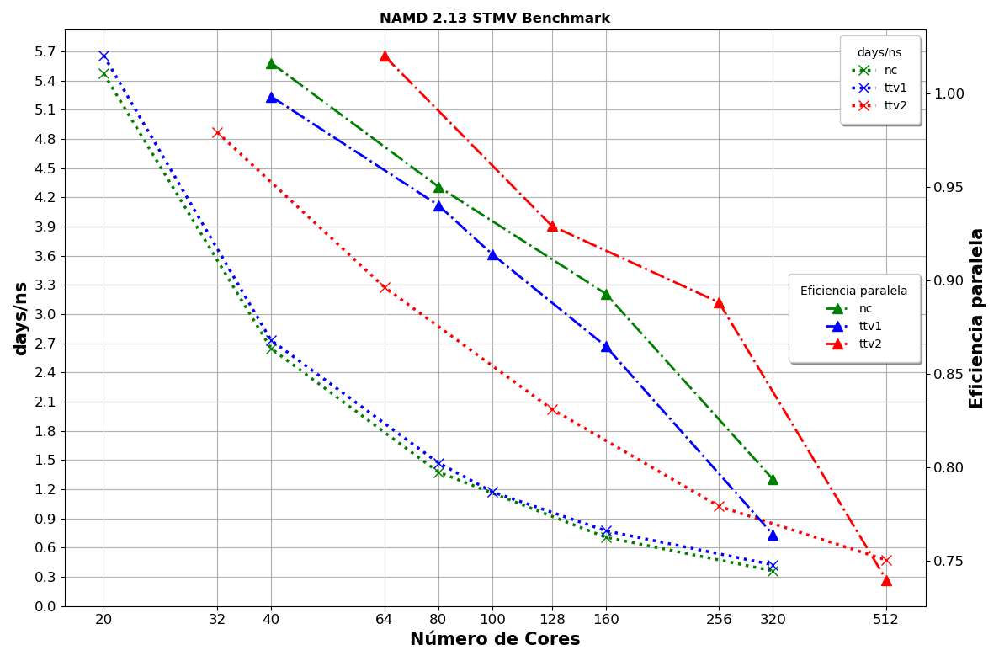
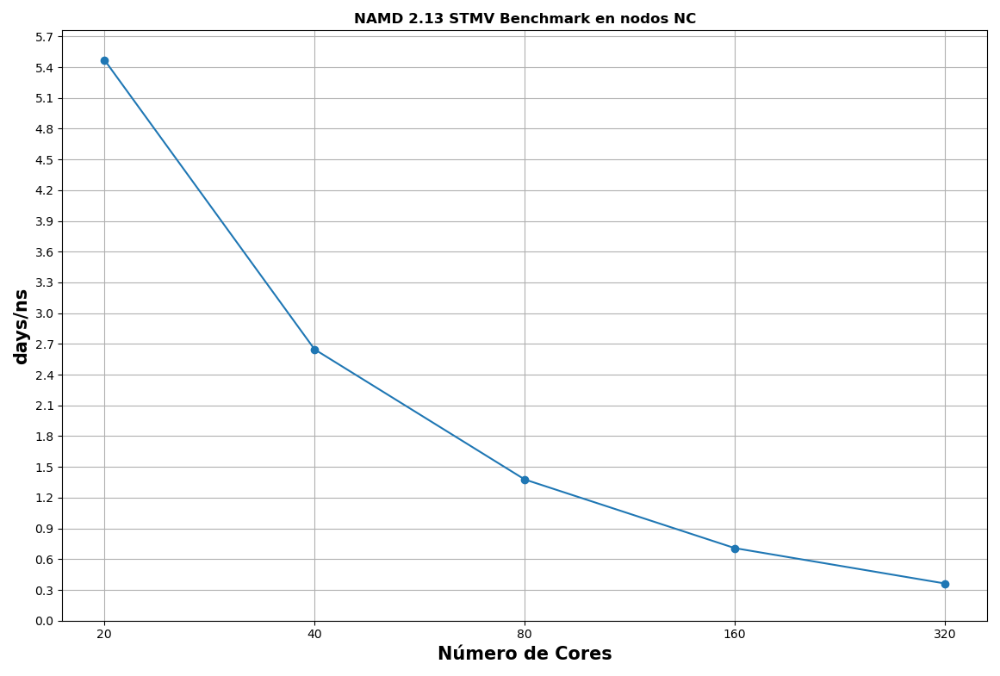
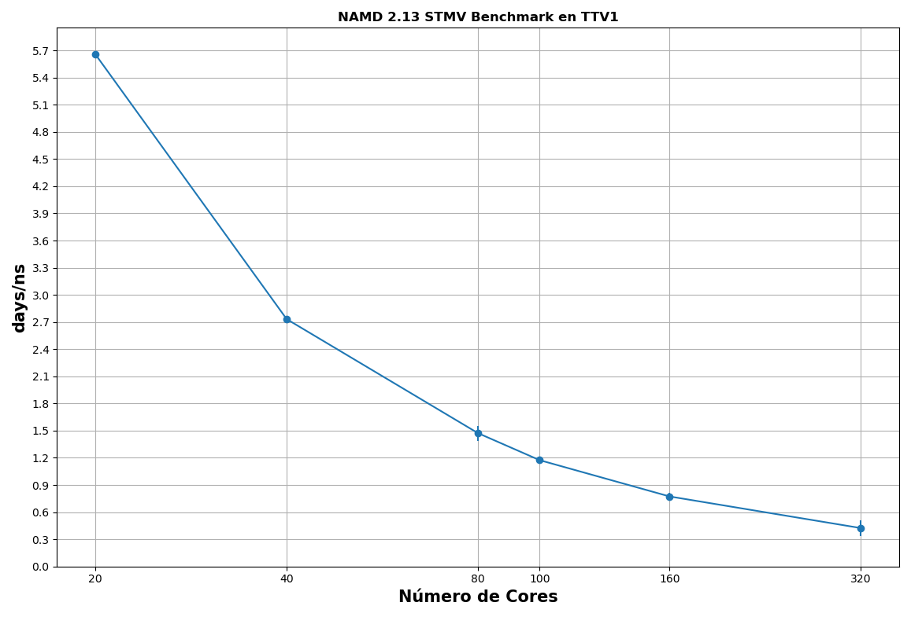
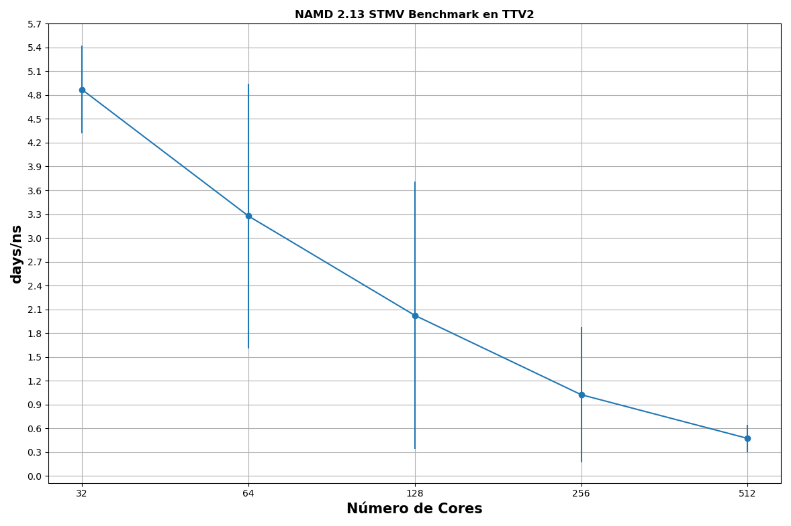
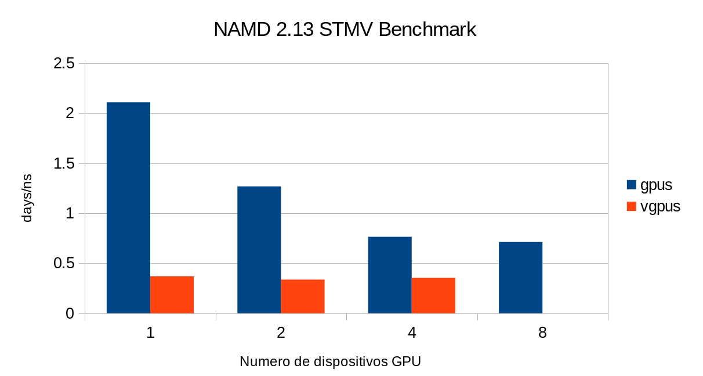
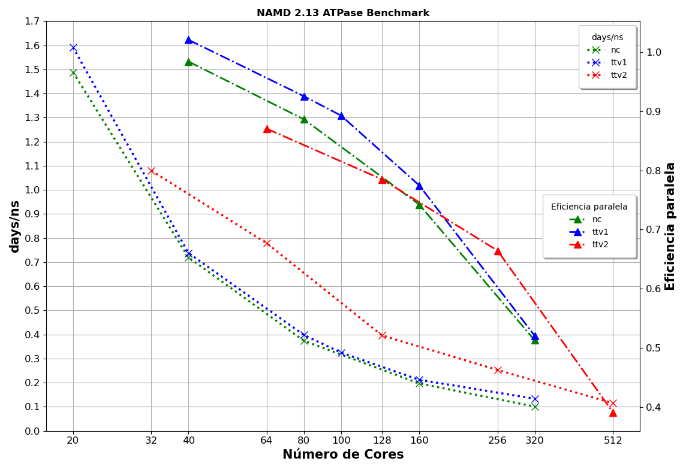
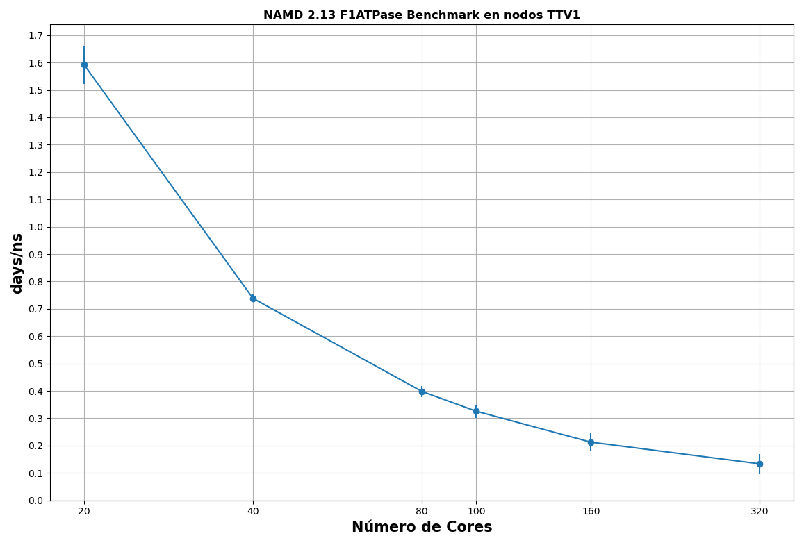
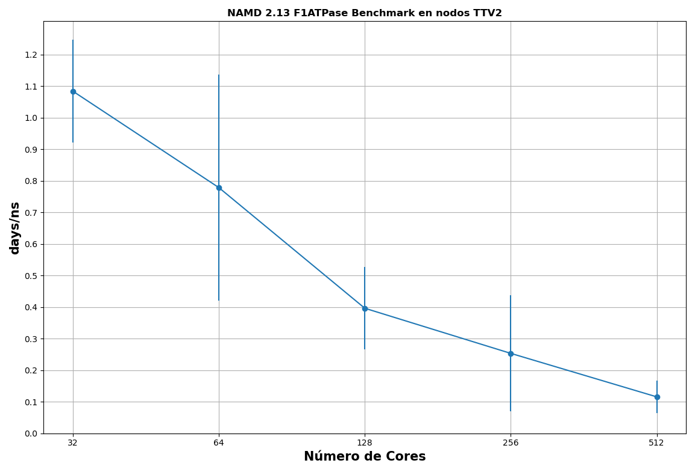
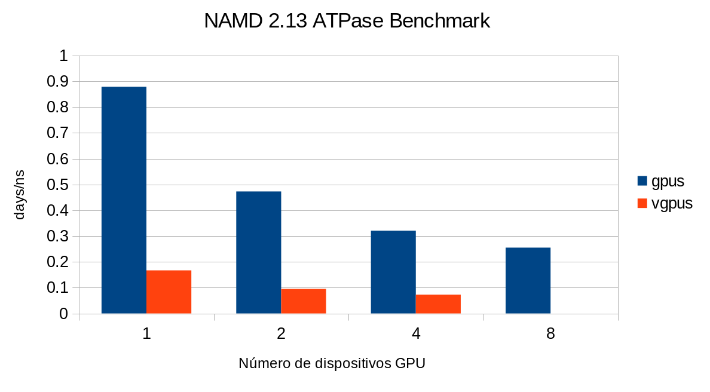

# Namd


## Descripción

NAMD, es un código de dinámica molecular paralelo diseñado para la simulación de alto rendimiento
de grandes sistemas biomoleculares. Basado en objetos paralelos *Charm++* , NAMD escala en cientos de
núcleos para simulaciones típicas y más allá de 500 000 núcleos para las simulaciones más grandes.

- NAMD utiliza el popular programa de gráficos moleculares VMD para la configuración de
  simulación y el análisis de trayectoria, pero también es compatible con archivos AMBER,
  CHARMM y X-PLOR. NAMD es distribuido de forma gratuita con el código fuente.

- Esta trabajo se realizo con NAMD 2.13.

- Benchmarks: F1-ATPase y STMV


## NAMD Performance

El rendimiento de simulación obtenido de NAMD depende de muchos factores. El protocolo de
simulación en particular que se está ejecutando es uno de los factores individuales más grandes
asociados con el rendimiento de NAMD, ya que los diferentes métodos de simulación invocan un
código diferente que puede tener costos de rendimiento sustancialmente diferentes, potencialmente con
un grado diferente de escalabilidad paralela, actividad de paso de mensajes, aceleración de hardware a
través del uso de GPU o vectorización de CPU, y otros atributos que también contribuyen al
rendimiento general de NAMD.


### Medición de desempeño

Cuando NAMD comienza a ejecutarse, realiza operaciones de E/S significativas, ajuste de FFT,
configuración de contexto de GPU y otros trabajos que no están relacionados con la actividad de
simulación normal, por lo que es importante medir el rendimiento solo cuando NAMD haya
completado el inicio y todas las unidades de procesamiento están corriendo al 100%. La mejor manera
de medir el rendimiento de NAMD es ejecutando simulaciones de NAMD con al menos 500 o 1000 pasos de
dinámica molecular, de modo que el equilibrio de carga tenga la posibilidad de realizarse varias veces,
y todas las CPU y GPU hayan aumentado hasta el 100% la velocidad de reloj.

NAMD proporciona mediciones de rendimiento en "days/ns", esto muestra la cantidad de días
de cómputo requeridos para simular 1 nanosegundo de tiempo real, es decir, cuantos menos días se
requieran, mejor.

Para estimar el rendimiento de NAMD para una simulación larga, Namd muestra
*Benchmark time:* cada cien de pasos de simulación (ver el atributo `numsteps` del archivo de entrada de
NAMD). Esta es una medida del rendimiento de NAMD después de que se hayan completado el inicio y el
equilibrio de carga inicial.

<span style="color: #990819;">*Ejemplo de salida Benchmark time*</span>

```bash
Info: Benchmark time: 20 CPUs 0.471939 s/step 5.46225 days/ns 1015.32 MB memory
```

Para este trabajo, obtenemos el rendimiento \"days/ns\" calculando el promedio de todas las salidas
\"days/ns\" presentes en *Benchmark time*.

Al final de una simulación, NAMD proporciona un resumen de los recursos utilizados.

<span style="color: #990819;">*Ejemplo de salida*</span>

```bash
WallClock: 4783.658691  CPUTime: 4783.658691  Memory: 1137.476562 MB
```

En este trabajo, para calcular su eficiencia paralela, solo nos interesa el tiempo de pared (WallClock).


### ENERGY

Las energías, junto con las temperaturas y presiones, se imprimen cada ciclo `outputEnergies` (presente en
el archivo de entrada) en una sola línea con un prefijo único
para facilitar el procesamiento con utilidades como grep y awk. El formato es el siguiente:

<span style="color: #990819;">*Formato de salida de NAMD*</span>


```bash
ETITLE:      TS           BOND          ANGLE          DIHED          IMPRP
            ELECT            VDW       BOUNDARY           MISC        KINETIC
            TOTAL           TEMP         TOTAL2         TOTAL3        TEMPAVG
        PRESSURE      GPRESSURE         VOLUME       PRESSAVG      GPRESSAVG
```

<span style="color: #990819;">*Ejemplo de salida de NAMD*</span>

```bash
.
.
ENERGY:    9997    108061.8062     81667.0452     16169.8824      1721.5431
    -1335791.0959    112556.9911         0.0000         0.0000    290465.6266
    -725148.2014       297.5422  -1015613.8280   -722543.2055       297.5422
        304.1737       161.3509   3104392.8098       304.1737       161.3509

ENERGY:    9998    108373.7883     81798.0534     16165.9493      1718.4754
    -1335967.4030    112577.6787         0.0000         0.0000    290204.5390
    -725128.9190       297.2748  -1015333.4580   -722544.8914       297.2748
        216.5664       160.7425   3104392.8098       216.5664       160.7425

ENERGY:    9999    108790.3699     81866.1842     16165.2348      1713.4982
    -1336153.5789    112590.8997         0.0000         0.0000    289924.9586
    -725102.4334       296.9884  -1015027.3920   -722547.1299       296.9884
        123.4770       159.9664   3104392.8098       123.4770       159.9664
.
.
```

Los valores de energía están en kcal/mol.Para este trabajo nos interesa el promedio del parametro
`TOTAL` que es la suma de las diversas energías potenciales y la energía `KINETIC`.


## Eficiencia paralela

La única forma confiable de ver si un trabajo escala de manera eficiente es compararlo. Comparar un
trabajo significa ejecutar un trabajo de prueba breve y representativo varias veces en diferentes
números de CPU para encontrar un punto óptimo.

A partir de estos datos, se puede calcular la **eficiencia paralela**. Esto se define cómo:

**E = (1/P) \* (T<sub>1</sub>/T<sub>P</sub>)**

- P = Numero de procesadores

- T<sub>1</sub> = tiempo óptimo para el algoritmo en un procesador

- T<sub>P</sub> = tiempo para algoritmo paralelo en P procesadores

Dado que la evaluación comparativa en un solo núcleo a menudo puede llevar mucho tiempo y
la escala dentro de un nodo es generalmente muy buena, para los propósitos del Yoltla es suficiente
hacer este cálculo por nodo, en lugar de por CPU. Para este trabajo, usaremos 1 proceso por core
disponible.

Como regla general, los trabajos que se ejecutan con una gran cantidad de núcleos deben tener
una eficiencia paralela superior o igual a 0,7.


## STMV Benchmark (Junio 2022)

STMV benchmark, 1,066,628 atoms, periodic, PME (disponible
[aquí](https://www.ks.uiuc.edu/Research/namd/utilities/)).

Los days/ns que se indican a continuación son para 10,000 pasos de dinámica molecular, que se
ejecutan en nodos completos por partición.

La simulación debe llegar a un valor `ENERGY:TOTAL` cercano a: `-2457729.98`



<span style="color: #990819;">*Figure 1. Performance STMV Benchmark.*</span>

\
Para este Benchmark vemos que después de 320 núcleos, los beneficios por solicitar más
recursos se vuelven muy marginales. Usar más recursos que esto resultará en un desperdicio.

Los datos muestran que el uso de nodos *nc* proporciona una mejor aceleración y rendimiento
que otro tipo de nodo.

<span style="color: #990819;">*Table 1. Performance STMV Benchmark*</span>
```
+---------+-------------+--------------+-------------+--------------+-------------+--------------+
| **\#    | **CPU's Nodos nc\          | **CPU's Nodos              | **CPU's Nodos              |
| Nodos** | 20 Cores x 2.50GHz Intel   | ttv1\[1-58\]\              | ttv2\[59-104\]\            |
|         | Xeón E5-2670v2\            | 20 Cores x 2.60GHz Intel   | 32 Cores x 2.10GHz Intel   |
|         | 64GB RAM\                  | Xeón E5-2660v3\            | Xeon E5-2683v4\            |
|         | Infiniband FDR10/FDR**     | 128GB RAM\                 | 256GB RAM\                 |
|         |                            | Infiniband FDR10/FDR**     | Infiniband FDR10/FDR**     |
|         +-------------+--------------+-------------+--------------+-------------+--------------+
|         | **days/ns** | **Eficiencia | **days/ns** | **Eficiencia | **days/ns** | **Eficiencia |
|         |             | Paralela %** |             | Paralela %** |             | Paralela %** |
+---------+-------------+--------------+-------------+--------------+-------------+--------------+
| 1       | 5.471       | 100 %        | 5.658       | 100 %        | 4.870       | 100 %        |
+---------+-------------+--------------+-------------+--------------+-------------+--------------+
| 2       | 2.647       | 100 %        | 2.732       | 98 %         | 3.276       | 99 %         |
+---------+-------------+--------------+-------------+--------------+-------------+--------------+
| 4       | 1.377       | 95 %         | 1.472       | 94 %         | 2.024       | 92 %         |
+---------+-------------+--------------+-------------+--------------+-------------+--------------+
| 5       |             |              | 1.174       | 91 %         |             |              |
+---------+-------------+--------------+-------------+--------------+-------------+--------------+
| 8       | 0.707       | 89 %         | 0.773       | 86 %         | 1.024       | 88 %         |
+---------+-------------+--------------+-------------+--------------+-------------+--------------+
| 16      | 0.362       | 79 %         | 0.424       | 76 %         | 0.473       | 73 %         |
+---------+-------------+--------------+-------------+--------------+-------------+--------------+
```


### Performance STMV Benchmark en nodos NC



<span style="color: #990819;">*Figure 2. Performance STMV Benchmark en nodos NC.*</span>

\
<span style="color: #990819;">*Table 2. Performance STMV Benchmark en nodos nc*</span>
```
+---------+---------------+---------------+---------------+---------------+---------------+---------------+
| **\#    | **CPU's Nodos nc\                                                                             |
| Nodos** | 20 Cores x 2.50GHz Intel Xeón E5-2670v2\                                                      |
|         | 64GB RAM\                                                                                     |
|         | Infiniband FDR10/FDR**                                                                        |
|         +---------------+---------------------------------------------------------------+---------------+
|         | **No.         | **days/ns**                                                   | **Wallclock   |
|         | Ejecuciones** |                                                               | (s)           |
|         |               |                                                               | Promedio**    |
|         |               +---------------+---------------+---------------+---------------+               |
|         |               | **Promedio**  | **Mínimo**    | **Máximo**    | **Desviación  |               |
|         |               |               |               |               | Estándar**    |               |
+---------+---------------+---------------+---------------+---------------+---------------+---------------+
| 1       | 20            | 5.471         | 5.419         | 5.519         | 0.0300        | 4816          |
+---------+---------------+---------------+---------------+---------------+---------------+---------------+
| 2       | 20            | 2.640         | 2.627         | 2.654         | 0.0096        | 2369          |
+---------+---------------+---------------+---------------+---------------+---------------+---------------+
| 4       | 20            | 1.375         | 1.363         | 1.413         | 0.0157        | 1304          |
+---------+---------------+---------------+---------------+---------------+---------------+---------------+
| 8       | 20            | 0.707         | 0.699         | 0.713         | 0.0054        | 680           |
+---------+---------------+---------------+---------------+---------------+---------------+---------------+
| 16      | 20            | 0.361         | 0.358         | 0.364         | 0.0026        | 391           |
+---------+---------------+---------------+---------------+---------------+---------------+---------------+
```


### Performance STMV Benchmark en nodos TTV1



<span style="color: #990819;">*Figure 3. Performance STMV Benchmark en nodos TTV1.*</span>

\
<span style="color: #990819;">*Table 3. Performance STMV Benchmark en nodos ttv1*</span>
```
+---------+---------------+---------------+---------------+---------------+---------------+---------------+
| **\#    | **CPU's Nodos ttv1\                                                                           |
| Nodos** | 20 Cores x 2.60GHz Intel Xeón E5-2660v3\                                                      |
|         | 128GB RAM\                                                                                    |
|         | Infiniband FDR10/FDR**                                                                        |
|         +---------------+---------------------------------------------------------------+---------------+
|         | **No.         | **days/ns**                                                   | **Wallclock   |
|         | Ejecuciones** |                                                               | (s)           |
|         |               |                                                               | Promedio**    |
|         |               +---------------+---------------+---------------+---------------+               |
|         |               | **Promedio**  | **Mínimo**    | **Máximo**    | **Desviación  |               |
|         |               |               |               |               | Estándar**    |               |
+---------+---------------+---------------+---------------+---------------+---------------+---------------+
| 1       | 20            | 5.658         | 5.627         | 5.696         | 0.0246        | 4860.62       |
+---------+---------------+---------------+---------------+---------------+---------------+---------------+
| 2       | 20            | 2.732         | 2.724         | 2.740         | 0.0080        | 2433.665      |
+---------+---------------+---------------+---------------+---------------+---------------+---------------+
| 4       | 20            | 1.472         | 1.376         | 1.702         | 0.0814        | 1292.24       |
+---------+---------------+---------------+---------------+---------------+---------------+---------------+
| 5       | 20            | 1.174         | 1.117         | 1.249         | 0.0336        | 1063.44       |
+---------+---------------+---------------+---------------+---------------+---------------+---------------+
| 8       | 20            | 0.773         | 0.735         | 0.869         | 0.0417        | 702.53        |
+---------+---------------+---------------+---------------+---------------+---------------+---------------+
| 16      | 20            | 0.424         | 0.380         | 0.660         | 0.0842        | 397.65        |
+---------+---------------+---------------+---------------+---------------+---------------+---------------+
```


### Performance STMV Benchmark en nodos TTV2



<span style="color: #990819;">*Figure 4. Performance STMV Benchmark en nodos TTV2.*</span>

\
<span style="color: #990819;">*Table 4. Performance STMV Benchmark en nodos ttv2*</span>
```
+---------+---------------+---------------+---------------+---------------+---------------+---------------+
| **\#    | **CPU's Nodos ttv2\                                                                           |
| Nodos** | 32 Cores x 2.10GHz Intel Xeon E5-2683v4\                                                      |
|         | 256GB RAM\                                                                                    |
|         | Infiniband FDR10/FDR**                                                                        |
|         +---------------+---------------------------------------------------------------+---------------+
|         | **No.         | **days/ns**                                                   | **Wallclock   |
|         | Ejecuciones** |                                                               | (s)           |
|         |               |                                                               | Promedio**    |
|         |               +---------------+---------------+---------------+---------------+               |
|         |               | **Promedio**  | **Mínimo**    | **Máximo**    | **Desviación  |               |
|         |               |               |               |               | Estándar**    |               |
+---------+---------------+---------------+---------------+---------------+---------------+---------------+
| 1       | 20            | 4.870         | 3.769         | 5.160         | 0.5509        | 4519.31       |
+---------+---------------+---------------+---------------+---------------+---------------+---------------+
| 2       | 20            | 3.276         | 2.486         | 7.662         | 1.6676        | 2214.67       |
+---------+---------------+---------------+---------------+---------------+---------------+---------------+
| 4       | 20            | 2.024         | 1.305         | 7.994         | 1.6832        | 1215.76       |
+---------+---------------+---------------+---------------+---------------+---------------+---------------+
| 8       | 20            | 1.024         | 0.637         | 3.881         | 0.8495        | 636.0         |
+---------+---------------+---------------+---------------+---------------+---------------+---------------+
| 16      | 20            | 0.473         | 0.326         | 0.987         | 0.1744        | 381.91        |
+---------+---------------+---------------+---------------+---------------+---------------+---------------+
```


### STMV: Múltiples dispositivos GPU en un solo nodo

Evaluación comparativa de STMV Benchmark en un solo nodo con equipos Tesla K20 y V100, con NAMD 2.13.
Las ejecuciones utilizaron todos los núcleos físicos y 2, 4 u 8 dispositivos GPU en el nodo.



<span style="color: #990819;">*Figure 5. Performance STMV Benchmark en GPUS.*</span>

La ejecución en un nodo de GPU K20 (1 GPU, 20 núcleos físicos) brinda aproximadamente el mismo
rendimiento que 2 nodos nc (40 núcleos físicos). La ejecución con 4 dispositivos GPU (+ 20 núcleos
físicos) ofrece aproximadamente el mismo rendimiento que en 8 nodos nc (160 núcleos físicos).

Los resultados muestran que el rendimiento de usar 1 GPU V100 es 6 veces mejor que 1 GPU
K20. Utilizar más de una GPU V100 para este Benchmark es ineficiente.

<span style="color: #990819;">*Table 5. Performance STMV Benchmark en GPUS.*</span>
```
+-------------+---------------+---------------+---------------+---------------+
| **\# GPU    | **Nodos GPUS Tesla K20\       | **Nodos GPUS V100\            |
| devices**   | 20 Cores\                     | 36 Cores\                     |
|             | 64GB RAM\                     | 256GB RAM\                    |
|             | Infiniband FDR10/FDR**        | Infiniband FDR10/FDR**        |
+-------------+---------------+---------------+---------------+---------------+
|             | **days/ns**   | **WallClock   | **days/ns**   | **WallClock   |
|             |               | (s)**         |               | (s)**         |
+-------------+---------------+---------------+---------------+---------------+
| 1           | 2.119         | 1938          | 0.368         | 392           |
+-------------+---------------+---------------+---------------+---------------+
| 2           | 1.287         | 1171          | 0.336         | 373           |
+-------------+---------------+---------------+---------------+---------------+
| 4           | 0.764         | 745           | 0.353         | 391           |
+-------------+---------------+---------------+---------------+---------------+
| 8           | 0.712         | 684           |               |               |
+-------------+---------------+---------------+---------------+---------------+
```


## F1-ATPase Benchmark (Junio 2022)

F1ATPase benchmark, 327,506 atoms, periodic, PME (disponible
[aquí](https://www.ks.uiuc.edu/Research/namd/utilities/)).

Los days/ns que se indican a continuación son para 10,000 pasos de dinámica molecular, que se
ejecutan en nodos completos por partición.

La simulación debe llegar a un valor `ENERGY:TOTAL` cercano a: `-725159.11`



<span style="color: #990819;">*Figure 6. Performance F1ATPase Benchmark.*</span>

El gráfico de eficiencia muestra que para un sistema molecular pequeño como ATPase, la
eficiencia cae por debajo del 70 % después de 8 nodos, siendo el valor ideal entre 160 y 256 cores para
su ejecución.

Los datos muestran que el uso de nodos *nc* proporciona un mejor rendimiento en las distintas
particiones de nodos presentes en Yoltla.

<span style="color: #990819;">*Table 6. Performance F1ATPase Benchmark*</span>
```
+---------+-------------+--------------+-------------+--------------+-------------+--------------+
| **\#    | **CPU's Nodos nc\          | **CPU's Nodos              | **CPU's Nodos              |
| Nodos** | 20 Cores x 2.50GHz Intel   | ttv1\[1-58\]\              | ttv2\[59-104\]\            |
|         | Xeón E5-2670v2\            | 20 Cores x 2.60GHz Intel   | 32 Cores x 2.10GHz Intel   |
|         | 64GB RAM\                  | Xeón E5-2660v3\            | Xeon E5-2683v4\            |
|         | Infiniband FDR10/FDR**     | 128GB RAM\                 | 256GB RAM\                 |
|         |                            | Infiniband FDR10/FDR**     | Infiniband FDR10/FDR**     |
|         +-------------+--------------+-------------+--------------+-------------+--------------+
|         | **days/ns** | **Eficiencia | **days/ns** | **Eficiencia | **days/ns** | **Eficiencia |
|         |             | Paralela %** |             | Paralela %** |             | Paralela %** |
+---------+-------------+--------------+-------------+--------------+-------------+--------------+
| 1       | 1.487       | 100 %        | 1.591       | 100 %        | 1.083       | 100 %        |
+---------+-------------+--------------+-------------+--------------+-------------+--------------+
| 2       | 0.715       | 98 %         | 0.738       | 100 %        | 0.778       | 87 %         |
+---------+-------------+--------------+-------------+--------------+-------------+--------------+
| 4       | 0.374       | 88 %         | 0.398       | 92 %         | 0.396       | 78 %         |
+---------+-------------+--------------+-------------+--------------+-------------+--------------+
| 5       |             |              | 0.325       | 89 %         |             |              |
+---------+-------------+--------------+-------------+--------------+-------------+--------------+
| 8       | 0.197       | 74 %         | 0.212       | 77 %         | 0.253       | 66 %         |
+---------+-------------+--------------+-------------+--------------+-------------+--------------+
| 16      | 0.101       | 51 %         | 0.133       | 52 %         | 0.115       | 39 %         |
+---------+-------------+--------------+-------------+--------------+-------------+--------------+
```


### Performance F1-ATPase Benchmark en nodos NC


<span style="color: #990819;">*Figure 7. Performance F1ATPase Benchmark en nodos NC.*</span>

\
<span style="color: #990819;">*Table 7. Performance F1ATPase Benchmark en nodos nc*</span>
```
+---------+---------------+---------------+---------------+---------------+---------------+---------------+
| **\#    | **CPU's Nodos nc\                                                                             |
| Nodos** | 20 Cores x 2.50GHz Intel Xeón E5-2670v2\                                                      |
|         | 64GB RAM\                                                                                     |
|         | Infiniband FDR10/FDR**                                                                        |
|         +---------------+---------------------------------------------------------------+---------------+
|         | **No.         | **days/ns**                                                   | **Wallclock   |
|         | Ejecuciones** |                                                               | (s)           |
|         |               |                                                               | Promedio**    |
|         |               +---------------+---------------+---------------+---------------+               |
|         |               | **Promedio**  | **Mínimo**    | **Máximo**    | **Desviación  |               |
|         |               |               |               |               | Estándar**    |               |
+---------+---------------+---------------+---------------+---------------+---------------+---------------+
| 1       | 20            | 1.488         | 1.482         | 1.497         | 0.004         | 1335.32       |
+---------+---------------+---------------+---------------+---------------+---------------+---------------+
| 2       | 20            | 0.720         | 0.711         | 0.782         | 0.016         | 678.47        |
+---------+---------------+---------------+---------------+---------------+---------------+---------------+
| 4       | 20            | 0.374         | 0.372         | 0.382         | 0.002         | 376.60        |
+---------+---------------+---------------+---------------+---------------+---------------+---------------+
| 8       | 20            | 0.197         | 0.195         | 0.201         | 0.002         | 224.89        |
+---------+---------------+---------------+---------------+---------------+---------------+---------------+
| 16      | 20            | 0.101         | 0.101         | 0.102         | 0.0002        | 162.74        |
+---------+---------------+---------------+---------------+---------------+---------------+---------------+
```


### Performance F1-ATPase Benchmark en nodos TTV1



<span style="color: #990819;">*Figure 8. Performance F1ATPase Benchmark en nodos TTV1.*</span>

\
<span style="color: #990819;">*Table 8. Performance F1ATPase Benchmark en nodos ttv1*</span>
```
+---------+---------------+---------------+---------------+---------------+---------------+---------------+
| **\#    | **CPU's Nodos ttv1\                                                                           |
| Nodos** | 20 Cores x 2.60GHz Intel Xeón E5-2660v3\                                                      |
|         | 128GB RAM\                                                                                    |
|         | Infiniband FDR10/FDR**                                                                        |
|         +---------------+---------------------------------------------------------------+---------------+
|         | **No.         | **days/ns**                                                   | **Wallclock   |
|         | Ejecuciones** |                                                               | (s)           |
|         |               |                                                               | Promedio**    |
|         |               +---------------+---------------+---------------+---------------+               |
|         |               | **Promedio**  | **Mínimo**    | **Máximo**    | **Desviación  |               |
|         |               |               |               |               | Estándar**    |               |
+---------+---------------+---------------+---------------+---------------+---------------+---------------+
| 1       | 20            | 1.591         | 1.527         | 1.677         | 0.069         | 1433.37       |
+---------+---------------+---------------+---------------+---------------+---------------+---------------+
| 2       | 20            | 0.738         | 0.727         | 0.762         | 0.013         | 702.08        |
+---------+---------------+---------------+---------------+---------------+---------------+---------------+
| 4       | 20            | 0.398         | 0.377         | 0.461         | 0.020         | 387.20        |
+---------+---------------+---------------+---------------+---------------+---------------+---------------+
| 5       | 20            | 0.325         | 0.307         | 0.404         | 0.024         | 321.12        |
+---------+---------------+---------------+---------------+---------------+---------------+---------------+
| 8       | 20            | 0.212         | 0.198         | 0.322         | 0.031         | 231.30        |
+---------+---------------+---------------+---------------+---------------+---------------+---------------+
| 16      | 20            | 0.133         | 0.102         | 0.198         | 0.036         | 172.10        |
+---------+---------------+---------------+---------------+---------------+---------------+---------------+
```


### Performance F1-ATPase Benchmark en nodos TTV2



<span style="color: #990819;">*Figure 9. Performance F1ATPase Benchmark en nodos TTV2.*</span>

\
<span style="color: #990819;">*Table 9. Performance F1ATPase Benchmark en nodos ttv2*</span>
```
+---------+---------------+---------------+---------------+---------------+---------------+---------------+
| **\#    | **CPU's Nodos ttv2\                                                                           |
| Nodos** | 32 Cores x 2.10GHz Intel Xeon E5-2683v4\                                                      |
|         | 256GB RAM\                                                                                    |
|         | Infiniband FDR10/FDR**                                                                        |
|         +---------------+---------------------------------------------------------------+---------------+
|         | **No.         | **days/ns**                                                   | **Wallclock   |
|         | Ejecuciones** |                                                               | (s)           |
|         |               |                                                               | Promedio**    |
|         |               +---------------+---------------+---------------+---------------+               |
|         |               | **Promedio**  | **Mínimo**    | **Máximo**    | **Desviación  |               |
|         |               |               |               |               | Estándar**    |               |
+---------+---------------+---------------+---------------+---------------+---------------+---------------+
| 1       | 20            | 1.083         | 0.982         | 1.365         | 0.162         | 1089.27       |
+---------+---------------+---------------+---------------+---------------+---------------+---------------+
| 2       | 20            | 0.778         | 0.567         | 1.919         | 0.358         | 625.69        |
+---------+---------------+---------------+---------------+---------------+---------------+---------------+
| 4       | 20            | 0.396         | 0.294         | 0.884         | 0.130         | 346.98        |
+---------+---------------+---------------+---------------+---------------+---------------+---------------+
| 8       | 20            | 0.253         | 0.168         | 0.961         | 0.183         | 204.90        |
+---------+---------------+---------------+---------------+---------------+---------------+---------------+
| 16      | 20            | 0.115         | 0.087         | 0.327         | 0.051         | 174.03        |
+---------+---------------+---------------+---------------+---------------+---------------+---------------+
```


### F1-ATPase: Múltiples dispositivos GPU en un solo nodo

Evaluación comparativa de F1-ATPase en un solo nodo con equipos Tesla K20 y V100, con NAMD
2.13. Las ejecuciones utilizaron todos los núcleos físicos y 1, 2, 4 u 8 dispositivos GPU en el nodo.



<span style="color: #990819;">*Figure 10. Performance ATPase Benchmark en GPUS.*</span>

La ejecución con 1 dispositivos GPU V100 (+ 36 núcleos físicos) ofrece un rendimiento similar que 8
nodos en los tres tipos de nodo.

Los resultados muestran que el rendimiento de usar 4 GPU V100 es superior a 512 procesos de
nodos ttv2.

<span style="color: #990819;">*Table 10. Performance ATPase Benchmark en GPUS.*</span>
```
+-------------+---------------+---------------+---------------+---------------+
| **\# GPU    | **Nodos GPUS Tesla K20\       | **Nodos GPUS V100\            |
| devices**   | 20 Cores\                     | 36 Cores\                     |
|             | 64GB RAM\                     | 256GB RAM\                    |
|             | Infiniband FDR10/FDR**        | Infiniband FDR10/FDR**        |
+-------------+---------------+---------------+---------------+---------------+
|             | **days/ns**   | **WallClock   | **days/ns**   | **WallClock   |
|             |               | (s)**         |               | (s)**         |
+-------------+---------------+---------------+---------------+---------------+
| 1           | 0.879         | 802           | 0.167         | 147           |
+-------------+---------------+---------------+---------------+---------------+
| 2           | 0.473         | 458           | 0.095         | 193           |
+-------------+---------------+---------------+---------------+---------------+
| 4           | 0.321         | 312           | 0.073         | 135           |
+-------------+---------------+---------------+---------------+---------------+
| 8           | 0.255         | 278           |               |               |
+-------------+---------------+---------------+---------------+---------------+
```


## Referencias

[NAMD Benchmarks](https://www.ks.uiuc.edu/Research/namd/utilities/)

[NAMD Performance](https://www.ks.uiuc.edu/Research/namd/2.13/ug/node91.html)

[NAMD Standard Output](http://www.ks.uiuc.edu/Training/Tutorials/namd/namd-tutorial-win-html/node28.html)

[Satellite Tobacco Mosaic Virus (STMV)](https://www.ks.uiuc.edu/Research/STMV/#stmv)

[ATP hydrolysis in F1-ATPase](https://www.ks.uiuc.edu/Research/atp_hydrolysis/)
