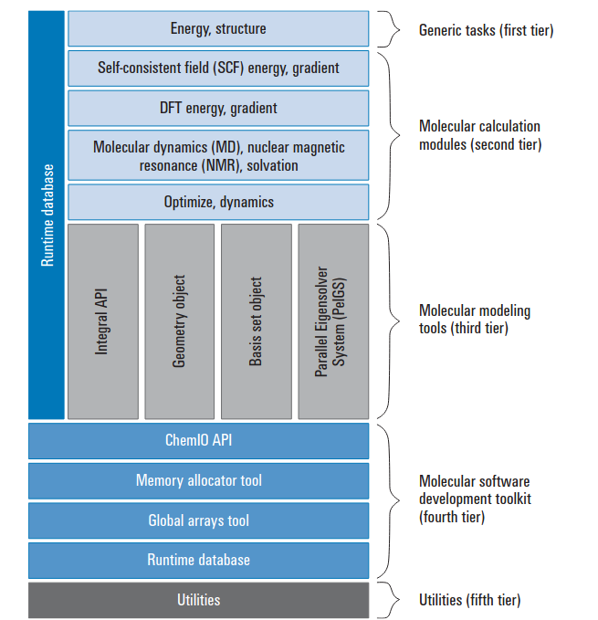
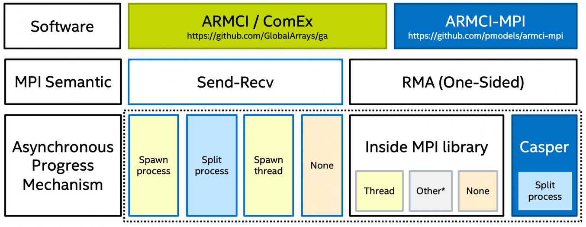
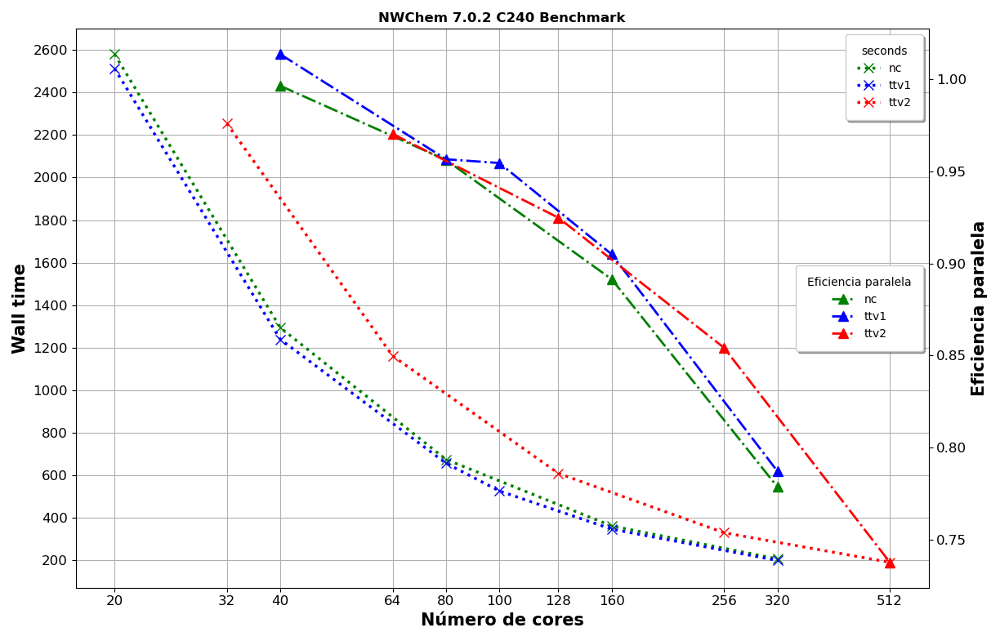
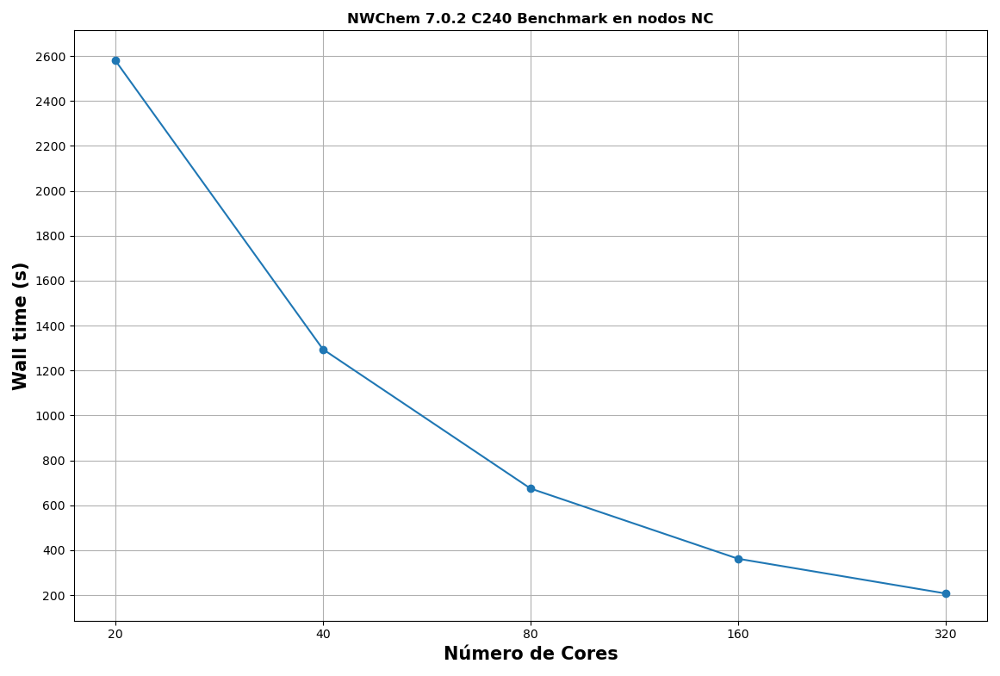
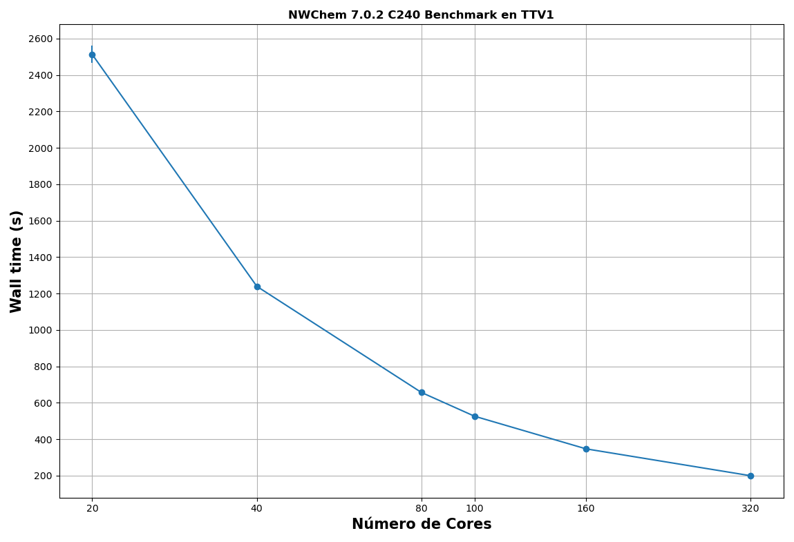
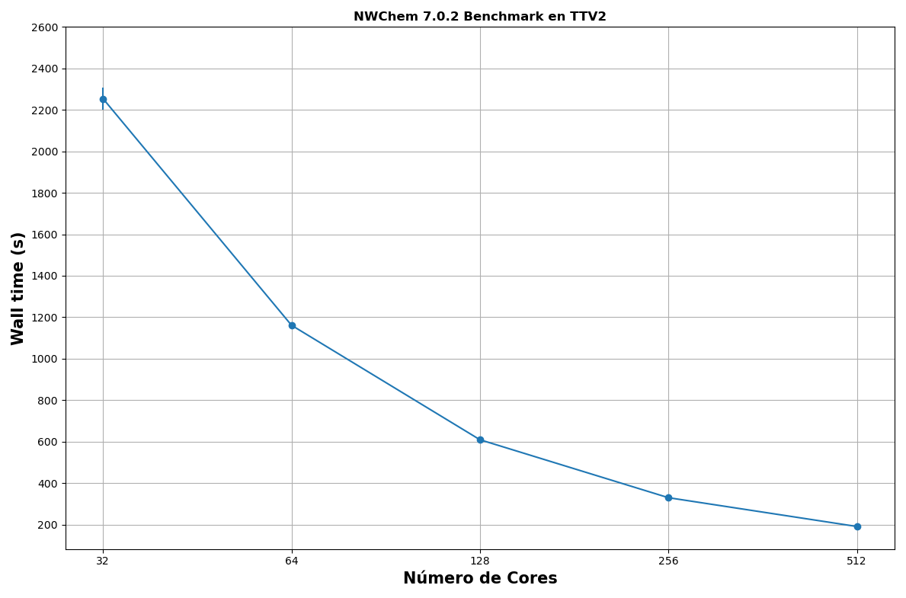
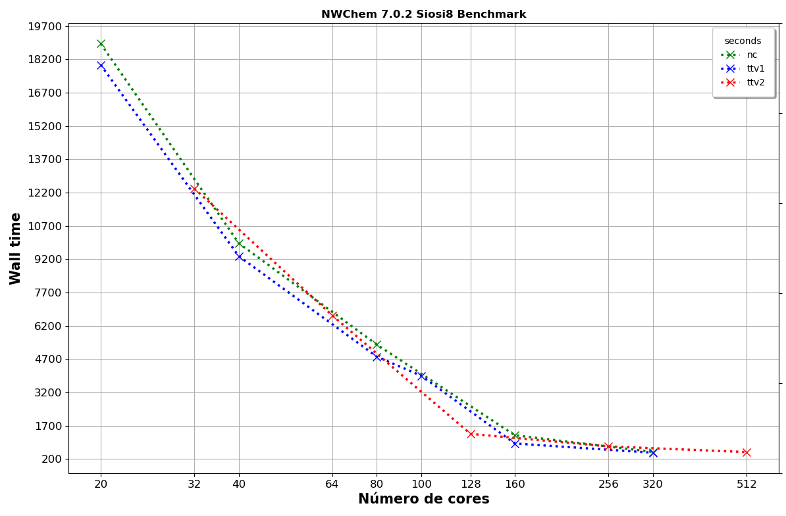

# Descripción

El software [NWChem](https://www.nwchem-sw.org/) contiene herramientas de química computacional que son
escalables tanto en su capacidad para tratar de manera eficiente grandes problemas científicos como en
el uso de los recursos informáticos disponibles, desde supercomputadoras paralelas de alto rendimiento
hasta clústeres de estaciones de trabajo convencionales.

- NWChem puede manejar:

  - Quimica cuántica o clásico, y todas las combinaciones.

  - Biomoléculas, nanoestructuras y estados solidos.

  - Estados fundamentales y excitados.

  - Funciones de base gaussianas u ondas planas.

  - Escalado de uno a miles de procesadores.

  - Propiedades y efectos relativistas.

- Esta trabajo se realizo con `NWChem` 7.0.2.

- Benchmarks: C240, Siosi8.

# Arquitectura de NWChem

Las simulaciones de dinámica molecular como `NWChem` son una herramienta importante en el estudio y diseño
racional de sistemas y materiales moleculares, proporcionando información sobre el comportamiento de los
sistemas químicos que puede ser difícil de obtener por otros medios. Se requieren recursos
computacionales considerables incluso para sistemas moleculares pequeños, que tienen decenas de miles de
átomos y períodos de simulación cortos en el rango de nanosegundos.

<span style="color: #990819;">*Figure 1. Arquitectura de NWChem*</span>



`NWChem` tiene una arquitectura modular de cinco niveles (Imagen 1). La aplicación incorpora varios
módulos y kits de herramientas existentes en varios niveles de la arquitectura debido a su adherencia a
los conceptos de programación orientada a objetos. Los cinco niveles son los siguientes.

- **Generic tasks**: En el primer nivel, la interfaz `NWChem` procesa la entrada, configura el entorno
  paralelo y realiza cualquier inicialización necesaria para los cálculos deseados. Este nivel sirve
  básicamente como el mecanismo que transfiere el control a los diferentes módulos en el segundo nivel.

- **Molecular calculation modules**: En el segundo nivel, estos módulos de programación de alto nivel
  realizan tareas computacionales, realizando operaciones particulares utilizando las teorías
  especificadas definidas por la entrada. Cada módulo de esta capa utiliza kits de herramientas y rutinas
  que residen en las capas inferiores de la arquitectura para realizar sus tareas. Estos módulos `NWChem`
  son independientes y comparten datos solo a través de una base de datos residente en disco, lo que
  permite que los módulos compartan datos o compartan acceso a archivos que contienen datos.

- **Molecular Modeling tools**: El tercer nivel contiene herramientas que brindan una funcionalidad básica
  común a muchos de los algoritmos utilizados en el campo de la química. Estos incluyen simetría,
  conjuntos básicos, cuadrículas, geometría e integrales.

- **Molecular software development toolkit**: Este conjunto de herramientas de cuarto nivel constituye el
  nivel básico de la estructura de cinco niveles del código NWChem y permite el desarrollo de un código
  orientado a objetos que se construye principalmente en Fortran77.

- **Utilities**: En el nivel más bajo de la arquitectura de NWChem, el quinto nivel contiene varias
  funciones básicas de probabilidades, incluidas las rutinas de utilidad que requieren la mayoría de los
  niveles superiores. Los ejemplos incluyen las rutinas de temporización, el analizador de entrada y las
  rutinas de impresión.

## Optimizables/No Optimizables

Hay una serie de parámetros ajustables que afectan el rendimiento de `NWChem`. Uno de ellos es la
biblioteca `MPI` utilizada y cómo *Global Arrays* usa `MPI`. A diferencia de muchos códigos HPC, *Global Arrays*
se basa en un modelo de comunicación unilateral, no en el paso de mensajes, y por lo tanto es sensible a
los detalles de implementación, como RDMA (Remote direct memory access) y progreso asincrónico
(Asynchronous Progress Support for MPI). Otro tema clave es la configuración de ejecución en paralelo.
`NWChem` a menudo funciona bien con paralelismo `MPI`, aunque con un mayor número de núcleos y/o capacidades
de memoria más pequeñas, una combinación de `MPI` y `OpenMP` puede mejorar el rendimiento de algunos módulos.

`NWChem` emplea Global Arrays (`GA`) como modelo de programación unilateral subyacente. GA proporciona una
vista del espacio de direcciones global de los espacios de direcciones distribuidos de diferentes
procesos. La interfaz de copia de memoria remota agregada (Aggregate Remote Memory Copy Interfac-ARMCI)
es la herramienta principal de comunicación que proporciona la funcionalidad de acceso a memoria
remota utilizada por `GA`.

La siguiente imagen (Imagen 2) contiene detalles de lo que sucede dentro de *Global Arrays*.

<span style="color: #990819;">*Figure 2. Asignación de ARMCI a MPI*</span>



- Hay dos implementaciones de la API ARMCI: la biblioteca ARMCI/ComEx distribuida con Global Arrays y
  la biblioteca ARMCI MPI distribuida por separado.

- Global Arrays puede usar Send-Recv o RMA (comunicación unilateral) internamente para implementar sus
  operaciones unilaterales.

- El rendimiento de diferentes bibliotecas MPI puede variar significativamente según los patrones de
  comunicación en NWChem. La elección de la biblioteca MPI es un parámetro ajustable importante para
  NWChem.

## Valor de ARMCI_DEFAULT_SHMMAX

Algunos valores de ARMCI_NETWORK dependen del valor `ARMCI_DEFAULT_SHMMAX` para grandes
asignaciones de memoria global. Recomendamos un valor de, al menos, 2048, por ejemplo:

```bash
  export ARMCI_DEFAULT_SHMMAX=2048
```  

Para que `ARMCI_DEFAULT_SHMMAX=2048` funcione, es necesario que el parámetro `kernel.shmmax` del kernel
sea mayor que 2147483648. Puede comprobar el valor actual de `kernel.shmmax` en su sistema escribiendo

```bash
  sysctl kernel.shmmax
```  

## Valor de Memory

`memory` es una directiva de inicio que permite al usuario especificar la cantidad de memoria
**POR NÚCLEO DE PROCESADOR** que NWChem puede usar para el trabajo. Si no se especifica esta directiva,
la memoria se asigna de acuerdo con los valores predeterminados que dependen de la instalación.
Los valores predeterminados generalmente deberían ser suficientes para la mayoría de los cálculos,
ya que los valores predeterminados generalmente corresponden a la cantidad total de memoria disponible
en la máquina.

`NWChem` reconoce las siguientes unidades de memoria:

- byte

- kb (kilobytes)

- mb (megabytes)

- mw (megawords, 64-bit word)

En la mayoría de los casos, el usuario necesita especificar solo el límite de memoria `total` para ajustar
la cantidad de memoria utilizada por NWChem.

```bash
  memory total 8 mb
  memory total 1048576
  memory total 1 gb
```  

En `NWChem` hay tres regiones distintas de memoria: `stack`, `heap`, and `global`. `stack` y `heap`
son privados para el nodo, mientras que `global` se usa para proporcionar memoria compartida globalmente.

Para este trabajo definimos una memoria `total` para cada simulación y optamos por una configuración
automática de `NWChem`. Más información en
[MEMORY](https://nwchemgit.github.io/Memory.html)

# NWChem Performance

NWChem no tiene una variable de performance como tal, en cambio muestra estadísticas de recursos
utilizados como el tiempo de cpu o memoria utilizada. Para este trabajo, para medir el performance y la eficiencia
paralela de `NWChem`, usaremos el tiempo de pared (`Wall time (s)`).

<span style="color: #990819;">*Ejemplo de salida de NWChem*</span>

```bash
                            GA Statistics for process    0
                            ------------------------------

          create   destroy   get      put      acc     scatter   gather  read&inc
  calls:  225      225     6.69e+06 1.19e+05 4.14e+06    0        0     1.27e+05
  number of processes/call 1.95e+01 1.14e+03 1.54e+01 0.00e+00 0.00e+00
  bytes total:             7.37e+10 6.06e+09 2.23e+10 0.00e+00 0.00e+00 1.02e+06
  bytes remote:            6.22e+10 1.87e+09 1.91e+10 0.00e+00 0.00e+00 0.00e+00
  Max memory consumed for GA by this process: 798445600 bytes

  MA_summarize_allocated_blocks: starting scan ...
  MA_summarize_allocated_blocks: scan completed: 0 heap blocks, 0 stack blocks
  MA usage statistics:

          allocation statistics:
                                                heap           stack
                                                ----           -----
          current number of blocks                 0               0
          maximum number of blocks                27              54
          current total bytes                      0               0
          maximum total bytes              675211384       406780120
          maximum total K-bytes               675212          406781
          maximum total M-bytes                  676             407


    Total times  cpu:    18836.5s     wall:    18899.4s
```

## Total DFT energy

`NWChem` muestra las energías
[DFT](https://nwchemgit.github.io/Density-Functional-Theory-for-Molecules.html)
totales en el nivel teórico
[LDA](https://en.wikipedia.org/wiki/Local-density_approximation)
para muchos sistemas atómicos, diatómicos y triatómicos homonucleares en las filas 1-4 de la tabla
periódica.

<span style="color: #990819;">*Ejemplo de salida de NWChem*</span>
Ejemplo de salida de NWChem

```bash
  .
  .

            Total DFT energy =    -9136.856741735493
        One electron energy =  -155556.626666359807
              Coulomb energy =    75980.853124940360
      Exchange-Corr. energy =    -1292.397954070615
    Nuclear repulsion energy =    71731.314753754574

    Numeric. integr. density =     1439.999946966567

        Total iterative time =   2406.8s


  .
  .
```

Por default `NWChem` busca llegar a un nivel de convergencia. Pero esto no siempre es posible y se puede
presentar el siguiente error:

```bash
      Calculation failed to converge
      ------------------------------
```
De forma predeterminada, el programa finaliza cuando una tarea no se completa correctamente. La palabra
clave `ignore` se puede usar en el archivo de entrada para evitar esta terminación y es reconocida
por la directiva
[TASK](https://nwchemgit.github.io/TASK.html).
Cuando una directiva `TASK` incluye la palabra clave `ignore`, se imprime un mensaje de
advertencia si la tarea falla y la ejecución del código continúa con la siguiente tarea. Ejemplo:

```bash
  task dft energy ignore
```

En este trabajo nos interesa evaluar que la variable `Total DFT energy` llegue a ciertos valores
esperados para cada simulación.

# Eficiencia Paralela

La única forma confiable de ver si un trabajo escala de manera eficiente es compararlo. Comparar un
trabajo significa ejecutar un trabajo de prueba breve y representativo varias veces en diferentes
números de CPU para encontrar un punto óptimo.

A partir de estos datos, se puede calcular la **eficiencia paralela**. Esto se define cómo:

**E = (1/P) \* (T<sub>1</sub>/T<sub>P</sub>)**

- P = Numero de procesadores

- T<sub>1</sub> = tiempo óptimo para el algoritmo en un procesador

- T<sub>P</sub> = tiempo para algoritmo paralelo en P procesadores

Dado que la evaluación comparativa en un solo núcleo a menudo puede llevar mucho tiempo y
la escala dentro de un nodo es generalmente muy buena, para los propósitos del Yoltla es suficiente
hacer este cálculo por nodo, en lugar de por CPU. Para este trabajo, usaremos 1 proceso por core
disponible.

Como regla general, los trabajos que se ejecutan con una gran cantidad de núcleos deben tener
una eficiencia paralela superior o igual a 0,7.


# C240 Benchmark

Rendimiento del módulo DFT de conjunto de bases gaussianas en `NWChem`. Este cálculo implicó realizar un
cálculo PBE0 (en modo directo) en el sistema on C 240 con el conjunto básico 6-31G\* (3600 funciones
básicas) sin simetría. Disponible
[aquí](https://nwchemgit.github.io/Benchmarks.html#hybrid-density-functional-calculation-on-the-c240-buckyball).

La simulación debe llegar a un valor `Total DFT energy` cercano a: `-9136.856741718977`

<span style="color: #990819;">*Figure 3. Performance C240 Benchmark*</span>



<span style="color: #990819;">*Table 1. Performance C240 Benchmark*</span>

+---------+-----------+--------------+-----------+--------------+-----------+--------------+
| **\#    | **CPU's Nodos nc\        | **CPU's Nodos            | **CPU's Nodos            |
| Nodos** | 20 Cores x 2.50GHz Intel | ttv1\[1-58\]\            | ttv2\[59-104\]\          |
|         | Xeón E5-2670v2\          | 20 Cores x 2.60GHz Intel | 32 Cores x 2.10GHz Intel |
|         | 64GB RAM\                | Xeón E5-2660v3\          | Xeon E5-2683v4\          |
|         | Infiniband FDR10/FDR**   | 128GB RAM\               | 256GB RAM\               |
|         |                          | Infiniband FDR10/FDR**   | Infiniband FDR10/FDR**   |
|         +-----------+--------------+-----------+--------------+-----------+--------------+
|         | **Wall    | **Eficiencia | **Wall    | **Eficiencia | **Wall    | **Eficiencia |
|         | time      | Paralela %** | time      | Paralela %** | time      | Paralela %** |
|         | (s)**     |              | (s)**     |              | (s)**     |              |
+---------+-----------+--------------+-----------+--------------+-----------+--------------+
| 1       | 2579.97   | 100 %        | 2512.62   | 100 %        | 2253.98   | 100 %        |
+---------+-----------+--------------+-----------+--------------+-----------+--------------+
| 2       | 1294.48   | 99 %         | 1239.36   | 99 %         | 1161.38   | 97 %         |
+---------+-----------+--------------+-----------+--------------+-----------+--------------+
| 4       | 674.51    | 95 %         | 656.63    | 95 %         | 609.27    | 92 %         |
+---------+-----------+--------------+-----------+--------------+-----------+--------------+
| 5       |           |              | 526.42    | 95 %         |           |              |
+---------+-----------+--------------+-----------+--------------+-----------+--------------+
| 8       | 361.77    | 89 %         | 347.04    | 90 %         | 329.84    | 85 %         |
+---------+-----------+--------------+-----------+--------------+-----------+--------------+
| 16      | 207.10    | 77 %         | 199.51    | 78 %         | 190.97    | 73 %         |
+---------+-----------+--------------+-----------+--------------+-----------+--------------+

: Performance C240 Benchmark


## Performance C240 Benchmark en nodos NC

C240 Performance nc

<span style="color: #990819;">*Figure 4. Performance C240 Benchmark en nodos nc.*</span>



<span style="color: #990819;">*Table 2. Performance C240 Benchmark en nodos nc.*</span>

+----------+---------------+---------------+---------------+---------------+---------------+
| **\#     | **CPU's Nodos nc\                                                             |
| Nodos**  | 20 Cores x 2.50GHz Intel Xeón E5-2670v2\                                      |
|          | 64GB RAM\                                                                     |
|          | Infiniband FDR10/FDR**                                                        |
|          +---------------+---------------------------------------------------------------+
|          | **No.         | **Wall time (s)**                                             |
|          | Ejecuciones** |                                                               |
|          |               +---------------+---------------+---------------+---------------+
|          |               | **Promedio**  | **Mínimo**    | **Máximo**    | **Desviación  |
|          |               |               |               |               | Estándar**    |
+----------+---------------+---------------+---------------+---------------+---------------+
| 1        | 20            | 2579.97       | 2541.8        | 2591.6        | 14.722        |
+----------+---------------+---------------+---------------+---------------+---------------+
| 2        | 20            | 1294.48       | 1276.6        | 1303.7        | 8.727         |
+----------+---------------+---------------+---------------+---------------+---------------+
| 4        | 20            | 674.51        | 671.2         | 678.7         | 3.215         |
+----------+---------------+---------------+---------------+---------------+---------------+
| 8        | 20            | 361.77        | 355.6         | 368.3         | 4.176         |
+----------+---------------+---------------+---------------+---------------+---------------+
| 16       | 20            | 207.1         | 205.9         | 210.4         | 1.558         |
+----------+---------------+---------------+---------------+---------------+---------------+

: Performance C240 Benchmark en nodos nc.


## Performance C240 Benchmark en nodos TTV1

C240 Performance ttv1

<span style="color: #990819;">*Figure 5. Performance C240 Benchmark en nodos ttv1.*</span>



<span style="color: #990819;">*Table 3. Performance C240 Benchmark en nodos ttv1.*</span>

+----------+---------------+---------------+---------------+---------------+---------------+
| **\#     | **CPU's Nodos ttv1\                                                           |
| Nodos**  | 20 Cores x 2.60GHz Intel Xeón E5-2660v3\                                      |
|          | 128GB RAM\                                                                    |
|          | Infiniband FDR10/FDR**                                                        |
|          +---------------+---------------------------------------------------------------+
|          | **No.         | **Wall time (s)**                                             |
|          | Ejecuciones** |                                                               |
|          |               +---------------+---------------+---------------+---------------+
|          |               | **Promedio**  | **Mínimo**    | **Máximo**    | **Desviación  |
|          |               |               |               |               | Estándar**    |
+----------+---------------+---------------+---------------+---------------+---------------+
| 1        | 20            | 2512.62       | 2445.6        | 2587.0        | 46.820        |
+----------+---------------+---------------+---------------+---------------+---------------+
| 2        | 20            | 1239.36       | 1230.3        | 1253.1        | 9.875         |
+----------+---------------+---------------+---------------+---------------+---------------+
| 4        | 20            | 656.63        | 651.3         | 670.7         | 6.722         |
+----------+---------------+---------------+---------------+---------------+---------------+
| 5        | 20            | 526.42        | 519.9         | 536.3         | 4.665         |
+----------+---------------+---------------+---------------+---------------+---------------+
| 8        | 20            | 347.04        | 345.2         | 348.4         | 0.921         |
+----------+---------------+---------------+---------------+---------------+---------------+
| 16       | 20            | 199.51        | 197.6         | 204.3         | 2.058         |
+----------+---------------+---------------+---------------+---------------+---------------+

: Performance C240 Benchmark en nodos ttv1.


## Performance C240 Benchmark en nodos TTV2

C240 Performance ttv2

<span style="color: #990819;">*Figure 6. Performance C240 Benchmark en nodos ttv2.*</span>



<span style="color: #990819;">*Table 4. Performance C240 Benchmark en nodos ttv2.*</span>

+----------+---------------+---------------+---------------+---------------+---------------+
| **\#     | **CPU's Nodos ttv2\                                                           |
| Nodos**  | 32 Cores x 2.10GHz Intel Xeon E5-2683v4\                                      |
|          | 256GB RAM\                                                                    |
|          | Infiniband FDR10/FDR**                                                        |
|          +---------------+---------------------------------------------------------------+
|          | **No.         | **Wall time (s)**                                             |
|          | Ejecuciones** |                                                               |
|          |               +---------------+---------------+---------------+---------------+
|          |               | **Promedio**  | **Mínimo**    | **Máximo**    | **Desviación  |
|          |               |               |               |               | Estándar**    |
+----------+---------------+---------------+---------------+---------------+---------------+
| 1        | 20            | 2253.98       | 2132.2        | 2302.3        | 52.315        |
+----------+---------------+---------------+---------------+---------------+---------------+
| 2        | 20            | 1161.38       | 1145.3        | 1181.2        | 12.552        |
+----------+---------------+---------------+---------------+---------------+---------------+
| 4        | 20            | 609.27        | 598.2         | 639.6         | 13.432        |
+----------+---------------+---------------+---------------+---------------+---------------+
| 8        | 20            | 329.84        | 324.5         | 346.7         | 7.461         |
+----------+---------------+---------------+---------------+---------------+---------------+
| 16       | 20            | 190.97        | 188.0         | 196.5         | 2.829         |
+----------+---------------+---------------+---------------+---------------+---------------+

: Performance C240 Benchmark en nodos ttv2.

# Siosi8 Benchmark

Cálculo del funcional de densidad de un fragmento de zeolita. Cálculos LDA (energy plus gradient) en un
fragmento de zeolita siosi8 de 533 átomos.
La entrada utiliza un conjunto de bases orbitales atómicas con 7108 funciones y una base de ajuste de 
densidad de carga con 16501 funciones. El archivo de entrada está disponible en este
[enlace](https://nwchemgit.github.io/Benchmarks.html#density-functional-calculation-of-a-zeolite-fragment).

La simulación debe llegar a un valor `Total DFT energy` cercano a: `-65667.628352536878`

<span style="color: #990819;">*Figure 7. Performance Siosi8 Benchmark*</span>



<span style="color: #990819;">*Table 5. Performance Siosi8 Benchmark*</span>

+-----------------+-----------------+-----------------+-----------------+
| **\# Nodos**    | **CPU's Nodos   | **CPU's Nodos   | **CPU's Nodos   |
|                 | nc\             | ttv1\[1-58\]\   | ttv2\[59-104\]\ |
|                 | 20 Cores x      | 20 Cores x      | 32 Cores x      |
|                 | 2.50GHz Intel   | 2.60GHz Intel   | 2.10GHz Intel   |
|                 | Xeón E5-2670v2\ | Xeón E5-2660v3\ | Xeon E5-2683v4\ |
|                 | 64GB RAM\       | 128GB RAM\      | 256GB RAM\      |
|                 | Infiniband      | Infiniband      | Infiniband      |
|                 | FDR10/FDR**     | FDR10/FDR**     | FDR10/FDR**     |
|                 +-----------------+-----------------+-----------------+
|                 | **Wall time     | **Wall time     | **Wall time     |
|                 | (s)**           | (s)**           | (s)**           |
+-----------------+-----------------+-----------------+-----------------+
| 1               | 18909.61        | 17956.3         | 12388.77        |
+-----------------+-----------------+-----------------+-----------------+
| 2               | 9924.14         | 9337.85         | 6663.14         |
+-----------------+-----------------+-----------------+-----------------+
| 4               | 5354.52         | 4811.38         | 1332.82         |
+-----------------+-----------------+-----------------+-----------------+
| 5               |                 | 3950.65         |                 |
+-----------------+-----------------+-----------------+-----------------+
| 8               | 1269.56         | 899.55          | 768.92          |
+-----------------+-----------------+-----------------+-----------------+
| 16              | 520.48          | 484.16          | 513.51          |
+-----------------+-----------------+-----------------+-----------------+

: Performance Siosi8 Benchmark

## Eficiencia Paralela

La simulación requiere altos recursos para un correcto performance. Calculamos la eficiencia paralela
a partir de 8 nodos de computo para cada tipo de nodo para una mejor interpretación de lo datos.

<span style="color: #990819;">*Table 6. Eficiencia Paralela Siosi8 Benchmark*</span>

+---------+-----------+--------------+-----------+--------------+-----------+--------------+
| **\#    | **CPU's Nodos nc\        | **CPU's Nodos            | **CPU's Nodos            |
| Nodos** | 20 Cores x 2.50GHz Intel | ttv1\[1-58\]\            | ttv2\[59-104\]\          |
|         | Xeón E5-2670v2\          | 20 Cores x 2.60GHz Intel | 32 Cores x 2.10GHz Intel |
|         | 64GB RAM\                | Xeón E5-2660v3\          | Xeon E5-2683v4\          |
|         | Infiniband FDR10/FDR**   | 128GB RAM\               | 256GB RAM\               |
|         |                          | Infiniband FDR10/FDR**   | Infiniband FDR10/FDR**   |
|         +-----------+--------------+-----------+--------------+-----------+--------------+
|         | **Wall    | **Eficiencia | **Wall    | **Eficiencia | **Wall    | **Eficiencia |
|         | time      | Paralela %** | time      | Paralela %** | time      | Paralela %** |
|         | (s)**     |              | (s)**     |              | (s)**     |              |
+---------+-----------+--------------+-----------+--------------+-----------+--------------+
| 8       | 1269.56   | 100 %        | 899.55    | 100 %        | 768.92    | 100 %        |
+---------+-----------+--------------+-----------+--------------+-----------+--------------+
| 16      | 520.48    | 121 %        | 484.16    | 92 %         | 513.51    | 74 %         |
+---------+-----------+--------------+-----------+--------------+-----------+--------------+


# Referencias

[NWChem Website](https://nwchemgit.github.io/)

[Benchmarks performed with NWChem](https://nwchemgit.github.io/Benchmarks.html)

[General information about NWChem](https://nwchemgit.github.io/FAQ.html)

[NWChem memory](https://nwchemgit.github.io/Memory.html)

[Density Functional Theory (NWChem DFT)](https://nwchemgit.github.io/Density-Functional-Theory-for-Molecules.html)

[NWChem Task](https://nwchemgit.github.io/TASK.html)
