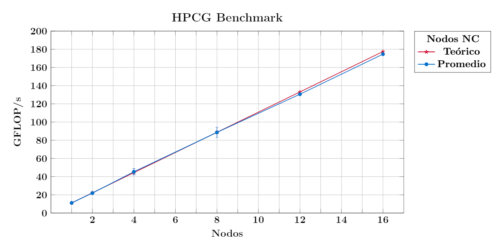
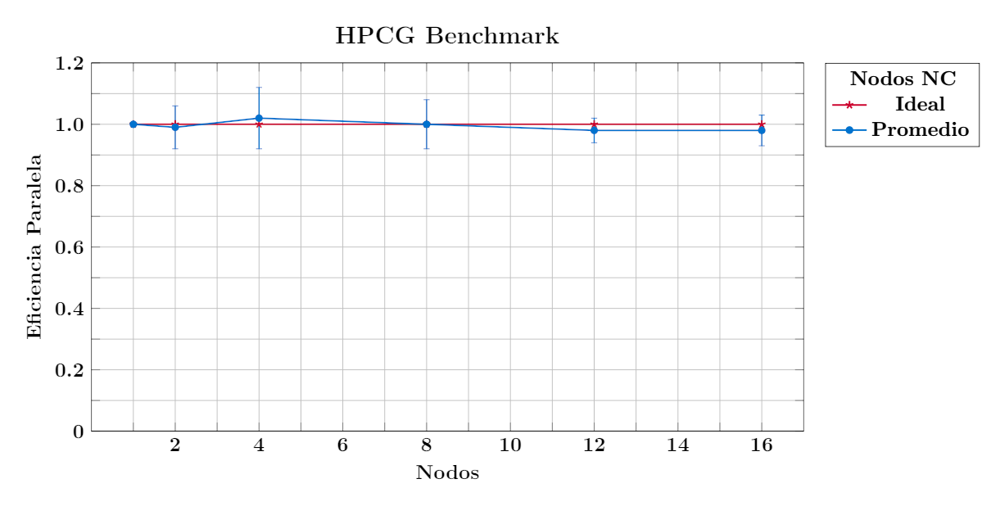
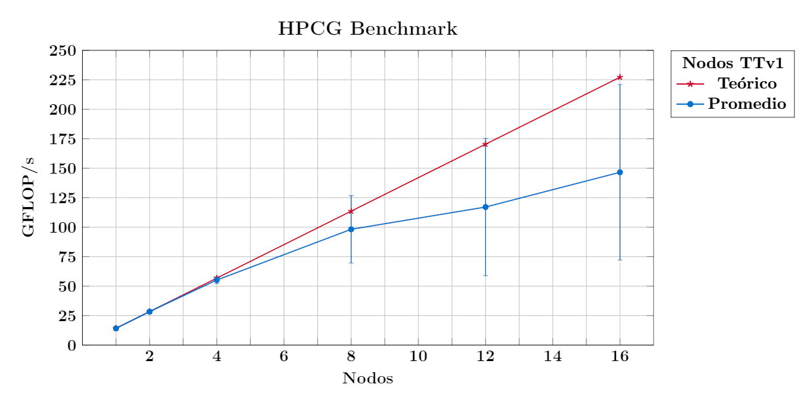
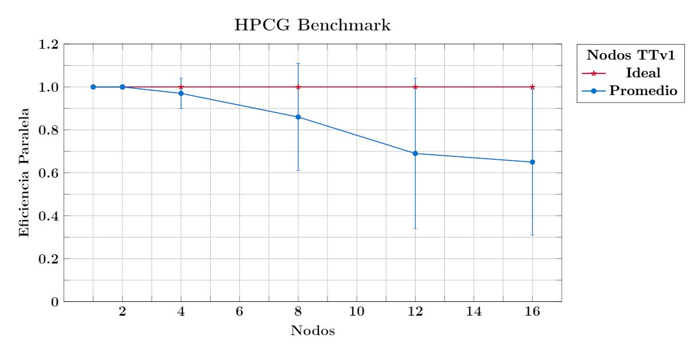
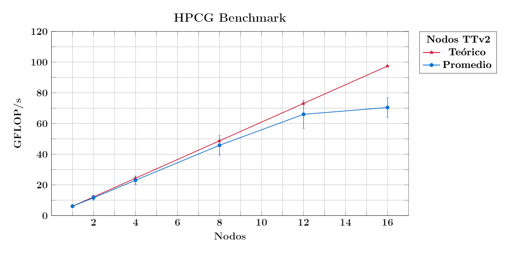
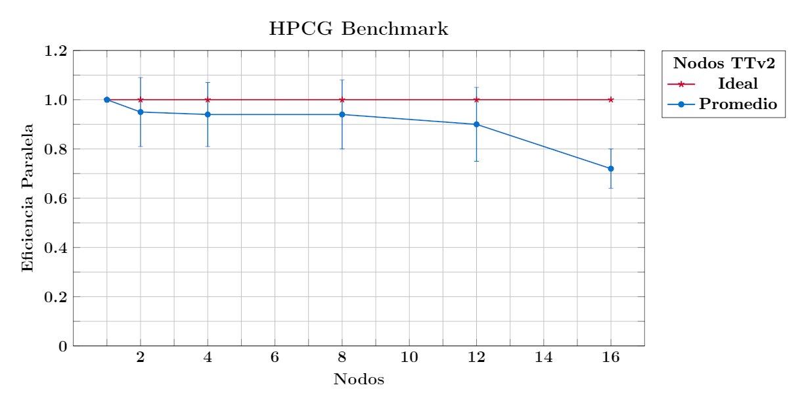
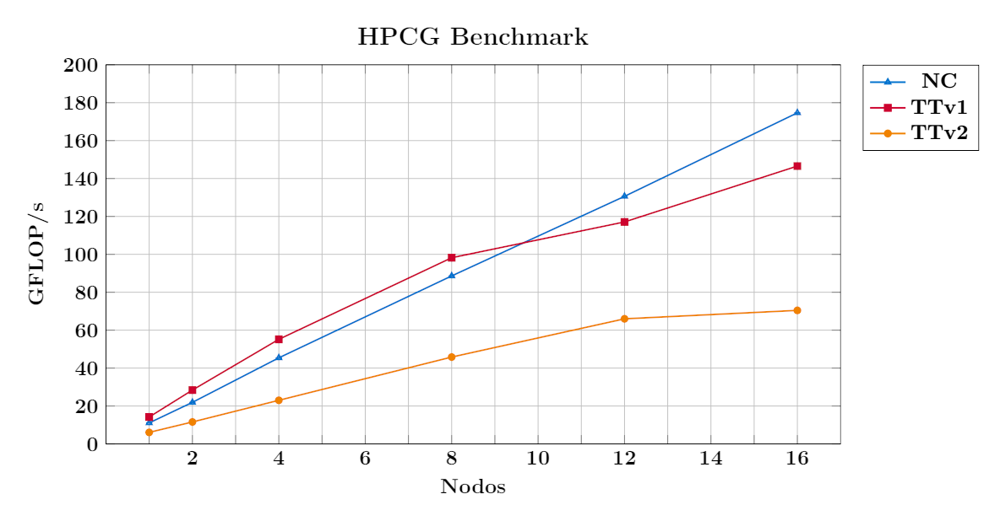
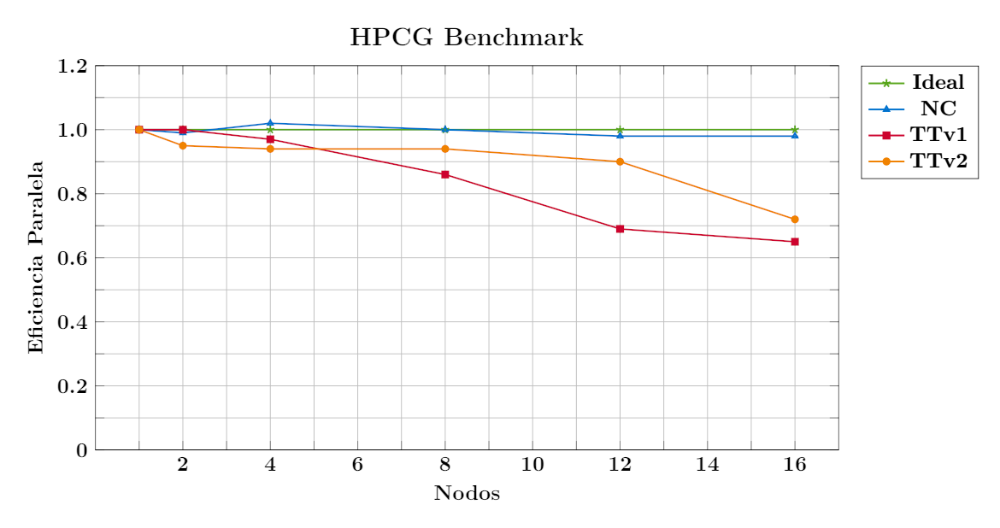

# HPCG

## Descripción

El benchmark High Performance Conjugate Gradients (HPCG) es un esfuerzo por crear una 
nueva métrica para clasificar los sistemas HPC. HPCG pretende ser un complemento del 
benchmark High Performance LINPACK (HPL), que actualmente se utiliza para clasificar 
los sistemas informáticos [TOP500](https://www.top500.org/).

Los patrones computacionales y de acceso a datos de HPL siguen siendo representativos 
de algunas aplicaciones escalables importantes, pero no de todas. HPCG está diseñado 
para ejercitar patrones computacionales y de acceso a datos que coincidan más estrechamente 
con un conjunto diferente y amplio de aplicaciones importantes, y para incentivar a los 
diseñadores de sistemas informáticos a invertir en capacidades que tendrán un impacto en 
el rendimiento colectivo de estas aplicaciones.

Para obtener más información, visite el sitio oficial de [HPCG](https://hpcg.info/).

## Archivo de entrada

HPCG necesita un archivo de entrada para poder ejecutarse, por defecto HPCG buscará 
este archivo con el nombre *hpcg.dat*. A continuación se presenta un ejemplo de este 
archivo:

<span style="color: #990819;">*hpcg.dat*</span>

```bash
    HPCG benchmark input file
    Sandia National Laboratories; University of Tennessee, Knoxville
    104 104 104
    60
```

Este archivo consta de 4 líneas y contiene información sobre el tamaño del problema, 
la configuración del sistema y las características del algoritmo que utilizará el 
ejecutable. A continuación se explica cada una de las líneas que conforman este archivo:

- **Línea 1:** Sin usar. Puede utilizar esta línea para el fin que desee. Por ejemplo, 
podría usarla para resumir el contenido del archivo de entrada. El valor por defecto 
de esta línea es:
    
    ```bash
    HPCG benchmark input file
    ```

- **Línea 2:** Sin usar. Igual que la línea 1. El valor por defecto de esta línea es:

    ```bash
    Sandia National Laboratories; University of Tennessee, Knoxville
    ```

- **Línea 3:** Esta línea especifica las dimensiones locales (a un proceso MPI) del 
problema. El valor por defecto de esta línea es:
    
    ```bash
    104 104 104
    ```

  lo que significa que cada proceso MPI calculará una solución para un cubo de tamaño 
  104 puntos.
  
  ```admonish warning title=" "
  El tamaño del problema debe ser un múltiplo de 8.
  ```

- **Línea 4:** Esta línea especifica la cantidad de segundos que debe ejecutarse la parte 
cronometrada del benchmark. El valor por defecto de esta línea es:
    
    ```bash
    60
    ```

  lo que significa que la parte cronometrada del benchmark durará 1 minuto. Este período 
  de tiempo no es suficiente para enviar una ejecución oficial, pero brinda datos suficientes 
  para ajustar el punto de referencia en la mayoría de los casos.
  
  ```admonish note title=" "
  Las ejecuciones oficiales deben ser de al menos 1800 segundos (30 minutos).
  ```
  

## Archivos de salida

A continuación se presenta el archivo de entrada:

<span style="color: #990819;">*hpcg.dat*</span>

```bash
HPCG benchmark input file
Laboratorio de Supercómputo y Visualización en Paralelo; UAM Iztapalapa
144 144 144
1800
```

y los archivos de salida de una ejecución de HPCG:

<span style="color: #990819;">*hpcg20220227T164457.txt*</span>

```bash
WARNING: PERFORMING UNPRECONDITIONED ITERATIONS
Call [0] Number of Iterations [11] Scaled Residual [8.26369e-14]
WARNING: PERFORMING UNPRECONDITIONED ITERATIONS
Call [1] Number of Iterations [11] Scaled Residual [8.26369e-14]
Call [0] Number of Iterations [2] Scaled Residual [2.35333e-17]
Call [1] Number of Iterations [2] Scaled Residual [2.35333e-17]
Departure from symmetry (scaled) for SpMV abs(x'*A*y - y'*A*x) = 4.98526e-11
Departure from symmetry (scaled) for MG abs(x'*Minv*y - y'*Minv*x) = 1.66175e-11
SpMV call [0] Residual [0]
SpMV call [1] Residual [0]
Call [0] Scaled Residual [0.00352974]
Call [1] Scaled Residual [0.00352974]
Call [2] Scaled Residual [0.00352974]
Call [3] Scaled Residual [0.00352974]
Call [4] Scaled Residual [0.00352974]
Call [5] Scaled Residual [0.00352974]
Call [6] Scaled Residual [0.00352974]
Call [7] Scaled Residual [0.00352974]
Call [8] Scaled Residual [0.00352974]
Call [9] Scaled Residual [0.00352974]
Call [10] Scaled Residual [0.00352974]
Call [11] Scaled Residual [0.00352974]
Call [12] Scaled Residual [0.00352974]
Call [13] Scaled Residual [0.00352974]
Call [14] Scaled Residual [0.00352974]
Call [15] Scaled Residual [0.00352974]
Call [16] Scaled Residual [0.00352974]
Call [17] Scaled Residual [0.00352974]
Call [18] Scaled Residual [0.00352974]
Call [19] Scaled Residual [0.00352974]
Call [20] Scaled Residual [0.00352974]
Call [21] Scaled Residual [0.00352974]
```

En este archivo se guarda información sobre las iteraciones del algoritmo.

<span style="color: #990819;">*HPCG-Benchmark_3.1_2022-02-27_17-19-53.txt*</span>

```bash
HPCG-Benchmark
version=3.1
Release date=March 28, 2019
Machine Summary=
Machine Summary::Distributed Processes=20
Machine Summary::Threads per processes=1
Global Problem Dimensions=
Global Problem Dimensions::Global nx=288
Global Problem Dimensions::Global ny=720
Global Problem Dimensions::Global nz=288
Processor Dimensions=
Processor Dimensions::npx=2
Processor Dimensions::npy=5
Processor Dimensions::npz=2
Local Domain Dimensions=
Local Domain Dimensions::nx=144
Local Domain Dimensions::ny=144
Local Domain Dimensions::Lower ipz=0
Local Domain Dimensions::Upper ipz=1
Local Domain Dimensions::nz=144
########## Problem Summary  ##########=
Setup Information=
Setup Information::Setup Time=16.8862
Linear System Information=
Linear System Information::Number of Equations=59719680
Linear System Information::Number of Nonzero Terms=1603488952
Multigrid Information=
Multigrid Information::Number of coarse grid levels=3
Multigrid Information::Coarse Grids=
Multigrid Information::Coarse Grids::Grid Level=1
Multigrid Information::Coarse Grids::Number of Equations=7464960
Multigrid Information::Coarse Grids::Number of Nonzero Terms=199322200
Multigrid Information::Coarse Grids::Number of Presmoother Steps=1
Multigrid Information::Coarse Grids::Number of Postsmoother Steps=1
Multigrid Information::Coarse Grids::Grid Level=2
Multigrid Information::Coarse Grids::Number of Equations=933120
Multigrid Information::Coarse Grids::Number of Nonzero Terms=24638248
Multigrid Information::Coarse Grids::Number of Presmoother Steps=1
Multigrid Information::Coarse Grids::Number of Postsmoother Steps=1
Multigrid Information::Coarse Grids::Grid Level=3
Multigrid Information::Coarse Grids::Number of Equations=116640
Multigrid Information::Coarse Grids::Number of Nonzero Terms=3011248
Multigrid Information::Coarse Grids::Number of Presmoother Steps=1
Multigrid Information::Coarse Grids::Number of Postsmoother Steps=1
########## Memory Use Summary  ##########=
Memory Use Information=
Memory Use Information::Total memory used for data (Gbytes)=42.708
Memory Use Information::Memory used for OptimizeProblem data (Gbytes)=0
Memory Use Information::Bytes per equation (Total memory / Number of Equations)=715.141
Memory Use Information::Memory used for linear system and CG (Gbytes)=37.5837
Memory Use Information::Coarse Grids=
Memory Use Information::Coarse Grids::Grid Level=1
Memory Use Information::Coarse Grids::Memory used=4.49168
Memory Use Information::Coarse Grids::Grid Level=2
Memory Use Information::Coarse Grids::Memory used=0.562133
Memory Use Information::Coarse Grids::Grid Level=3
Memory Use Information::Coarse Grids::Memory used=0.0704422
########## V&V Testing Summary  ##########=
Spectral Convergence Tests=
Spectral Convergence Tests::Result=PASSED
Spectral Convergence Tests::Unpreconditioned=
Spectral Convergence Tests::Unpreconditioned::Maximum iteration count=11
Spectral Convergence Tests::Unpreconditioned::Expected iteration count=12
Spectral Convergence Tests::Preconditioned=
Spectral Convergence Tests::Preconditioned::Maximum iteration count=2
Spectral Convergence Tests::Preconditioned::Expected iteration count=2
Departure from Symmetry |x'Ay-y'Ax|/(2*||x||*||A||*||y||)/epsilon=
Departure from Symmetry |x'Ay-y'Ax|/(2*||x||*||A||*||y||)/epsilon::Result=PASSED
Departure from Symmetry |x'Ay-y'Ax|/(2*||x||*||A||*||y||)/epsilon::Departure for SpMV=4.98526e-11
Departure from Symmetry |x'Ay-y'Ax|/(2*||x||*||A||*||y||)/epsilon::Departure for MG=1.66175e-11
########## Iterations Summary  ##########=
Iteration Count Information=
Iteration Count Information::Result=PASSED
Iteration Count Information::Reference CG iterations per set=50
Iteration Count Information::Optimized CG iterations per set=50
Iteration Count Information::Total number of reference iterations=1100
Iteration Count Information::Total number of optimized iterations=1100
########## Reproducibility Summary  ##########=
Reproducibility Information=
Reproducibility Information::Result=PASSED
Reproducibility Information::Scaled residual mean=0.00352974
Reproducibility Information::Scaled residual variance=0
########## Performance Summary (times in sec) ##########=
Benchmark Time Summary=
Benchmark Time Summary::Optimization phase=0
Benchmark Time Summary::DDOT=22.2014
Benchmark Time Summary::WAXPBY=52.935
Benchmark Time Summary::SpMV=265.962
Benchmark Time Summary::MG=1531.98
Benchmark Time Summary::Total=1873.42
Floating Point Operations Summary=
Floating Point Operations Summary::Raw DDOT=3.96778e+11
Floating Point Operations Summary::Raw WAXPBY=3.96778e+11
Floating Point Operations Summary::Raw SpMV=3.59823e+12
Floating Point Operations Summary::Raw MG=2.01152e+13
Floating Point Operations Summary::Total=2.4507e+13
Floating Point Operations Summary::Total with convergence overhead=2.4507e+13
GB/s Summary=
GB/s Summary::Raw Read B/W=80.5824
GB/s Summary::Raw Write B/W=18.622
GB/s Summary::Raw Total B/W=99.2044
GB/s Summary::Total with convergence and optimization phase overhead=97.2754
GFLOP/s Summary=
GFLOP/s Summary::Raw DDOT=17.8717
GFLOP::::/s Summary::Raw WAXPBY=7.49556
GFLOP/s Summary::Raw SpMV=13.5291
GFLOP/s Summary::Raw MG=13.1302
GFLOP/s Summary::Raw Total=13.0814
GFLOP/s Summary::Total with convergence overhead=13.0814
GFLOP/s Summary::Total with convergence and optimization phase overhead=12.8271
User Optimization Overheads=
User Optimization Overheads::Optimization phase time (sec)=0
User Optimization Overheads::Optimization phase time vs reference SpMV+MG time=0
DDOT Timing Variations=
DDOT Timing Variations::Min DDOT MPI_Allreduce time=2.25398
DDOT Timing Variations::Max DDOT MPI_Allreduce time=32.4059
DDOT Timing Variations::Avg DDOT MPI_Allreduce time=13.7598
Final Summary=
Final Summary::HPCG result is VALID with a GFLOP/s rating of=12.8271
Final Summary::HPCG 2.4 rating for historical reasons is=13.0814
Final Summary::Reference version of ComputeDotProduct used=Performance results are most likely suboptimal
Final Summary::Reference version of ComputeSPMV used=Performance results are most likely suboptimal
Final Summary::Reference version of ComputeMG used=Performance results are most likely suboptimal
Final Summary::Reference version of ComputeWAXPBY used=Performance results are most likely suboptimal
Final Summary::Please upload results from the YAML file contents to=http://hpcg-benchmark.org
```

En este archivo se guarda información detallada sobre la ejecución del benchmark. 
A continuación se mencionan algunas de la secciones más relevantes de este archivo:

- **Resumen del Sistema**
    ```bash
    Machine Summary=
    Machine Summary::Distributed Processes=20
    Machine Summary::Threads per processes=1
    ```

  Número de procesos e hilos por proceso asignados para la ejecución del benchmark.

- **Dimensiones Globales del Problema**
    ```bash
    Global Problem Dimensions=
    Global Problem Dimensions::Global nx=288
    Global Problem Dimensions::Global ny=720
    Global Problem Dimensions::Global nz=288
    ```

  Se calculán multiplicando las *Dimensiones de Dominio Local* por las *Dimensiones del Procesador*.

- **Dimensiones del Procesador**
    ```bash
    Processor Dimensions=
    Processor Dimensions::npx=2
    Processor Dimensions::npy=5
    Processor Dimensions::npz=2
    ```

  Constituye una factorización del espacio de proceso de MPI que se calcula automáticamente
en la fase de configuración de HPCG.

- **Dimensiones del Dominio Local**
    ```bash
    Local Domain Dimensions=
    Local Domain Dimensions::nx=144
    Local Domain Dimensions::ny=144
    Local Domain Dimensions::nz=144
    ```

  Son leídas del archivo de entrada *hpcg.dat*.

- **Información del Uso de la Memoria**
    ```bash
    Memory Use Information=
    Memory Use Information::Total memory used for data (Gbytes)=42.708
    Memory Use Information::Memory used for OptimizeProblem data (Gbytes)=0
    Memory Use Information::Bytes per equation (Total memory / Number of Equations)=715.141
    Memory Use Information::Memory used for linear system and CG (Gbytes)=37.5837
    ```

- **Resumen Final**
    ```bash
    Final Summary=
    Final Summary::HPCG result is VALID with a GFLOP/s rating of=12.8271
    Final Summary::HPCG 2.4 rating for historical reasons is=13.0814
    ```

  Resultados finales obtenidos por el benchmark. GFLOP/s obtenidos.

## Nodos de cómputo

Unresolved directive in hpcg.adoc - include::partial\$reframe/nodos_computo.adoc\[\]

## Pruebas

Una ejecución válida debe utilizar un tamaño de problema que sea lo suficientemente 
grande para que las matrices de datos a las que se accede en el bucle de iteración 
de CG no quepan en la memoria caché del dispositivo. Actualmente, esta restricción 
significa que el tamaño del problema debe ser lo suficientemente grande como para 
ocupar una fracción significativa de la \"memoria principal\", al menos 1/4 del total.

Para cada tipo de nodo se determinó un tamaño de problema que cumpliera la condición 
antes mencionada. En las siguientas tablas se da un resumen de las pruebas realizadas 
en cada tipo de nodo:

<span style="color: #990819;">*Tabla 1. Pruebas en los nodos NC*</span>

<div class="tabla-scroll">
<table style="text-align: center;">
<thead>

<tr>
<th rowspan="2">Número de nodos</th>
<th rowspan="2">Número de CPUs</th>
<th colspan="3">Dimensiones del problema</th>
<th rowspan="2">Tiempo de ejecución (s)</th>
</tr>

<tr>
<th>x</th>
<th>y</th>
<th>z</th>
</tr>

</thead>
<tbody>

<tr>
<td>1</td><td>20</td><td>144</td><td>144</td><td>144</td><td>1800</td>
</tr>

<tr>
<td>2</td><td>40</td><td>144</td><td>144</td><td>144</td><td>1800</td>
</tr>

<tr>
<td>4</td><td>80</td><td>144</td><td>144</td><td>144</td><td>1800</td>
</tr>

<tr>
<td>8</td><td>160</td><td>144</td><td>144</td><td>144</td><td>1800</td>
</tr>

<tr>
<td>12</td><td>240</td><td>144</td><td>144</td><td>144</td><td>1800</td>
</tr>

<tr>
<td>16</td><td>320</td><td>144</td><td>144</td><td>144</td><td>1800</td>
</tr>

</tbody>
</table>
</div>

\
<span style="color: #990819;">*Tabla 2. Pruebas en los nodos TTv1*</span>

<div class="tabla-scroll">
<table style="text-align: center;">
<thead>

<tr>
<th rowspan="2">Número de nodos</th>
<th rowspan="2">Número de CPUs</th>
<th colspan="3">Dimensiones del problema</th>
<th rowspan="2">Tiempo de ejecución (s)</th>
</tr>

<tr>
<th>x</th>
<th>y</th>
<th>z</th>
</tr>

</thead>
<tbody>

<tr>
<td>1</td><td>20</td><td>176</td><td>176</td><td>176</td><td>1800</td>
</tr>

<tr>
<td>2</td><td>40</td><td>176</td><td>176</td><td>176</td><td>1800</td>
</tr>

<tr>
<td>4</td><td>80</td><td>176</td><td>176</td><td>176</td><td>1800</td>
</tr>

<tr>
<td>8</td><td>160</td><td>176</td><td>176</td><td>176</td><td>1800</td>
</tr>

<tr>
<td>12</td><td>240</td><td>176</td><td>176</td><td>176</td><td>1800</td>
</tr>

<tr>
<td>16</td><td>320</td><td>176</td><td>176</td><td>176</td><td>1800</td>
</tr>

</tbody>
</table>
</div>

\
<span style="color: #990819;">*Tabla 3. Pruebas en los nodos TTv2*</span>

<div class="tabla-scroll">
<table style="text-align: center;">
<thead>

<tr>
<th rowspan="2">Número de nodos</th>
<th rowspan="2">Número de CPUs</th>
<th colspan="3">Dimensiones del problema</th>
<th rowspan="2">Tiempo de ejecución (s)</th>
</tr>

<tr>
<th>x</th>
<th>y</th>
<th>z</th>
</tr>

</thead>
<tbody>

<tr>
<td>1</td><td>32</td><td>192</td><td>192</td><td>192</td><td>1800</td>
</tr>

<tr>
<td>2</td><td>64</td><td>192</td><td>192</td><td>192</td><td>1800</td>
</tr>

<tr>
<td>4</td><td>128</td><td>192</td><td>192</td><td>192</td><td>1800</td>
</tr>

<tr>
<td>8</td><td>256</td><td>192</td><td>192</td><td>192</td><td>1800</td>
</tr>

<tr>
<td>12</td><td>384</td><td>192</td><td>192</td><td>192</td><td>1800</td>
</tr>

<tr>
<td>16</td><td>512</td><td>192</td><td>192</td><td>192</td><td>1800</td>
</tr>

</tbody>
</table>
</div>


## Scripts


### Estructura de directorios

Dentro de la carpeta raíz *hpcg* existen tres subdirectorios principales, uno por 
cada tipo de nodo en el cluster Yoltla:

```bash
hpcg
├── nc
|   .
|   .
|   .
├── ttv1
|   .
|   .
|   .
└── ttv2
|   .
|   .
|   .
```

Cada uno de estos directorios alberga seis pruebas de ReFrame, cada una en su directorio 
correspondiente:

```bash
hpcg/
├── nc
│   ├── nodos_01
│   │   ├── hpcg_nc_20p.py
│   │   ├── logs
│   │   └── src
│   │       └── hpcg.dat
│   ├── nodos_02
│   │   ├── hpcg_nc_40p.py
│   │   ├── logs
│   │   └── src
│   │       └── hpcg.dat
│   ├── nodos_04
│   │   ├── hpcg_nc_80p.py
│   │   ├── logs
│   │   └── src
│   │       └── hpcg.dat
│   ├── nodos_08
│   │   ├── hpcg_nc_160p.py
│   │   ├── logs
│   │   └── src
│   │       └── hpcg.dat
│   ├── nodos_12
│   │   ├── hpcg_nc_240p.py
│   │   ├── logs
│   │   └── src
│   │       └── hpcg.dat
│   └── nodos_16
│       ├── hpcg_nc_320p.py
│       ├── logs
│       └── src
│           └── hpcg.dat
├── ttv1
│   ├── nodos_01
│   │   ├── hpcg_ttv1_20p.py
│   │   ├── logs
│   │   └── src
│   │       └── hpcg.dat
.   .
.   .
.   .
│   └── nodos_16
│       ├── hpcg_ttv1_320p.py
│       ├── logs
│       └── src
│           └── hpcg.dat
└── ttv2
    ├── nodos_01
    │   ├── hpcg_ttv2_32p.py
    │   ├── logs
    │   └── src
    │       └── hpcg.dat
    .
    .
    .
    └── nodos_16
        ├── hpcg_ttv2_512p.py
        ├── logs
        └── src
            └── hpcg.dat
```

Estas pruebas van desde 1 hasta 16 nodos, y pueden ser lanzadas de manera individual 
o por etiquetas.

```admonish note title=" "
La versión de HPCG utilizada en estos scripts es la 3.1.
```


### Lanzar pruebas


#### Individualmente

Para lanzar pruebas de forma individual, ubíquese dentro del directorio de la prueba 
de interés, y ejecute el comando:

```bash
reframe -c <nombre_script> -r
```

Por ejemplo, para lanzar la prueba de 16 nodos, en los nodos NC, ejecute el comando:

```bash
[t.800@yoltla nodos_16]$ reframe -c hpcg_nc_320p.py -r
```

#### Etiquetas

Utilizando etiquetas puede lanzar múltiples pruebas con un solo comando. Por ejemplo, 
para lanzar todas las pruebas de los nodos NC, siga los siguientes pasos:

1.  Ubíquese en el directorio raíz *hpcg*:

    ```bash
    [t.800@yoltla hpcg]$
    ```

2.  Cree el directorio *logs*:

    ```bash
    [t.800@yoltla hpcg]$ mkdir logs
    ```

3.  Ejecute el comando:

    ```bash
    [t.800@yoltla hpcg]$ reframe -c . -R -t nc -r
    ```

Para lanzar todas las pruebas:

1.  Ubíquese en el directorio raíz *hpcg*:

    ```bash
    [t.800@yoltla hpcg]$
    ```

2.  Cree el directorio *logs*:

    ```bash
    [t.800@yoltla hpcg]$ mkdir logs
    ```

3.  Ejecute el comando:

    ```bash
    [t.800@yoltla hpcg]$ reframe -c . -R -t hpcg -r
    ```

```admonish warning title=" "
Si no crea el directorio *logs* obtendrá el siguiente mensaje:

    /LUSTRE/home/uam/.../t.800/spack_scope/deps/linux-centos6-ivybridge/gcc-7.2.0/reframe-3.9.2-gqmjpwbafkinwklzww777oktqutklrfn/bin/reframe: failed to load configuration: [Errno 2] No such file or directory: '/LUSTRE/home/uam/.../t.800/.../hpcg/logs/rfm.out'
    /LUSTRE/home/uam/.../t.800/spack_scope/deps/linux-centos6-ivybridge/gcc-7.2.0/reframe-3.9.2-gqmjpwbafkinwklzww777oktqutklrfn/bin/reframe: Log file(s) saved in '/tmp/rfm-kc85z_00.log'
```


## Resultados


### Nodos NC

<span style="color: #990819;">*Tabla 4. Rendimiento de los nodos NC*</span>

<div class="tabla-scroll">
<table style="text-align: center;">
<thead>

<tr>
<th rowspan="2">No. de ejecuciones</th>
<th rowspan="2">Número de nodos</th>
<th colspan="3">Dimensiones del problema</th>
<th colspan="5">GFLOP/s</th>
</tr>

<tr>
<th>x</th>
<th>y</th>
<th>z</th>
<th>Teórico</th>
<th>Promedio</th>
<th>Mínimo</th>
<th>Máximo</th>
<th>σ</th>
</tr>

</thead>
<tbody>

<tr>
<td>10</td><td>1</td><td>144</td><td>144</td><td>144</td><td>11.09</td><td>11.09</td><td>10.84</td><td>12.83</td><td>0.58</td>
</tr>

<tr>
<td>10</td><td>2</td><td>144</td><td>144</td><td>144</td><td>22.19</td><td>21.93</td><td>21.29</td><td>25.19</td><td>1.10</td>
</tr>

<tr>
<td>10</td><td>4</td><td>144</td><td>144</td><td>144</td><td>44.37</td><td>45.41</td><td>42.07</td><td>50.93</td><td>3.57</td>
</tr>

<tr>
<td>10</td><td>8</td><td>144</td><td>144</td><td>144</td><td>88.75</td><td>88.62</td><td>84.80</td><td>99.82</td><td>5.60</td>
</tr>

<tr>
<td>10</td><td>12</td><td>144</td><td>144</td><td>144</td><td>133.12</td><td>130.60</td><td>129.53</td><td>131.79</td><td>0.75</td>
</tr>

<tr>
<td>10</td><td>16</td><td>144</td><td>144</td><td>144</td><td>177.49</td><td>174.64</td><td>172.77</td><td>175.93</td><td>0.95</td>
</tr>

</tbody>
</table>
</div>

\
<span style="color: #1285E3;">Rendimiento de los nodos NC</span>



<span style="color: #990819;">*Figura 1. Rendimiento de los nodos NC*</span>

```admonish note title=" "
Los valores teóricos se calcularon tomando como base el rendimiento obtenido en 1 nodo.
```

\
<span style="color: #990819;">*Tabla 5. Eficiencia paralela de los nodos NC*</span>

<div class="tabla-scroll">
<table style="text-align: center;">
<thead>

<tr>
<th rowspan="2">No. de ejecuciones</th>
<th rowspan="2">Número de nodos</th>
<th colspan="3">Dimensiones del problema</th>
<th colspan="5">Eficiencia Paralela</th>
</tr>

<tr>
<th>x</th>
<th>y</th>
<th>z</th>
<th>Ideal</th>
<th>Promedio</th>
<th>Mínimo</th>
<th>Máximo</th>
<th>σ</th>
</tr>

</thead>
<tbody>

<tr>
<td>10</td><td>1</td><td>144</td><td>144</td><td>144</td><td>1.00</td><td>1.00</td><td>1.00</td><td>1.00</td><td>0.00</td>
</tr>

<tr>
<td>10</td><td>2</td><td>144</td><td>144</td><td>144</td><td>1.00</td><td>0.99</td><td>0.84</td><td>1.15</td><td>0.07</td>
</tr>

<tr>
<td>10</td><td>4</td><td>144</td><td>144</td><td>144</td><td>1.00</td><td>1.02</td><td>0.82</td><td>1.18</td><td>0.10</td>
</tr>

<tr>
<td>10</td><td>8</td><td>144</td><td>144</td><td>144</td><td>1.00</td><td>1.00</td><td>0.84</td><td>1.14</td><td>0.08</td>
</tr>

<tr>
<td>10</td><td>12</td><td>144</td><td>144</td><td>144</td><td>1.00</td><td>0.98</td><td>0.85</td><td>1.01</td><td>0.04</td>
</tr>

<tr>
<td>10</td><td>16</td><td>144</td><td>144</td><td>144</td><td>1.00</td><td>0.98</td><td>0.85</td><td>1.01</td><td>0.05</td>
</tr>

</tbody>
</table>
</div>

\
<span style="color: #1285E3;">Eficiencia Paralela de los nodos NC</span>



<span style="color: #990819;">*Figura 2. Eficiencia Paralela de los nodos NC*</span>

```admonish note title=" "
Se utilizó como base la eficiencia paralela en 1 nodo para calcular la eficiencia paralela del resto.
```


### Nodos TTv1

<span style="color: #990819;">*Tabla 6. Rendimiento de los nodos TTv1*</span>

<div class="tabla-scroll">
<table style="text-align: center;">
<thead>

<tr>
<th rowspan="2">No. de ejecuciones</th>
<th rowspan="2">Número de nodos</th>
<th colspan="3">Dimensiones del problema</th>
<th colspan="5">GFLOP/s</th>
</tr>

<tr>
<th>x</th>
<th>y</th>
<th>z</th>
<th>Teórico</th>
<th>Promedio</th>
<th>Mínimo</th>
<th>Máximo</th>
<th>σ</th>
</tr>

</thead>
<tbody>

<tr>
<td>10</td><td>1</td><td>176</td><td>176</td><td>176</td><td>14.20</td><td>14.20</td><td>13.06</td><td>14.43</td><td>0.44</td>
</tr>

<tr>
<td>10</td><td>2</td><td>176</td><td>176</td><td>176</td><td>28.40</td><td>28.40</td><td>26.01</td><td>28.79</td><td>0.81</td>
</tr>

<tr>
<td>10</td><td>4</td><td>176</td><td>176</td><td>176</td><td>56.81</td><td>55.17</td><td>47.93</td><td>57.29</td><td>3.00</td>
</tr>

<tr>
<td>10</td><td>8</td><td>176</td><td>176</td><td>176</td><td>113.61</td><td>98.21</td><td>14.72</td><td>114.04</td><td>28.53</td>
</tr>

<tr>
<td>10</td><td>12</td><td>176</td><td>176</td><td>176</td><td>170.42</td><td>117.09</td><td>25.89</td><td>169.05</td><td>58.25</td>
</tr>

<tr>
<td>10</td><td>16</td><td>176</td><td>176</td><td>176</td><td>227.22</td><td>146.56</td><td>33.68</td><td>218.84</td><td>74.46</td>
</tr>

</tbody>
</table>
</div>

\
<span style="color: #1285E3;">Rendimiento de los nodos TTv1</span>



<span style="color: #990819;">*Figura 3. Rendimiento de los nodos TTv1*</span>

```admonish note title=" "
Los valores teóricos se calcularon tomando como base el rendimiento obtenido en 1 nodo.
```

\
<span style="color: #990819;">*Tabla 7. Eficiencia paralela de los nodos TTv1*</span>

<div class="tabla-scroll">
<table style="text-align: center;">
<thead>

<tr>
<th rowspan="2">No. de ejecuciones</th>
<th rowspan="2">Número de nodos</th>
<th colspan="3">Dimensiones del problema</th>
<th colspan="5">Eficiencia Paralela</th>
</tr>

<tr>
<th>x</th>
<th>y</th>
<th>z</th>
<th>Ideal</th>
<th>Promedio</th>
<th>Mínimo</th>
<th>Máximo</th>
<th>σ</th>
</tr>

</thead>
<tbody>

<tr>
<td>10</td><td>1</td><td>176</td><td>176</td><td>176</td><td>1.00</td><td>1.00</td><td>1.00</td><td>1.00</td><td>0.00</td>
</tr>

<tr>
<td>10</td><td>2</td><td>176</td><td>176</td><td>176</td><td>1.00</td><td>1.00</td><td>0.99</td><td>1.04</td><td>0.01</td>
</tr>

<tr>
<td>10</td><td>4</td><td>176</td><td>176</td><td>176</td><td>1.00</td><td>0.97</td><td>0.83</td><td>1.09</td><td>0.07</td>
</tr>

<tr>
<td>10</td><td>8</td><td>176</td><td>176</td><td>176</td><td>1.00</td><td>0.86</td><td>0.13</td><td>1.01</td><td>0.25</td>
</tr>

<tr>
<td>10</td><td>12</td><td>176</td><td>176</td><td>176</td><td>1.00</td><td>0.69</td><td>0.15</td><td>1.00</td><td>0.35</td>
</tr>

<tr>
<td>10</td><td>16</td><td>176</td><td>176</td><td>176</td><td>1.00</td><td>0.65</td><td>0.15</td><td>1.00</td><td>0.34</td>
</tr>

</tbody>
</table>
</div>

\
<span style="color: #1285E3;">Eficiencia Paralela de los nodos TTv1</span>



<span style="color: #990819;">*Figura 4. Eficiencia Paralela de los nodos TTv1*</span>

```admonish note title=" "
Se utilizó como base la eficiencia paralela en 1 nodo para calcular la eficiencia paralela del resto.
```


### Nodos TTv2

<span style="color: #990819;">*Tabla 8. Rendimiento de los nodos TTv2*</span>

<div class="tabla-scroll">
<table style="text-align: center;">
<thead>

<tr>
<th rowspan="2">No. de ejecuciones</th>
<th rowspan="2">Número de nodos</th>
<th colspan="3">Dimensiones del problema</th>
<th colspan="5">GFLOP/s</th>
</tr>

<tr>
<th>x</th>
<th>y</th>
<th>z</th>
<th>Teórico</th>
<th>Promedio</th>
<th>Mínimo</th>
<th>Máximo</th>
<th>σ</th>
</tr>

</thead>
<tbody>

<tr>
<td>10</td><td>1</td><td>192</td><td>192</td><td>192</td><td>6.09</td><td>6.09</td><td>5.23</td><td>6.31</td><td>0.38</td>
</tr>

<tr>
<td>10</td><td>2</td><td>192</td><td>192</td><td>192</td><td>12.18</td><td>11.58</td><td>8.45</td><td>12.55</td><td>1.52</td>
</tr>

<tr>
<td>10</td><td>4</td><td>192</td><td>192</td><td>192</td><td>24.37</td><td>23.01</td><td>18.07</td><td>25.16</td><td>2.76</td>
</tr>

<tr>
<td>10</td><td>8</td><td>192</td><td>192</td><td>192</td><td>48.73</td><td>45.82</td><td>33.68</td><td>49.89</td><td>6.39</td>
</tr>

<tr>
<td>10</td><td>12</td><td>192</td><td>192</td><td>192</td><td>73.10</td><td>65.99</td><td>48.60</td><td>74.46</td><td>9.07</td>
</tr>

<tr>
<td>10</td><td>16</td><td>192</td><td>192</td><td>192</td><td>97.47</td><td>70.44</td><td>60.99</td><td>81.64</td><td>6.33</td>
</tr>

</tbody>
</table>
</div>

\
<span style="color: #1285E3;">Rendimiento de los nodos TTv2</span>



<span style="color: #990819;">*Figura 5. Rendimiento de los nodos TTv2*</span>

```admonish note title=" "
Los valores teóricos se calcularon tomando como base el rendimiento obtenido en 1 nodo.
```

\
<span style="color: #990819;">*Tabla 9. Eficiencia paralela de los nodos TTv2*</span>

<div class="tabla-scroll">
<table style="text-align: center;">
<thead>

<tr>
<th rowspan="2">No. de ejecuciones</th>
<th rowspan="2">Número de nodos</th>
<th colspan="3">Dimensiones del problema</th>
<th colspan="5">Eficiencia Paralela</th>
</tr>

<tr>
<th>x</th>
<th>y</th>
<th>z</th>
<th>Ideal</th>
<th>Promedio</th>
<th>Mínimo</th>
<th>Máximo</th>
<th>σ</th>
</tr>

</thead>
<tbody>

<tr>
<td>10</td><td>1</td><td>192</td><td>192</td><td>192</td><td>1.00</td><td>1.00</td><td>1.00</td><td>1.00</td><td>0.00</td>
</tr>

<tr>
<td>10</td><td>2</td><td>192</td><td>192</td><td>192</td><td>1.00</td><td>0.95</td><td>0.67</td><td>1.19</td><td>0.14</td>
</tr>

<tr>
<td>10</td><td>4</td><td>192</td><td>192</td><td>192</td><td>1.00</td><td>0.94</td><td>0.72</td><td>1.16</td><td>0.13</td>
</tr>

<tr>
<td>10</td><td>8</td><td>192</td><td>192</td><td>192</td><td>1.00</td><td>0.94</td><td>0.67</td><td>1.19</td><td>0.14</td>
</tr>

<tr>
<td>10</td><td>12</td><td>192</td><td>192</td><td>192</td><td>1.00</td><td>0.90</td><td>0.64</td><td>1.13</td><td>0.15</td>
</tr>

<tr>
<td>10</td><td>16</td><td>192</td><td>192</td><td>192</td><td>1.00</td><td>0.72</td><td>0.61</td><td>0.85</td><td>0.08</td>
</tr>

</tbody>
</table>
</div>

\
<span style="color: #1285E3;">Eficiencia Paralela de los nodos TTv2</span>



<span style="color: #990819;">*Figura 6. Eficiencia Paralela de los nodos TTv2*</span>

```admonish note title=" "
Se utilizó como base la eficiencia paralela en 1 nodo para calcular la eficiencia paralela del resto.
```


### Yoltla

<span style="color: #1285E3;">Rendimiento promedio de los nodos del cluster Yoltla</span>



<span style="color: #990819;">*Figura 7. Rendimiento promedio de los nodos del cluster Yoltla*</span>

\
<span style="color: #1285E3;">Eficiencia Paralela promedio de los nodos del cluster Yoltla</span>



<span style="color: #990819;">*Figura 8. Eficiencia Paralela promedio de los nodos del cluster Yoltla*</span>

```admonish note title=" "
Todos los resultados mostrados en esta sección fueron obtenidos en el periodo de Febrero-Marzo del 2022.
```


## Sitios de interés

- [HPCG Benchmark](https://hpcg.info/)

- [HPCG Benchmark: a New Metric for Ranking High Performance Computing Systems](https://netlib.org/utk/people/JackDongarra/PAPERS/HPCG-benchmark.pdf)

- [High Performance Conjugate Gradient Benchmark (HPCG)](https://github.com/hpcg-benchmark/hpcg)

- [AMD \| HPCG](https://developer.amd.com/spack/hpcg-benchmark/)


