# HPL


## Descripción

HPL es un paquete de software que resuelve un sistema lineal denso (aleatorio)
en aritmética de doble precisión (64 bits) en computadoras con memoria distribuida. 
Por lo tanto, se puede considerar como una implementación portátil y de libre 
acceso de High Performance Computing Linpack Benchmark.

El paquete HPL proporciona un programa de prueba y cronometraje para cuantificar 
la precisión de la solución obtenida, así como el tiempo necesario para calcularla.

Para obtener más información, visite el sitio oficial de [HPL](https://netlib.org/benchmark/hpl/).


## Archivo de entrada

HPL necesita un archivo de entrada para poder ejecutarse, por defecto HPL buscará
este archivo con el nombre *HPL.dat*. A continuación se presenta un ejemplo de este archivo:

<span style="color: #990819;">*HPL.dat*</span>

```bash

HPLinpack benchmark input file
Innovative Computing Laboratory, University of Tennessee
HPL.out     output file name (if any)
6           device out (6=stdout,7=stderr,file)
2           # of problems sizes (N)
3000 6000   Ns
3           # of NBs
80 100 120  NBs
0           MAP process mapping (0=Row-,1=Column-major)
2           # of process grids (P x Q)
1 2         Ps
6 8         Qs
16.0        threshold
1           # of panel fact<
2           PFACTs (0=left, 1=Crout, 2=Right)
1           # of recursive stopping criterium
4           NBMINs (>= 1)
1           # of panels in recursion
2           NDIVs
1           # of recursive panel fact.
1           RFACTs (0=left, 1=Crout, 2=Right)
1           # of broadcast
1           BCASTs (0=1rg,1=1rM,2=2rg,3=2rM,4=Lng,5=LnM)
1           # of lookahead depth
1           DEPTHs (>=0)
2           SWAP (0=bin-exch,1=long,2=mix)
64          swapping threshold
0           L1 in (0=transposed,1=no-transposed) form
0           U in (0=transposed,1=no-transposed) form
1           Equilibration (0=no,1=yes)
8           memory alignment in double (> 0)
```

Este archivo consta de 31 líneas y contiene información sobre los tamaños de los 
problemas, la configuración del sistema y las características del algoritmo que 
utilizará el ejecutable. A continuación se explican algunos de los parámetros 
más relevantes de este archivo:

- **Línea 5:** Esta línea especifica el número de tamaños de problema a utilizar. 
Este número debe ser menor o igual a 20. El primer entero es significativo, el 
resto se ignora. Si la línea dice:
    
    ```bash
    2        # of problems sizes (N)
    ```
  esto significa que se utilizarán 2 tamaños de problema que se especificarán en 
  la siguiente línea.

- **Línea 6:** Esta línea especifica los tamaños de problema a utilizar. Suponiendo 
que la línea anterior comenzó con 2, los 2 primeros números enteros positivos son 
significativos, el resto se ignora. Por ejemplo:
    
    ```bash
    3000 6000   Ns
    ```

  Para obtener más información de este parámetro, consulte el siguiente 
  [enlace](https://ulhpc-tutorials.readthedocs.io/en/latest/parallel/mpi/HPL/#hpl-main-parameters).

- **Línea 7:** Esta línea especifica el número de tamaños de bloque a utilizar. 
Este número debe ser menor o igual a 20. El primer entero es significativo, el 
resto se ignora. Si la línea dice:

    ```bash
    3        # of NBs
    ```

  esto significa que se utilizarán 3 tamaños de bloque que se especificarán en la 
  siguiente línea.

- **Línea 8:** Esta línea especifica los tamaños de bloque a utilizar. Suponiendo 
que la línea anterior comenzó con 3, los 3 primeros números enteros positivos son 
significativos, el resto se ignora. Por ejemplo:

    ```
    80 100 120  NBs
    ```

- **Línea 10:** Esta línea especifica el número de cuadrículas de procesos a utilizar. 
Este número debe ser menor o igual a 20. El primer entero es significativo, el resto 
se ignora. Si la línea dice:
    ```bash
    2        # of process grids (P x Q)
    ```
  Esto significa que se utilizarán 2 tamaños de cuadrícula de procesos que se especificarán 
  en la siguiente línea.

- **Línea 11-12:** Estas dos líneas especifican la cantidad de procesos correspondientes 
a cada fila y a cada columna de cada cuadrícula a utilizar. Suponiendo que la línea anterior 
comenzó con 2, los 2 primeros números enteros positivos de esas dos líneas son significativos, 
el resto se ignora. Por ejemplo:

    ```
    2 4          Ps
    5 8          Qs
    ```

```admonish warning title=""
En este ejemplo, se requiere ejecutar HPL en un nodo con al menos 32 cores:

Ps<sub>1</sub> x Qs<sub>1</sub> = 2 x 5 = 10 cores\
Ps<sub>2</sub> x Qs<sub>2</sub> = 4 x 8 = 32 cores
```

Para escribir el archivo de entrada de HPL debe considerar los recursos de su sistema: 
el número de nodos, el número de CPUs por nodo, y la cantidad de memoria por nodo. 
Puede utilizar el sitio web [How do I tune my HPL.dat file?](https://www.advancedclustering.com/act_kb/tune-hpl-dat-file/) 
para generar su archivo de entrada.

Para obtener más información, consulte la sección 
[HPL Tuning](https://netlib.org/benchmark/hpl/tuning.html) del sitio oficial de HPL.


## Archivo de salida

A continuación se presenta el archivo de entrada:

<span style="color: #990819;">*HPL.dat*</span>

```bash
HPLinpack benchmark input file
Innovative Computing Laboratory, University of Tennessee
HPL.out     output file name (if any)
6           device out (6=stdout,7=stderr,file)
2           # of problems sizes (N)
82432 285600 Ns
1           # of NBs
224         # of problems sizes (N)
0           MAP process mapping (0=Row-,1=Column-major)
1           # of process grids (P x Q)
15          Ps
16          Qs
16.0        threshold
1           # of panel fact<
2           PFACTs (0=left, 1=Crout, 2=Right)
1           # of recursive stopping criterium
4           NBMINs (>= 1)
1           # of panels in recursion
2           NDIVs
1           # of recursive panel fact.
1           RFACTs (0=left, 1=Crout, 2=Right)
1           # of broadcast
1           BCASTs (0=1rg,1=1rM,2=2rg,3=2rM,4=Lng,5=LnM)
1           # of lookahead depth
1           DEPTHs (>=0)
2           SWAP (0=bin-exch,1=long,2=mix)
64          swapping threshold
0           L1 in (0=transposed,1=no-transposed) form
0           U in (0=transposed,1=no-transposed) form
1           Equilibration (0=no,1=yes)
8           memory alignment in double (> 0)
```

y la salida de una ejecución de HPL:

<span style="color: #990819;">*HPL.out*</span>

```bash

(1)

================================================================================
HPLinpack 2.3  --  High-Performance Linpack benchmark  --   December 2, 2018
Written by A. Petitet and R. Clint Whaley,  Innovative Computing Laboratory, UTK
Modified by Piotr Luszczek, Innovative Computing Laboratory, UTK
Modified by Julien Langou, University of Colorado Denver
================================================================================

(2)

An explanation of the input/output parameters follows:
T/V    : Wall time / encoded variant.
N      : The order of the coefficient matrix A.
NB     : The partitioning blocking factor.
P      : The number of process rows.
Q      : The number of process columns.
Time   : Time in seconds to solve the linear system.
Gflops : Rate of execution for solving the linear system.

(3)

The following parameter values will be used:

N      :   82432   329728
NB     :     224
PMAP   : Row-major process mapping
P      :      16
Q      :      20
PFACT  :   Right
NBMIN  :       4
NDIV   :       2
RFACT  :   Crout
BCAST  :  1ringM
DEPTH  :       1
SWAP   : Mix (threshold = 64)
L1     : transposed form
U      : transposed form
EQUIL  : yes
ALIGN  : 8 double precision words

--------------------------------------------------------------------------------

(4)

- The following scaled residual check will be computed:
        ||Ax-b||_oo / ( eps * ( || x ||_oo * || A ||_oo + || b ||_oo ) * N )
- The relative machine precision (eps) is taken to be               1.110223e-16
- Computational tests pass if scaled residuals are less than                16.0

(5)

================================================================================
T/V                N    NB     P     Q               Time                 Gflops
--------------------------------------------------------------------------------
WR11C2R4       82432   224    16    20              73.92             5.0515e+03
HPL_pdgesv() start time Mon Feb 14 08:41:17 2022

HPL_pdgesv() end time   Mon Feb 14 08:42:31 2022

--------------------------------------------------------------------------------
||Ax-b||_oo/(eps*(||A||_oo*||x||_oo+||b||_oo)*N)=   1.93387398e-03 ...... PASSED
================================================================================
T/V                N    NB     P     Q               Time                 Gflops
--------------------------------------------------------------------------------
WR11C2R4      329728   224    16    20            3799.69             6.2897e+03
HPL_pdgesv() start time Mon Feb 14 08:42:39 2022

HPL_pdgesv() end time   Mon Feb 14 09:45:59 2022

--------------------------------------------------------------------------------
||Ax-b||_oo/(eps*(||A||_oo*||x||_oo+||b||_oo)*N)=   1.40718329e-03 ...... PASSED
================================================================================

(6)

Finished      2 tests with the following results:
                2 tests completed and passed residual checks,
                0 tests completed and failed residual checks,
                0 tests skipped because of illegal input values.
--------------------------------------------------------------------------------

End of Tests.
================================================================================
```

1. Información general del benchmark

2. Explicación de los parámetros de entrada/salida

3. Parámetros utilizados

4. Criterio de aprobación

5. Información de la ejecución de las pruebas:
  - Parámetros
  - Tiempo de ejecución
  - GFLOP/s
  - Éxito/fallo de la prueba

6. Resumen de la ejecución de las pruebas:
  - Número de pruebas ejecutadas
  - Número de pruebas completadas exitosas
  - Número de pruebas completadas fallidas
  - Número de pruebas omitidas debido a valores de entrada ilegales


## Nodos de cómputo

Unresolved directive in hpl.adoc - include::partial\$reframe/nodos_computo.adoc\[\]

## Pruebas

Las pruebas realizadas con este benchmark se dividen en dos grupos:

- **Rendimiento.** Su objetivo es obtener el mayor rendimiento posible. En cada prueba 
se utiliza un tamaño de problema acorde a los recursos disponibles.

- **Eficiencia Paralela.** Su objetivo es determinar la eficiencia paralela. El tamaño 
del problema se mantiene fijo en todas las pruebas.

En las siguientas tablas se da un resumen de las pruebas realizadas en cada tipo de nodo:

<span style="color: #990819;">*Tabla 1. Pruebas en los nodos NC*</span>
```
+-----------+-----------+-----------------+---------------+----------+-----------+-----------+
| **Número\ | **Número\ | **Tamaño del problema**         | **Tamaño | **Tamaño de\          |
| de        | de CPUs** |                                 | del\     | la cuadrícula**       |
| nodos**   |           |                                 | bloque** |                       |
|           |           +-----------------+---------------+          +-----------+-----------+
|           |           | **Rendimiento** | **Eficiencia\ |          | **P**     | **Q**     |
|           |           |                 | Paralela**    |          |           |           |
+-----------+-----------+-----------------+---------------+----------+-----------+-----------+
| 1         | 20        | 82432           | 82432         | 224      | 4         | 5         |
+-----------+-----------+-----------------+---------------+----------+-----------+-----------+
| 2         | 40        | 116480          | 82432         | 224      | 5         | 8         |
+-----------+-----------+-----------------+---------------+----------+-----------+-----------+
| 4         | 80        | 164864          | 82432         | 224      | 8         | 10        |
+-----------+-----------+-----------------+---------------+----------+-----------+-----------+
| 8         | 160       | 233184          | 82432         | 224      | 10        | 16        |
+-----------+-----------+-----------------+---------------+----------+-----------+-----------+
| 12        | 240       | 285600          | 82432         | 224      | 15        | 16        |
+-----------+-----------+-----------------+---------------+----------+-----------+-----------+
| 16        | 320       | 329728          | 82432         | 224      | 16        | 20        |
+-----------+-----------+-----------------+---------------+----------+-----------+-----------+
```
\
<span style="color: #990819;">*Tabla 2. Pruebas en los nodos TTv1*</span>
```
+-----------+-----------+-----------------+---------------+----------+-----------+-----------+
| **Número\ | **Número\ | **Tamaño del problema**         | **Tamaño | **Tamaño de\          |
| de        | de CPUs** |                                 | del\     | la cuadrícula**       |
| nodos**   |           |                                 | bloque** |                       |
|           |           +-----------------+---------------+          +-----------+-----------+
|           |           | **Rendimiento** | **Eficiencia\ |          | **P**     | **Q**     |
|           |           |                 | Paralela**    |          |           |           |
+-----------+-----------+-----------------+---------------+----------+-----------+-----------+
| 1         | 20        | 116480          | 116480        | 224      | 4         | 5         |
+-----------+-----------+-----------------+---------------+----------+-----------+-----------+
| 2         | 40        | 164864          | 116480        | 224      | 5         | 8         |
+-----------+-----------+-----------------+---------------+----------+-----------+-----------+
| 4         | 80        | 233184          | 116480        | 224      | 8         | 10        |
+-----------+-----------+-----------------+---------------+----------+-----------+-----------+
| 8         | 160       | 329728          | 116480        | 224      | 10        | 16        |
+-----------+-----------+-----------------+---------------+----------+-----------+-----------+
| 12        | 240       | 403872          | 116480        | 224      | 15        | 16        |
+-----------+-----------+-----------------+---------------+----------+-----------+-----------+
| 16        | 320       | 466368          | 116480        | 224      | 16        | 20        |
+-----------+-----------+-----------------+---------------+----------+-----------+-----------+
```
\
<span style="color: #990819;">*Tabla 3. Pruebas en los nodos TTv2*</span>
```
+-----------+-----------+-----------------+---------------+----------+-----------+-----------+
| **Número\ | **Número\ | **Tamaño del problema**         | **Tamaño | **Tamaño de\          |
| de        | de CPUs** |                                 | del\     | la cuadrícula**       |
| nodos**   |           |                                 | bloque** |                       |
|           |           +-----------------+---------------+          +-----------+-----------+
|           |           | **Rendimiento** | **Eficiencia\ |          | **P**     | **Q**     |
|           |           |                 | Paralela**    |          |           |           |
+-----------+-----------+-----------------+---------------+----------+-----------+-----------+
| 1         | 32        | 164864          | 164864        | 224      | 4         | 8         |
+-----------+-----------+-----------------+---------------+----------+-----------+-----------+
| 2         | 64        | 233184          | 164864        | 224      | 8         | 8         |
+-----------+-----------+-----------------+---------------+----------+-----------+-----------+
| 4         | 128       | 329728          | 164864        | 224      | 8         | 16        |
+-----------+-----------+-----------------+---------------+----------+-----------+-----------+
| 8         | 256       | 466368          | 164864        | 224      | 16        | 16        |
+-----------+-----------+-----------------+---------------+----------+-----------+-----------+
| 12        | 384       | 571200          | 164864        | 224      | 16        | 24        |
+-----------+-----------+-----------------+---------------+----------+-----------+-----------+
| 16        | 512       | 659456          | 164864        | 224      | 16        | 32        |
+-----------+-----------+-----------------+---------------+----------+-----------+-----------+
```


## Scripts


### Estructura de directorios

Dentro de la carpeta raíz *hpl* existen tres subdirectorios principales, uno por cada tipo de nodo en el cluster Yoltla:

```bash
hpl
├── nc
|   .
|   .
|   .
├── ttv1
|   .
|   .
|   .
└── ttv2
|   .
|   .
|   .
```

Cada uno de estos directorios alberga seis pruebas de ReFrame, cada una en su directorio correspondiente:

```bash
hpl
├── nc
│   ├── nodos_01
│   │   ├── hpl_nc_20p.py
│   │   ├── logs
│   │   └── src
│   │       └── HPL.dat
│   ├── nodos_02
│   │   ├── hpl_nc_40p.py
│   │   ├── logs
│   │   └── src
│   │       └── HPL.dat
│   ├── nodos_04
│   │   ├── hpl_nc_80p.py
│   │   ├── logs
│   │   └── src
│   │       └── HPL.dat
│   ├── nodos_08
│   │   ├── hpl_nc_160p.py
│   │   ├── logs
│   │   └── src
│   │       └── HPL.dat
│   ├── nodos_12
│   │   ├── hpl_nc_240p.py
│   │   ├── logs
│   │   └── src
│   │       └── HPL.dat
│   └── nodos_16
│       ├── hpl_nc_320p.py
│       ├── logs
│       └── src
│           └── HPL.dat
├── ttv1
│   ├── nodos_01
│   │   ├── hpl_ttv1_20p.py
│   │   ├── logs
│   │   └── src
│   │       └── HPL.dat
.   .
.   .
.   .
│   └── nodos_16
│       ├── hpl_ttv1_320p.py
│       ├── logs
│       └── src
│           └── HPL.dat
└── ttv2
    ├── nodos_01
    │   ├── hpl_ttv2_32p.py
    │   ├── logs
    │   └── src
    │       └── HPL.dat
    .
    .
    .
    └── nodos_16
        ├── hpl_ttv2_512p.py
        ├── logs
        └── src
            └── HPL.dat
```

Estas pruebas van desde 1 hasta 16 nodos, y pueden ser lanzadas de manera individual o por etiquetas.

```admonish note title=" "
La versión de HPL utilizada en estos scripts es la 2.3.
```


### Lanzar pruebas


#### Individualmente

Para lanzar pruebas de forma individual, ubíquese dentro del directorio de la prueba de interés, y ejecute el comando:

```bash
reframe -c <nombre_script> -r
```

Por ejemplo, para lanzar la prueba de 16 nodos, en los nodos NC, ejecute el comando:

```bash
[t.800@yoltla nodos_16]$ reframe -c hpl_nc_320p.py -r
```


#### Etiquetas

Utilizando etiquetas puede lanzar múltiples pruebas con un solo comando. Por ejemplo, para lanzar todas las pruebas de los nodos NC, siga los siguientes pasos:

1.  Ubíquese en el directorio raíz *hpl*:

    ```bash
    [t.800@yoltla hpl]$
    ```

2.  Cree el directorio *logs*:

    ```bash
    [t.800@yoltla hpl]$ mkdir logs
    ```

3.  Ejecute el comando:

    ```bash
    [t.800@yoltla hpl]$ reframe -c . -R -t nc -r
    ```

Para lanzar todas las pruebas:

1.  Ubíquese en el directorio raíz *hpl*:

    ```bash
    [t.800@yoltla hpl]$
    ```

2.  Cree el directorio *logs*:

    ```bash
    [t.800@yoltla hpl]$ mkdir logs
    ```

3.  Ejecute el comando:

    ```bash
    [t.800@yoltla hpl]$ reframe -c . -R -t hpl -r
    ```

```admonish warning title=" "
Si no crea el directorio *logs* obtendrá el siguiente mensaje:

    /LUSTRE/home/uam/.../t.800/spack_scope/deps/linux-centos6-ivybridge/gcc-7.2.0/reframe-3.9.2-gqmjpwbafkinwklzww777oktqutklrfn/bin/reframe: failed to load configuration: [Errno 2] No such file or directory: '/LUSTRE/home/uam/.../t.800/.../hpl/logs/rfm.out'
    /LUSTRE/home/uam/.../t.800/spack_scope/deps/linux-centos6-ivybridge/gcc-7.2.0/reframe-3.9.2-gqmjpwbafkinwklzww777oktqutklrfn/bin/reframe: Log file(s) saved in '/tmp/rfm-v3564kg5.log'
```


## Resultados


### Nodos NC


#### Rendimiento

<span style="color: #990819;">*Tabla 4. Rendimiento de los nodos NC*</span>
```
+---------------+----------+------------+-------------+--------------+------------+------------+------------+
| **No. de\     | **Número | **Tamaño   | **GFLOP/s**                                                       |
| ejecuciones** | de\      | del\       |                                                                   |
|               | nodos**  | problema** |                                                                   |
|               |          |            +-------------+--------------+------------+------------+------------+
|               |          |            | **Teórico** | **Promedio** | **Mínimo** | **Máximo** | **σ**      |
+---------------+----------+------------+-------------+--------------+------------+------------+------------+
| 5             | 1        | 82432      | 400.00      | 411.05       | 404.29     | 414.69     | 3.73       |
+---------------+----------+------------+-------------+--------------+------------+------------+------------+
| 5             | 2        | 116480     | 800.00      | 785.80       | 711.87     | 818.96     | 41.41      |
+---------------+----------+------------+-------------+--------------+------------+------------+------------+
| 5             | 4        | 164864     | 1600.00     | 1531.58      | 1255.50    | 1617.90    | 138.36     |
+---------------+----------+------------+-------------+--------------+------------+------------+------------+
| 5             | 8        | 233184     | 3200.00     | 3174.02      | 3171.10    | 3178.10    | 2.72       |
+---------------+----------+------------+-------------+--------------+------------+------------+------------+
| 5             | 12       | 285600     | 4800.00     | 4671.76      | 4665.50    | 4676.80    | 4.38       |
+---------------+----------+------------+-------------+--------------+------------+------------+------------+
| 5             | 16       | 329728     | 6400.00     | 6228.20      | 6044.70    | 6284.20    | 92.06      |
+---------------+----------+------------+-------------+--------------+------------+------------+------------+
```
\
<span style="color: #1285E3;">Rendimiento de los nodos NC</span>

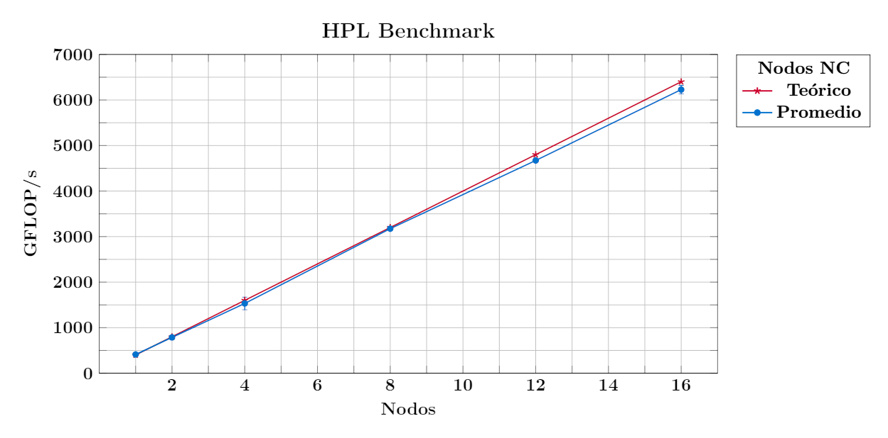

<span style="color: #990819;">*Figura 1. Rendimiento de los nodos NC*</span>

```admonish note title=" "
Los valores teóricos se calcularon tomando como base el rendimiento teórico en 1 nodo. Este valor se obtuvo del siguiente [documento](https://www.intel.com/content/dam/support/us/en/documents/processors/APP-for-Intel-Xeon-Processors.pdf).

Para obtener más información, consulte el siguiente [enlace](https://www.intel.com/content/www/us/en/support/articles/000005755/processors.html).
```


#### Eficiencia paralela

<span style="color: #990819;">*Tabla 5. Rendimiento de los nodos NC*</span>
```
+---------------+----------+------------+-------------+--------------+------------+------------+------------+
| **No. de\     | **Número | **Tamaño   | **GFLOP/s**                                                       |
| ejecuciones** | de\      | del\       |                                                                   |
|               | nodos**  | problema** |                                                                   |
|               |          |            +-------------+--------------+------------+------------+------------+
|               |          |            | **Teórico** | **Promedio** | **Mínimo** | **Máximo** | **σ**      |
+---------------+----------+------------+-------------+--------------+------------+------------+------------+
| 5             | 1        | 82432      | 411.05      | 411.05       | 404.29     | 414.69     | 3.73       |
+---------------+----------+------------+-------------+--------------+------------+------------+------------+
| 5             | 2        | 82432      | 822.11      | 776.97       | 694.87     | 799.44     | 41.08      |
+---------------+----------+------------+-------------+--------------+------------+------------+------------+
| 5             | 4        | 82432      | 1644.22     | 1532.72      | 1521.20    | 1548.60    | 11.20      |
+---------------+----------+------------+-------------+--------------+------------+------------+------------+
| 5             | 8        | 82432      | 3288.43     | 2838.42      | 2805.60    | 2849.70    | 16.56      |
+---------------+----------+------------+-------------+--------------+------------+------------+------------+
| 5             | 12       | 82432      | 4932.65     | 3953.76      | 3931.70    | 3975.50    | 15.55      |
+---------------+----------+------------+-------------+--------------+------------+------------+------------+
| 5             | 16       | 82432      | 6576.86     | 5129.76      | 5068.80    | 5171.00    | 38.33      |
+---------------+----------+------------+-------------+--------------+------------+------------+------------+
```
\
<span style="color: #1285E3;">Rendimiento de los nodos NC</span>

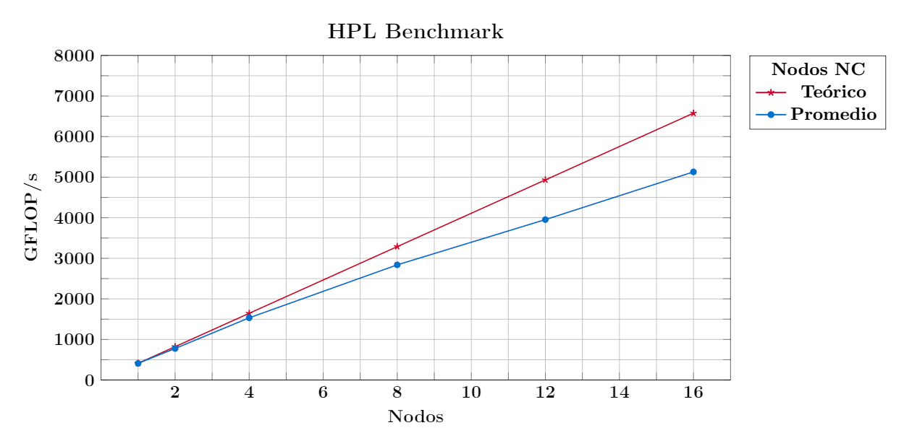

<span style="color: #990819;">*Figura 2. Rendimiento de los nodos NC*</span>

```admonish note title=" "
Los valores teóricos se calcularon tomando como base el rendimiento obtenido en 1 nodo.
```

<span style="color: #990819;">*Tabla 6. SpeedUp de los nodos NC*</span>
```
+---------------+----------+------------+------------+--------------+------------+------------+------------+
| **No. de\     | **Número | **Tamaño   | **SpeedUp**                                                      |
| ejecuciones** | de\      | del\       |                                                                  |
|               | nodos**  | problema** |                                                                  |
|               |          |            +------------+--------------+------------+------------+------------+
|               |          |            | **Ideal**  | **Promedio** | **Mínimo** | **Máximo** | **σ**      |
+---------------+----------+------------+------------+--------------+------------+------------+------------+
| 5             | 1        | 82432      | 1.00       | 1.00         | 1.00       | 1.00       | 0.00       |
+---------------+----------+------------+------------+--------------+------------+------------+------------+
| 5             | 2        | 82432      | 2.00       | 1.88         | 1.68       | 1.98       | 0.11       |
+---------------+----------+------------+------------+--------------+------------+------------+------------+
| 5             | 4        | 82432      | 4.00       | 3.73         | 3.68       | 3.78       | 0.03       |
+---------------+----------+------------+------------+--------------+------------+------------+------------+
| 5             | 8        | 82432      | 8.00       | 6.91         | 6.80       | 7.05       | 0.08       |
+---------------+----------+------------+------------+--------------+------------+------------+------------+
| 5             | 12       | 82432      | 12.00      | 9.62         | 9.50       | 9.78       | 0.09       |
+---------------+----------+------------+------------+--------------+------------+------------+------------+
| 5             | 16       | 82432      | 16.00      | 12.48        | 12.29      | 12.62      | 0.11       |
+---------------+----------+------------+------------+--------------+------------+------------+------------+
```
\
<span style="color: #1285E3;">SpeedUp de los nodos NC</span>

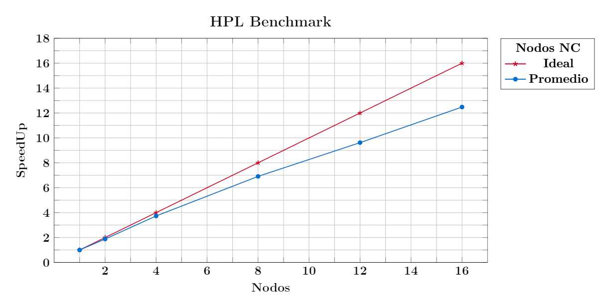

<span style="color: #990819;">*Figura 3. SpeedUp de los nodos NC*</span>

\
<span style="color: #990819;">*Tabla 7. Eficiencia paralela de los nodos NC*</span>
```
+---------------+----------+------------+------------+--------------+------------+------------+------------+
| **No. de\     | **Número | **Tamaño   | **Eficiencia Paralela**                                          |
| ejecuciones** | de\      | del\       |                                                                  |
|               | nodos**  | problema** |                                                                  |
|               |          |            +------------+--------------+------------+------------+------------+
|               |          |            | **Ideal**  | **Promedio** | **Mínimo** | **Máximo** | **σ**      |
+---------------+----------+------------+------------+--------------+------------+------------+------------+
| 5             | 1        | 82432      | 1.00       | 1.00         | 1.00       | 1.00       | 0.00       |
+---------------+----------+------------+------------+--------------+------------+------------+------------+
| 5             | 2        | 82432      | 1.00       | 0.94         | 0.84       | 0.99       | 0.05       |
+---------------+----------+------------+------------+--------------+------------+------------+------------+
| 5             | 4        | 82432      | 1.00       | 0.93         | 0.92       | 0.95       | 0.01       |
+---------------+----------+------------+------------+--------------+------------+------------+------------+
| 5             | 8        | 82432      | 1.00       | 0.86         | 0.85       | 0.88       | 0.01       |
+---------------+----------+------------+------------+--------------+------------+------------+------------+
| 5             | 12       | 82432      | 1.00       | 0.80         | 0.79       | 0.82       | 0.01       |
+---------------+----------+------------+------------+--------------+------------+------------+------------+
| 5             | 16       | 82432      | 1.00       | 0.78         | 0.77       | 0.79       | 0.01       |
+---------------+----------+------------+------------+--------------+------------+------------+------------+
```
\
<span style="color: #1285E3;">Eficiencia Paralela de los nodos NC</span>

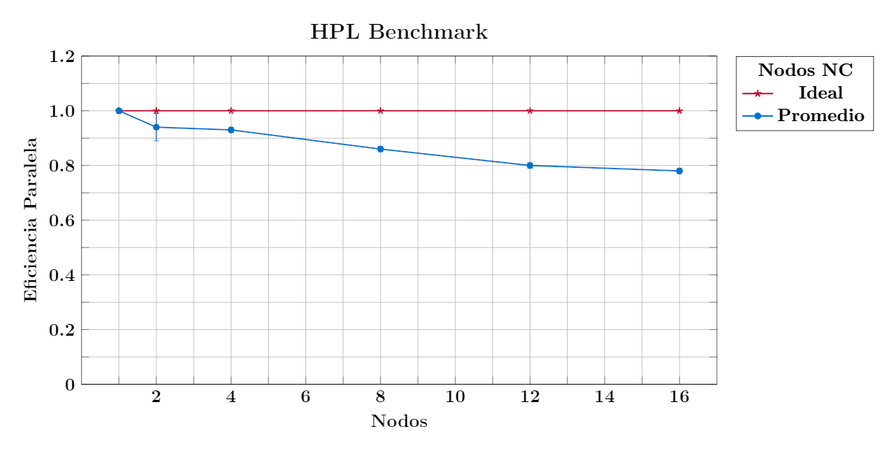

<span style="color: #990819;">*Figura 4. Eficiencia Paralela de los nodos NC*</span>


### Nodos TTv1


#### Rendimiento

<span style="color: #990819;">*Tabla 8. Rendimiento de los nodos TTv1*</span>
```
+---------------+----------+------------+-------------+--------------+------------+------------+------------+
| **No. de\     | **Número | **Tamaño   | **GFLOP/s**                                                       |
| ejecuciones** | de\      | del\       |                                                                   |
|               | nodos**  | problema** |                                                                   |
|               |          |            +-------------+--------------+------------+------------+------------+
|               |          |            | **Teórico** | **Promedio** | **Mínimo** | **Máximo** | **σ**      |
+---------------+----------+------------+-------------+--------------+------------+------------+------------+
| 5             | 1        | 116480     | 832.00      | 598.28       | 576.12     | 617.02     | 15.18      |
+---------------+----------+------------+-------------+--------------+------------+------------+------------+
| 5             | 2        | 164864     | 1664.00     | 1140.56      | 1077.40    | 1162.60    | 32.24      |
+---------------+----------+------------+-------------+--------------+------------+------------+------------+
| 5             | 4        | 233184     | 3328.00     | 2157.34      | 1698.70    | 2355.90    | 239.96     |
+---------------+----------+------------+-------------+--------------+------------+------------+------------+
| 5             | 8        | 329728     | 6656.00     | 3891.14      | 2419.00    | 4632.90    | 787.50     |
+---------------+----------+------------+-------------+--------------+------------+------------+------------+
| 5             | 12       | 403872     | 9984.00     | 4627.80      | 3241.60    | 6507.70    | 1433.78    |
+---------------+----------+------------+-------------+--------------+------------+------------+------------+
| 5             | 16       | 466368     | 13312.00    | 5796.84      | 3118.60    | 8684.90    | 2121.74    |
+---------------+----------+------------+-------------+--------------+------------+------------+------------+
```
\
<span style="color: #1285E3;">Rendimiento de los nodos TTv1</span>

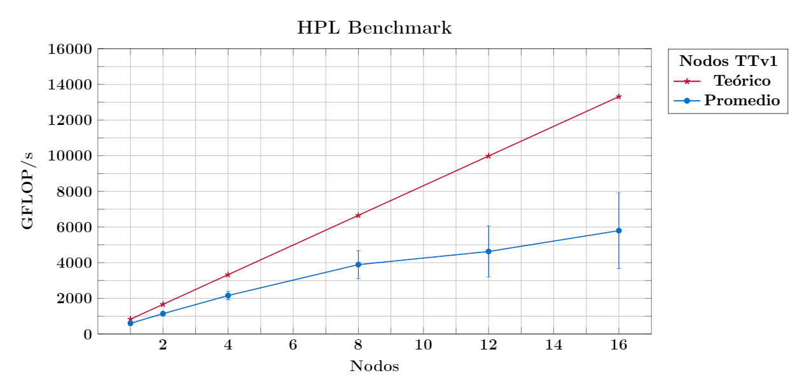

<span style="color: #990819;">*Figura 5. Rendimiento de los nodos TTv1*</span>

```admonish note title=" "
Los valores teóricos se calcularon tomando como base el rendimiento teórico en 1 nodo. Este valor se obtuvo del siguiente [documento](https://www.intel.com/content/dam/support/us/en/documents/processors/APP-for-Intel-Xeon-Processors.pdf).

Para obtener más información, consulte el siguiente [enlace](https://www.intel.com/content/www/us/en/support/articles/000005755/processors.html).
```


#### Eficiencia paralela

<span style="color: #990819;">*Tabla 9. Rendimiento de los nodos TTv1*</span>
```
+---------------+----------+------------+-------------+--------------+------------+------------+------------+
| **No. de\     | **Número | **Tamaño   | **GFLOP/s**                                                       |
| ejecuciones** | de\      | del\       |                                                                   |
|               | nodos**  | problema** |                                                                   |
|               |          |            +-------------+--------------+------------+------------+------------+
|               |          |            | **Teórico** | **Promedio** | **Mínimo** | **Máximo** | **σ**      |
+---------------+----------+------------+-------------+--------------+------------+------------+------------+
| 5             | 1        | 116480     | 598.28      | 598.28       | 576.12     | 617.02     | 15.18      |
+---------------+----------+------------+-------------+--------------+------------+------------+------------+
| 5             | 2        | 116480     | 1196.56     | 1103.86      | 1050.6     | 1146.4     | 38.66      |
+---------------+----------+------------+-------------+--------------+------------+------------+------------+
| 5             | 4        | 116480     | 2393.11     | 2101.16      | 1737.2     | 2265.9     | 200.42     |
+---------------+----------+------------+-------------+--------------+------------+------------+------------+
| 5             | 8        | 116480     | 4786.22     | 3702.76      | 2263.8     | 4259.7     | 739.10     |
+---------------+----------+------------+-------------+--------------+------------+------------+------------+
| 5             | 12       | 116480     | 7179.34     | 4250.50      | 3245.7     | 6021.9     | 1217.63    |
+---------------+----------+------------+-------------+--------------+------------+------------+------------+
| 5             | 16       | 116480     | 9572.45     | 5636.48      | 4197.3     | 7901.7     | 1742.36    |
+---------------+----------+------------+-------------+--------------+------------+------------+------------+
```
\
<span style="color: #1285E3;">Rendimiento de los nodos TTv1</span>

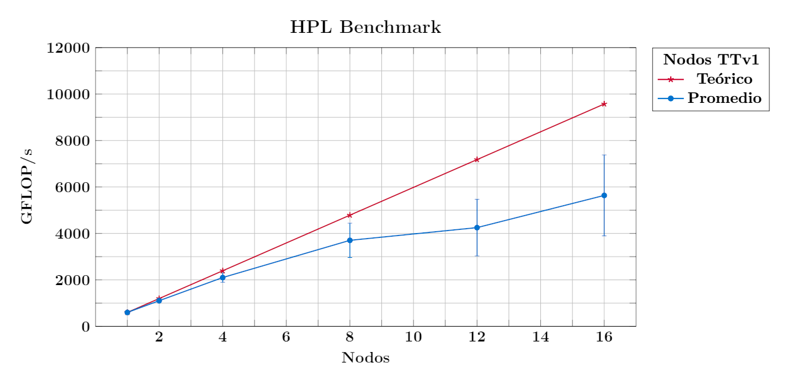

<span style="color: #990819;">*Figura 6. Rendimiento de los nodos TTv1*</span>

```admonish note title=" "
Los valores teóricos se calcularon tomando como base el rendimiento obtenido en 1 nodo.
```

<span style="color: #990819;">*Tabla 10. SpeedUp de los nodos TTv1*</span>
```
+---------------+----------+------------+------------+--------------+------------+------------+------------+
| **No. de\     | **Número | **Tamaño   | **SpeedUp**                                                      |
| ejecuciones** | de\      | del\       |                                                                  |
|               | nodos**  | problema** |                                                                  |
|               |          |            +------------+--------------+------------+------------+------------+
|               |          |            | **Ideal**  | **Promedio** | **Mínimo** | **Máximo** | **σ**      |
+---------------+----------+------------+------------+--------------+------------+------------+------------+
| 5             | 1        | 116480     | 1.00       | 1.00         | 1.00       | 1.00       | 0.00       |
+---------------+----------+------------+------------+--------------+------------+------------+------------+
| 5             | 2        | 116480     | 2.00       | 1.84         | 1.72       | 1.95       | 0.08       |
+---------------+----------+------------+------------+--------------+------------+------------+------------+
| 5             | 4        | 116480     | 4.00       | 3.48         | 3.02       | 3.84       | 0.30       |
+---------------+----------+------------+------------+--------------+------------+------------+------------+
| 5             | 8        | 116480     | 8.00       | 5.85         | 3.93       | 7.09       | 1.15       |
+---------------+----------+------------+------------+--------------+------------+------------+------------+
| 5             | 12       | 116480     | 12.00      | 6.59         | 5.35       | 10.27      | 2.04       |
+---------------+----------+------------+------------+--------------+------------+------------+------------+
| 5             | 16       | 116480     | 16.00      | 8.63         | 7.05       | 12.81      | 2.68       |
+---------------+----------+------------+------------+--------------+------------+------------+------------+
```

\
<span style="color: #1285E3;">SpeedUp de los nodos TTv1</span>

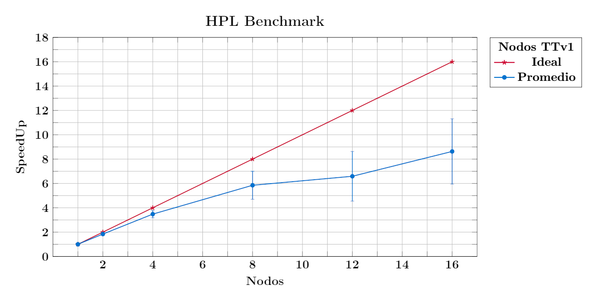

<span style="color: #990819;">*Figura 7. SpeedUp de los nodos TTv1*</span>

\
<span style="color: #990819;">*Tabla 11. Eficiencia paralela de los nodos TTv1*</span>
```
+---------------+----------+------------+------------+--------------+------------+------------+------------+
| **No. de\     | **Número | **Tamaño   | **Eficiencia Paralela**                                          |
| ejecuciones** | de\      | del\       |                                                                  |
|               | nodos**  | problema** |                                                                  |
|               |          |            +------------+--------------+------------+------------+------------+
|               |          |            | **Ideal**  | **Promedio** | **Mínimo** | **Máximo** | **σ**      |
+---------------+----------+------------+------------+--------------+------------+------------+------------+
| 5             | 1        | 116480     | 1.00       | 1.00         | 1.00       | 1.00       | 0.00       |
+---------------+----------+------------+------------+--------------+------------+------------+------------+
| 5             | 2        | 116480     | 1.00       | 0.92         | 0.86       | 0.98       | 0.04       |
+---------------+----------+------------+------------+--------------+------------+------------+------------+
| 5             | 4        | 116480     | 1.00       | 0.87         | 0.76       | 0.96       | 0.08       |
+---------------+----------+------------+------------+--------------+------------+------------+------------+
| 5             | 8        | 116480     | 1.00       | 0.73         | 0.49       | 0.89       | 0.14       |
+---------------+----------+------------+------------+--------------+------------+------------+------------+
| 5             | 12       | 116480     | 1.00       | 0.55         | 0.45       | 0.86       | 0.17       |
+---------------+----------+------------+------------+--------------+------------+------------+------------+
| 5             | 16       | 116480     | 1.00       | 0.54         | 0.44       | 0.80       | 0.17       |
+---------------+----------+------------+------------+--------------+------------+------------+------------+
```

\
<span style="color: #1285E3;">Eficiencia Paralela de los nodos TTv1</span>

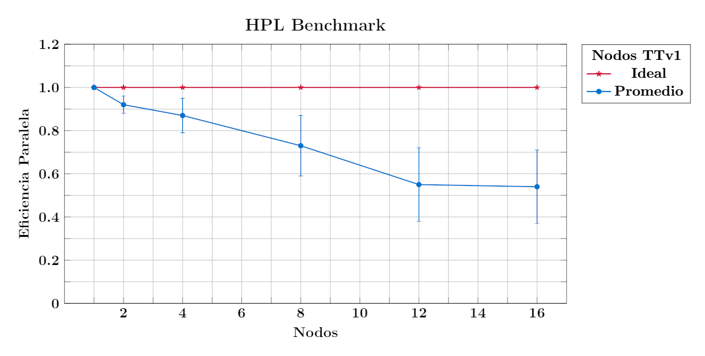

<span style="color: #990819;">*Figura 8. Eficiencia Paralela de los nodos TTv1*</span>


### Nodos TTv2


#### Rendimiento

<span style="color: #990819;">Tabla 12. Rendimiento de los nodos TTv2</span>
```
+---------------+----------+------------+-------------+--------------+------------+------------+------------+
| **No. de\     | **Número | **Tamaño   | **GFLOP/s**                                                       |
| ejecuciones** | de\      | del\       |                                                                   |
|               | nodos**  | problema** |                                                                   |
|               |          |            +-------------+--------------+------------+------------+------------+
|               |          |            | **Teórico** | **Promedio** | **Mínimo** | **Máximo** | **σ**      |
+---------------+----------+------------+-------------+--------------+------------+------------+------------+
| 5             | 1        | 164864     | 1075.20     | 729.58       | 686.95     | 761.56     | 29.24      |
+---------------+----------+------------+-------------+--------------+------------+------------+------------+
| 5             | 2        | 233184     | 2150.40     | 1438.04      | 1381.10    | 1496.80    | 42.90      |
+---------------+----------+------------+-------------+--------------+------------+------------+------------+
| 5             | 4        | 329728     | 4300.80     | 1724.86      | 1232.80    | 2659.00    | 539.26     |
+---------------+----------+------------+-------------+--------------+------------+------------+------------+
| 5             | 8        | 466368     | 8601.60     | 3236.20      | 2455.10    | 4972.80    | 886.62     |
+---------------+----------+------------+-------------+--------------+------------+------------+------------+
| 5             | 12       | 571200     | 12902.40    | 5254.36      | 2497.90    | 8010.10    | 1748.29    |
+---------------+----------+------------+-------------+--------------+------------+------------+------------+
| 5             | 16       | 659456     | 17203.20    | 4508.90      | 2689.00    | 7151.30    | 1661.60    |
+---------------+----------+------------+-------------+--------------+------------+------------+------------+
```

\
<span style="color: #1285E3;">Rendimiento de los nodos TTv2</span>

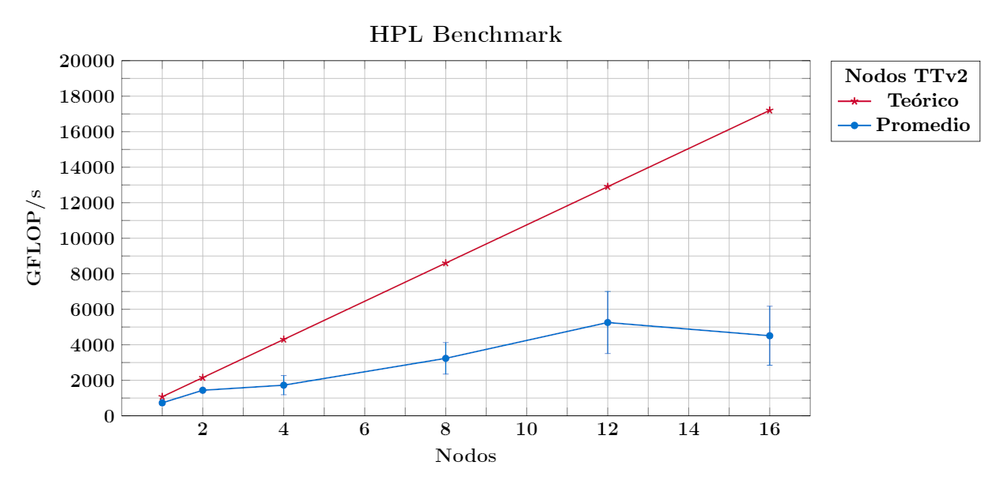

<span style="color: #990819;">*Figura 9. Rendimiento de los nodos TTv2*</span>

```admonish note title=" "
Los valores teóricos se calcularon tomando como base el rendimiento teórico en 1 nodo. Este valor se obtuvo del siguiente [documento](https://www.intel.com/content/dam/support/us/en/documents/processors/APP-for-Intel-Xeon-Processors.pdf).

Para obtener más información, consulte el siguiente [enlace](https://www.intel.com/content/www/us/en/support/articles/000005755/processors.html).
```


#### Eficiencia paralela

<span style="color: #990819;">*Tabla 13. Rendimiento de los nodos TTv2*</span>
```
+---------------+----------+------------+-------------+--------------+------------+------------+------------+
| **No. de\     | **Número | **Tamaño   | **GFLOP/s**                                                       |
| ejecuciones** | de\      | del\       |                                                                   |
|               | nodos**  | problema** |                                                                   |
|               |          |            +-------------+--------------+------------+------------+------------+
|               |          |            | **Teórico** | **Promedio** | **Mínimo** | **Máximo** | **σ**      |
+---------------+----------+------------+-------------+--------------+------------+------------+------------+
| 5             | 1        | 164864     | 729.58      | 729.58       | 686.95     | 761.56     | 29.24      |
+---------------+----------+------------+-------------+--------------+------------+------------+------------+
| 5             | 2        | 164864     | 1459.15     | 1382.94      | 1338.30    | 1445.60    | 38.44      |
+---------------+----------+------------+-------------+--------------+------------+------------+------------+
| 5             | 4        | 164864     | 2918.30     | 1574.09      | 416.97     | 2490.90    | 795.92     |
+---------------+----------+------------+-------------+--------------+------------+------------+------------+
| 5             | 8        | 164864     | 5836.61     | 3107.22      | 1951.00    | 4834.50    | 1008.10    |
+---------------+----------+------------+-------------+--------------+------------+------------+------------+
| 5             | 12       | 164864     | 8754.91     | 3451.72      | 1115.20    | 6475.40    | 1818.78    |
+---------------+----------+------------+-------------+--------------+------------+------------+------------+
| 5             | 16       | 164864     | 11673.22    | 4288.94      | 2398.70    | 6023.20    | 1153.10    |
+---------------+----------+------------+-------------+--------------+------------+------------+------------+
```

\
<span style="color: #1285E3;">Rendimiento de los nodos TTv2</span>

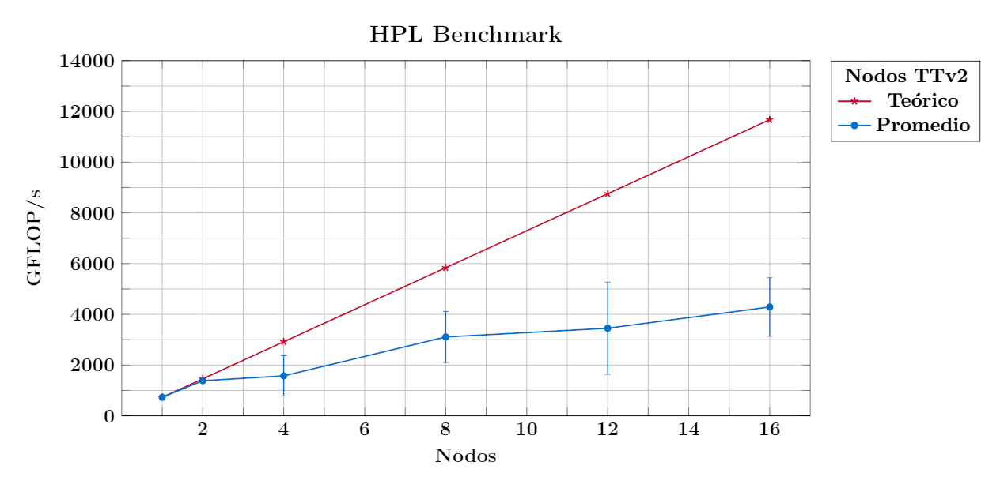

<span style="color: #990819;">*Figura 10. Rendimiento de los nodos TTv2*</span>

```admonish note title=" "
Los valores teóricos se calcularon tomando como base el rendimiento obtenido en 1 nodo.
```

\
<span style="color: #990819;">*Tabla 14. SpeedUp de los nodos TTv2*</span>
```
+---------------+----------+------------+------------+--------------+------------+------------+------------+
| **No. de\     | **Número | **Tamaño   | **SpeedUp**                                                      |
| ejecuciones** | de\      | del\       |                                                                  |
|               | nodos**  | problema** |                                                                  |
|               |          |            +------------+--------------+------------+------------+------------+
|               |          |            | **Ideal**  | **Promedio** | **Mínimo** | **Máximo** | **σ**      |
+---------------+----------+------------+------------+--------------+------------+------------+------------+
| 5             | 1        | 164864     | 1.00       | 1.00         | 1.00       | 1.00       | 0.00       |
+---------------+----------+------------+------------+--------------+------------+------------+------------+
| 5             | 2        | 164864     | 2.00       | 1.90         | 1.85       | 1.95       | 0.03       |
+---------------+----------+------------+------------+--------------+------------+------------+------------+
| 5             | 4        | 164864     | 4.00       | 1.43         | 0.61       | 3.27       | 1.01       |
+---------------+----------+------------+------------+--------------+------------+------------+------------+
| 5             | 8        | 164864     | 8.00       | 3.87         | 2.84       | 6.35       | 1.22       |
+---------------+----------+------------+------------+--------------+------------+------------+------------+
| 5             | 12       | 164864     | 12.00      | 3.35         | 1.62       | 8.50       | 2.32       |
+---------------+----------+------------+------------+--------------+------------+------------+------------+
| 5             | 16       | 164864     | 16.00      | 5.38         | 3.49       | 7.91       | 1.40       |
+---------------+----------+------------+------------+--------------+------------+------------+------------+
```

\
<span style="color: #1285E3;">SpeedUp de los nodos TTv2</span>

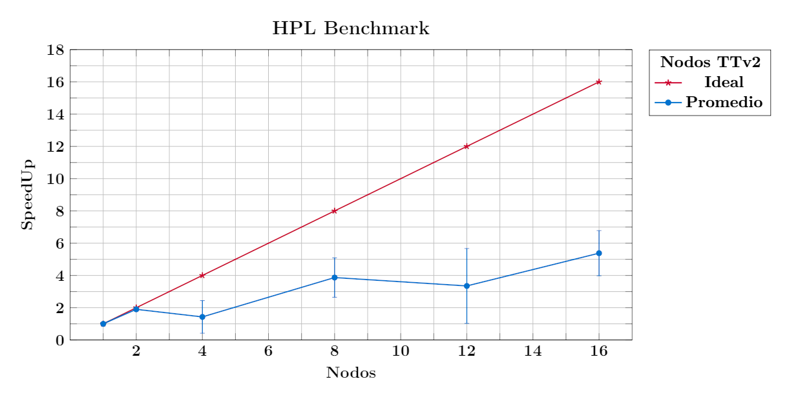

<span style="color: #990819;">*Figura 11. SpeedUp de los nodos TTv2*</span>

\
<span style="color: #990819;">*Tabla 15. Eficiencia paralela de los nodos TTv2*</span>
```
+---------------+----------+------------+------------+--------------+------------+------------+------------+
| **No. de\     | **Número | **Tamaño   | **Eficiencia Paralela**                                          |
| ejecuciones** | de\      | del\       |                                                                  |
|               | nodos**  | problema** |                                                                  |
|               |          |            +------------+--------------+------------+------------+------------+
|               |          |            | **Ideal**  | **Promedio** | **Mínimo** | **Máximo** | **σ**      |
+---------------+----------+------------+------------+--------------+------------+------------+------------+
| 5             | 1        | 164864     | 1.00       | 1.00         | 1.00       | 1.00       | 0.00       |
+---------------+----------+------------+------------+--------------+------------+------------+------------+
| 5             | 2        | 164864     | 1.00       | 0.95         | 0.93       | 0.98       | 0.02       |
+---------------+----------+------------+------------+--------------+------------+------------+------------+
| 5             | 4        | 164864     | 1.00       | 0.36         | 0.15       | 0.82       | 0.25       |
+---------------+----------+------------+------------+--------------+------------+------------+------------+
| 5             | 8        | 164864     | 1.00       | 0.48         | 0.36       | 0.79       | 0.15       |
+---------------+----------+------------+------------+--------------+------------+------------+------------+
| 5             | 12       | 164864     | 1.00       | 0.28         | 0.14       | 0.71       | 0.19       |
+---------------+----------+------------+------------+--------------+------------+------------+------------+
| 5             | 16       | 164864     | 1.00       | 0.34         | 0.22       | 0.49       | 0.09       |
+---------------+----------+------------+------------+--------------+------------+------------+------------+
```

\
<span style="color: #1285E3;">Eficiencia Paralela de los nodos TTv2</span>

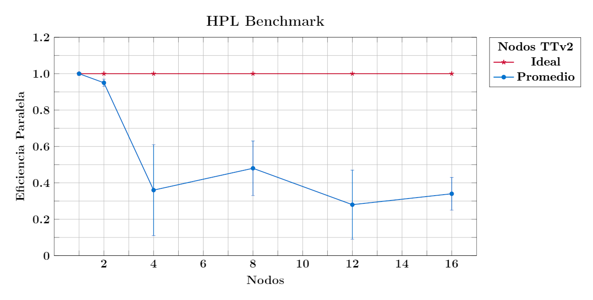

<span style="color: #990819;">*Figura 12. Eficiencia Paralela de los nodos TTv2*</span>


### Yoltla


#### Rendimiento

<span style="color: #1285E3;">Rendimiento promedio de los nodos del cluster Yoltla</span>

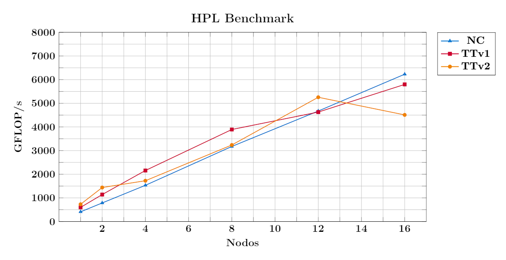

<span style="color: #990819;">*Figura 13. Rendimiento promedio de los nodos del cluster Yoltla*</span>


#### Eficiencia paralela

<span style="color: #1285E3;">Rendimiento promedio de los nodos del cluster Yoltla</span>

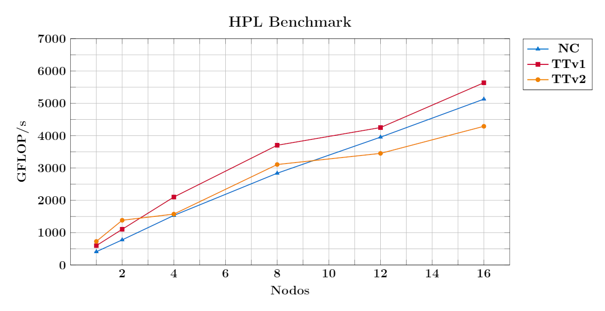

<span style="color: #990819;">*Figura 14. Rendimiento promedio de los nodos del cluster Yoltla*</span>

\
<span style="color: #1285E3;">SpeedUp promedio de los nodos del cluster Yoltla</span>

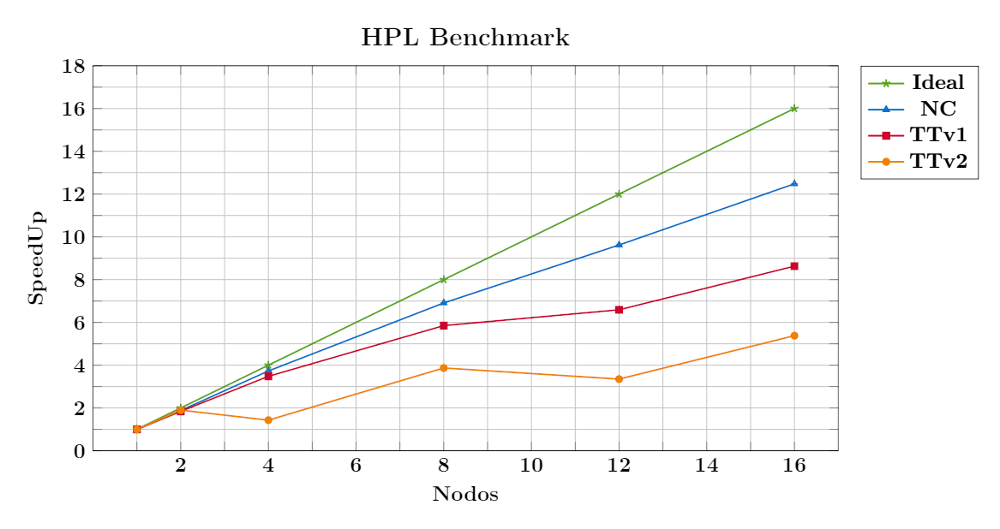

<span style="color: #990819;">*Figura 15. SpeedUp promedio de los nodos del cluster Yoltla*</span>

\
<span style="color: #1285E3;">Eficiencia Paralela promedio de los nodos del cluster Yoltla</span>

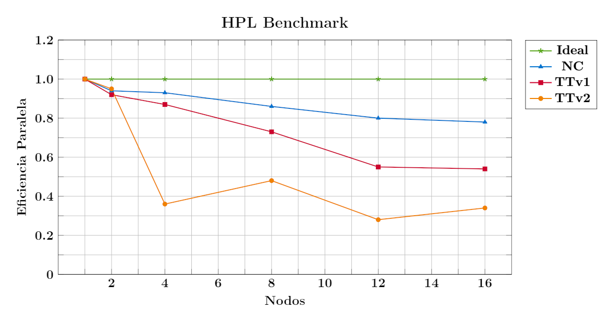

<span style="color: #990819;">*Figura 16. Eficiencia Paralela promedio de los nodos del cluster Yoltla*</span>


```admonish note title=" "
Todos los resultados mostrados en esta sección fueron obtenidos en el mes de Febrero del 2022.
```

## Sitios de interés

- [HPL - A Portable Implementation of the High-Performance Linpack Benchmark for Distributed-Memory Computers](https://netlib.org/benchmark/hpl/)

- [High-Performance Linpack (HPL) benchmarking on UL HPC platform](https://ulhpc-tutorials.readthedocs.io/en/latest/parallel/mpi/HPL/)

- [How do I tune my HPL.dat file?](https://www.advancedclustering.com/act_kb/tune-hpl-dat-file/)

- [AMD \| HPL Benchmark](https://developer.amd.com/spack/hpl-benchmark/)
