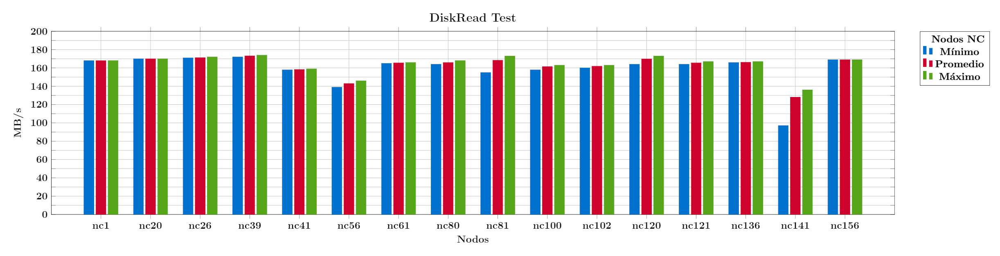
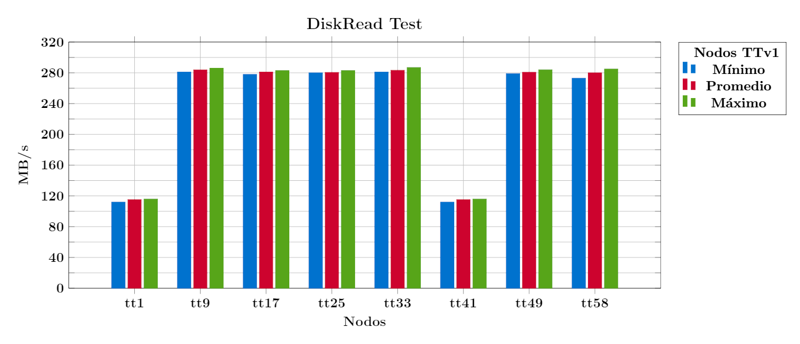
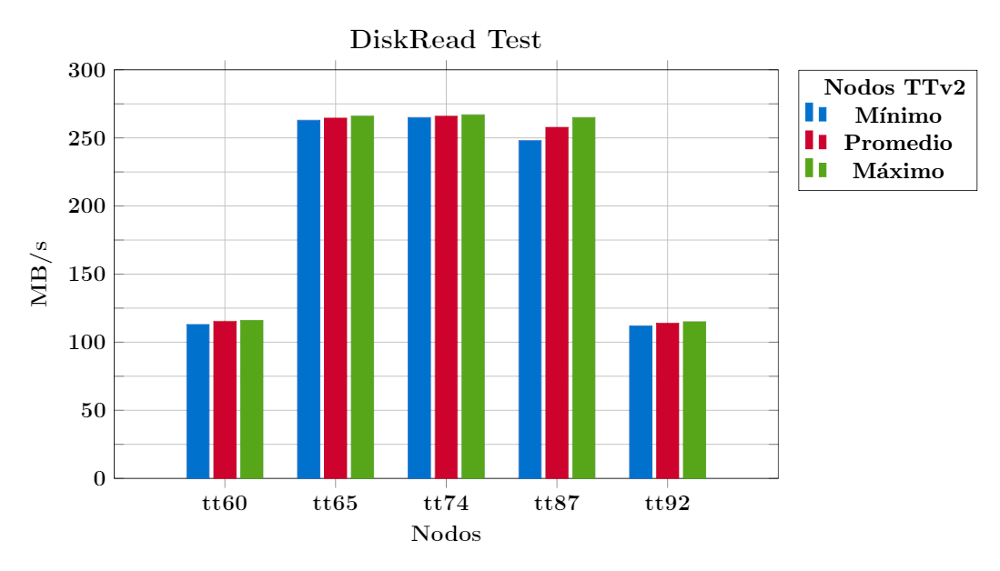
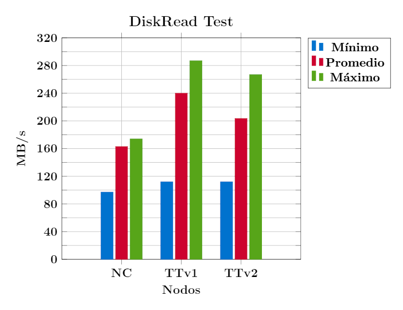

# DiskRead


## Descripción

La velocidad de lectura de un disco es el parámetro que determina la rapidez con la 
que se puede leer un archivo en el sistema. Una baja velocidad de lectura puede ser 
signo de un disco defectuoso o de una configuración inadecuada, por lo que es importante 
conocer el valor de este parámetro.

Existen diferentes programas y utilidades para determinar este valor, sin embargo, muchos 
de ellos requieren permisos de superusuario (root) para su ejecución, con el fin de evitar 
este problema, se optó por utilizar el comando `dd` del del paquete 
[GNU Core Utilities](https://www.gnu.org/software/coreutils/).


## Ejecución

1.  Cargue el módulo de Coreutils:

    ```bash
    [t.800@yoltla ~]$ module load coreutils-8.32-gcc-7.2.0-43jmyud
    ```

2.  Cree el archivo a leer:

    ```bash
    [t.800@yoltla ~]$ sync; dd if=/dev/zero of=/tmp/read_file bs=1M count=2048 oflag=dsync status=progress; sync
    ```

3.  Descarte de la memoria caché los datos del archivo a leer:

    ```bash
    [t.800@yoltla ~]$ dd if=/tmp/read_file iflag=nocache count=0
    [t.800@yoltla ~]$ dd of=/tmp/read_file oflag=nocache conv=notrunc,fdatasync count=0
    ```

4.  Ejecute el comando:

    ```bash
    [t.800@yoltla ~]$ sync; dd if=/tmp/read_file of=/dev/null bs=1M status=progress; sync
    ```


## Salida

A continuación se presenta la salida de una ejecución de esta prueba:

```bash
1357905920 bytes (1.4 GB, 1.3 GiB) copied, 7 s, 194 MB/s          (1)  
2048+0 records in                                                 (2) 
2048+0 records out                                                (3)
2147483648 bytes (2.1 GB, 2.0 GiB) copied, 7.73725 s, 278 MB/s    (4)  
```

1. Progreso de la ejecución

2. Número de registros leídos

3. Número de registros escritos

4. Bytes copiados, tiempo de ejecución, velocidad final de lectura


## Nodos de cómputo

Unresolved directive in diskread.adoc - include::partial\$reframe/nodos_computo.adoc\[\]

## Pruebas

No existe una restricción en el tamaño del archivo a leer en esta prueba, por lo que el 
criterio para determinar los parámetros de la misma fue el de poder realizar pruebas 
rápidas y fiables. En todos los nodos se utilizaron los mismos parámetros. En las siguientas 
tablas se da un resumen de las pruebas realizadas:

<span style="color: #990819;">*Tabla 1. Pruebas en los nodos NC*</span>

| **Nodo** | **bs** | **count** |
|:--------:|:------:|:---------:|
| nc1      | 1M     | 8192      |
| nc20     | 1M     | 8192      |
| nc26     | 1M     | 8192      |
| nc39     | 1M     | 8192      |
| nc41     | 1M     | 8192      |
| nc56     | 1M     | 8192      |
| nc61     | 1M     | 8192      |
| nc80     | 1M     | 8192      |
| nc81     | 1M     | 8192      |
| nc100    | 1M     | 8192      |
| nc102    | 1M     | 8192      |
| nc120    | 1M     | 8192      |
| nc121    | 1M     | 8192      |
| nc136    | 1M     | 8192      |
| nc141    | 1M     | 8192      |
| nc156    | 1M     | 8192      |

<span style="color: #990819;">*Pruebas en los nodos TTv1*</span>

| **Nodo** | **bs** | **count** |
|:--------:|:------:|:---------:|
| tt1      | 1M     | 8192      |
| tt9      | 1M     | 8192      |
| tt17     | 1M     | 8192      |
| tt25     | 1M     | 8192      |
| tt33     | 1M     | 8192      |
| tt41     | 1M     | 8192      |
| tt49     | 1M     | 8192      |
| tt58     | 1M     | 8192      |


<span style="color: #990819;">*Pruebas en los nodos TTv2*</span>

| **Nodo** | **bs** | **count** |
|:--------:|:------:|:---------:|
| tt60     | 1M     | 8192      |
| tt65     | 1M     | 8192      |
| tt74     | 1M     | 8192      |
| tt87     | 1M     | 8192      |
| tt92     | 1M     | 8192      |

```admonish note title=" "
Los nodos no fueron seleccionados bajo ningún criterio en particular, salvo su 
disponibilidad en el cluster, y con el objetivo de obtener una muestra representativa 
de cada tipo de nodo.
```


## Scripts


### Estructura de directorios

Dentro de la carpeta raíz *diskread* existen tres subdirectorios, uno por cada tipo 
de nodo en el cluster Yoltla:

    diskread
    ├── nc
    │   ├── logs
    │   ├── diskread_nc.py
    │   └── src
    ├── ttv1
    │   ├── logs
    │   ├── diskread_ttv1.py
    │   └── src
    └── ttv2
        ├── logs
        ├── diskread_ttv2.py
        └── src

Cada uno de estos directorios alberga una prueba de ReFrame.

```admonish note title=" "
La versión de coreutils utilizada en estos scripts es la 8.32.
```


### Lanzar pruebas


#### Individualmente

Para lanzar pruebas de forma individual, ubíquese dentro del directorio de la prueba 
de interés, y ejecute el comando:

```bash
reframe -c <nombre_script> -r
```

Por ejemplo, para lanzar la prueba de los nodos NC, ejecute el comando:

```bash
[t.800@yoltla nc]$ reframe -c diskread_nc.py -r
```


#### Etiquetas

Utilizando etiquetas puede lanzar múltiples pruebas con un solo comando. Para lanzar 
todas las pruebas, siga los siguientes pasos:

1.  Ubíquese en el directorio raíz *diskread*:

    ```bash
    [t.800@yoltla diskread]$
    ```

2.  Cree el directorio *logs*:

    ```bash
    [t.800@yoltla diskread]$ mkdir logs
    ```

3.  Ejecute el comando:

    ```bash
    [t.800@yoltla diskread]$ reframe -c . -R -t disk -t read -r
    ```

```admonish warning title=" "
Si no crea el directorio *logs* obtendrá el siguiente mensaje:

    /LUSTRE/home/uam/.../t.800/spack_scope/deps/linux-centos6-ivybridge/gcc-7.2.0/reframe-3.9.2-gqmjpwbafkinwklzww777oktqutklrfn/bin/reframe: failed to load configuration: [Errno 2] No such file or directory: '/LUSTRE/home/uam/.../t.800/.../diskread/logs/rfm.out'
    /LUSTRE/home/uam/.../t.800/spack_scope/deps/linux-centos6-ivybridge/gcc-7.2.0/reframe-3.9.2-gqmjpwbafkinwklzww777oktqutklrfn/bin/reframe: Log file(s) saved in '/tmp/rfm-gj0eh8gb.log'
```


## Resultados


### Nodos NC

<span style="color: #990819;">*Pruebas en los nodos TTv2*</span>

<div class="tabla-scroll">
<table style="text-align: center;">
<thead>

<tr>
<th rowspan="2">No. de ejecuciones</th>
<th rowspan="2">Nodo</th>
<th colspan="4">MB/s</th>
</tr>

<tr>
<th>Promedio</th>
<th>Mínimo</th>
<th>Máximo</th>
<th>σ</th>
</tr>

</thead>
<tbody>

<tr>
<td>5</td><td>nc1</td><td>168.00</td><td>168.00</td><td>168.00</td><td>0.00</td>
</tr>

<tr>
<td>5</td><td>nc20</td><td>170.00</td><td>170.00</td><td>170.00</td><td>0.00</td>
</tr>

<tr>
<td>5</td><td>nc26</td><td>171.20</td><td>171.00</td><td>172.00</td><td>0.40</td>
</tr>

<tr>
<td>5</td><td>nc39</td><td>173.20</td><td>172.00</td><td>174.00</td><td>0.75</td>
</tr>

<tr>
<td>5</td><td>nc41</td><td>158.40</td><td>158.00</td><td>159.00</td><td>0.49</td>
</tr>

<tr>
<td>5</td><td>nc56</td><td>143.00</td><td>139.00</td><td>146.00</td><td>2.90</td>
</tr>

<tr>
<td>5</td><td>nc61</td><td>165.60</td><td>165.00</td><td>166.00</td><td>0.49</td>
</tr>

<tr>
<td>5</td><td>nc80</td><td>166.00</td><td>164.00</td><td>168.00</td><td>1.79</td>
</tr>

<tr>
<td>5</td><td>nc81</td><td>168.40</td><td>155.00</td><td>173.00</td><td>6.86</td>
</tr>

<tr>
<td>5</td><td>nc100</td><td>161.40</td><td>158.00</td><td>163.00</td><td>2.06</td>
</tr>

<tr>
<td>5</td><td>nc102</td><td>162.00</td><td>160.00</td><td>163.00</td><td>1.26</td>
</tr>

<tr>
<td>5</td><td>nc120</td><td>169.80</td><td>164.00</td><td>173.00</td><td>3.12</td>
</tr>

<tr>
<td>5</td><td>nc121</td><td>165.60</td><td>164.00</td><td>167.00</td><td>1.02</td>
</tr>

<tr>
<td>5</td><td>nc136</td><td>166.20</td><td>166.00</td><td>167.00</td><td>0.40</td>
</tr>

<tr>
<td>5</td><td>nc141</td><td>128.02</td><td>97.10</td><td>136.00</td><td>15.46</td>
</tr>

<tr>
<td>5</td><td>nc156</td><td>169.00</td><td>169.00</td><td>169.00</td><td>0.00</td>
</tr>

</tbody>
</table>
</div>

\
<span style="color: #1285E3;">Resultados de la prueba DiskRead en los nodos NC</span>



<span style="color: #990819;">*Figura 1. Resultados de la prueba DiskRead en los nodos NC*</span>


### Nodos TTv1

<span style="color: #990819;">*Tabla 5. Resultados de la prueba DiskRead en los nodos TTv1*</span>

<div class="tabla-scroll">
<table style="text-align: center;">
<thead>

<tr>
<th rowspan="2">No. de ejecuciones</th>
<th rowspan="2">Nodo</th>
<th colspan="4">MB/s</th>
</tr>

<tr>
<th>Promedio</th>
<th>Mínimo</th>
<th>Máximo</th>
<th>σ</th>
</tr>

</thead>
<tbody>

<tr>
<td>5</td><td>tt1</td><td>115.20</td><td>112.00</td><td>116.00</td><td>1.60</td>
</tr>

<tr>
<td>5</td><td>tt9</td><td>283.80</td><td>281.00</td><td>286.00</td><td>1.72</td>
</tr>

<tr>
<td>5</td><td>tt17</td><td>281.00</td><td>278.00</td><td>283.00</td><td>1.79</td>
</tr>

<tr>
<td>5</td><td>tt25</td><td>280.60</td><td>280.00</td><td>283.00</td><td>1.20</td>
</tr>

<tr>
<td>5</td><td>tt33</td><td>283.40</td><td>281.00</td><td>287.00</td><td>1.96</td>
</tr>

<tr>
<td>5</td><td>tt41</td><td>115.20</td><td>112.00</td><td>116.00</td><td>1.60</td>
</tr>

<tr>
<td>5</td><td>tt49</td><td>280.80</td><td>279.00</td><td>284.00</td><td>1.83</td>
</tr>

<tr>
<td>5</td><td>tt58</td><td>280.00</td><td>273.00</td><td>285.00</td><td>4.10</td>
</tr>

</tbody>
</table>
</div>

\
<span style="color: #1285E3;">Resultados de la prueba DiskRead en los nodos TTv1</span>



<span style="color: #990819;">*Figura 2. Resultados de la prueba DiskRead en los nodos TTv1*</span>


### Nodos TTv2

<span style="color: #990819;">*Tabla 6. Resultados de la prueba DiskRead en los nodos TTv2*</span>

<div class="tabla-scroll">
<table style="text-align: center;">
<thead>

<tr>
<th rowspan="2">No. de ejecuciones</th>
<th rowspan="2">Nodo</th>
<th colspan="4">MB/s</th>
</tr>

<tr>
<th>Promedio</th>
<th>Mínimo</th>
<th>Máximo</th>
<th>σ</th>
</tr>

</thead>
<tbody>

<tr>
<td>5</td><td>tt60</td><td>115.40</td><td>113.00</td><td>116.00</td><td>1.20</td>
</tr>

<tr>
<td>5</td><td>tt65</td><td>264.60</td><td>263.00</td><td>266.00</td><td>1.36</td>
</tr>

<tr>
<td>5</td><td>tt74</td><td>266.00</td><td>265.00</td><td>267.00</td><td>0.63</td>
</tr>

<tr>
<td>5</td><td>tt87</td><td>257.80</td><td>248.00</td><td>265.00</td><td>6.58</td>
</tr>

<tr>
<td>5</td><td>tt92</td><td>114.00</td><td>112.00</td><td>115.00</td><td>1.26</td>
</tr>

</tbody>
</table>
</div>

\
<span style="color: #1285E3;">Resultados de la prueba DiskRead en los nodos TTv2</span>



<span style="color: #990819;">*Figura 3. Resultados de la prueba DiskRead en los nodos TTv2*</span>


### Yoltla

<span style="color: #990819;">*Tabla 7. Resultados de la prueba DiskRead en el cluster Yoltla*</span>

<div class="tabla-scroll">
<table style="text-align: center;">
<thead>

<tr>
<th rowspan="2">Nodos</th>
<th colspan="4">MB/s</th>
</tr>

<tr>
<th>Promedio</th>
<th>Mínimo</th>
<th>Máximo</th>
<th>σ</th>
</tr>

</thead>
<tbody>

<tr>
<td>NC</td><td>162.86</td><td>97.10</td><td>174.00</td><td>12.13</td>
</tr>

<tr>
<td>TTv1</td><td>240.00</td><td>112.00</td><td>287.00</td><td>72.10</td>
</tr>

<tr>
<td>TTv2</td><td>203.56</td><td>112.00</td><td>267.00</td><td>72.68</td>
</tr>

</tbody>
</table>
</div>

\
<span style="color: #1285E3;">Resultados de la prueba DiskRead en el cluster Yoltla</span>



<span style="color: #990819;">*Figura 4. Resultados de la prueba DiskRead en el cluster Yoltla*</span>

```admonish note title=" "
Todos los resultados mostrados en esta sección fueron obtenidos en el mes de Agosto del 2022.
```


## Sitios de interés

- [dd: Convert and copy a file](https://www.gnu.org/software/coreutils/manual/coreutils.html#dd-invocation)

- [Tuning dd block size](http://blog.tdg5.com/tuning-dd-block-size/)
