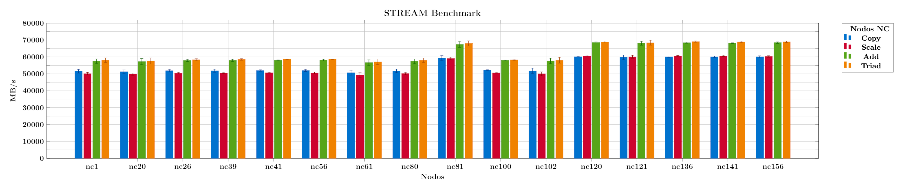
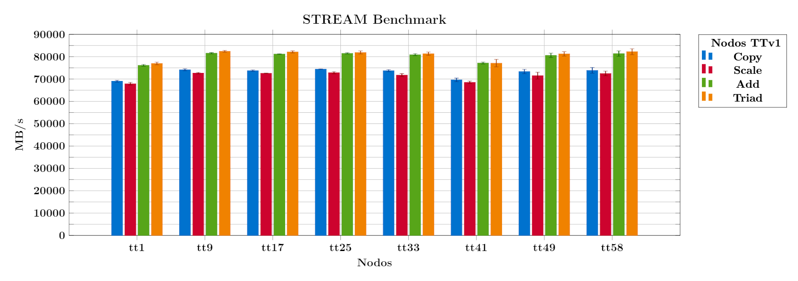
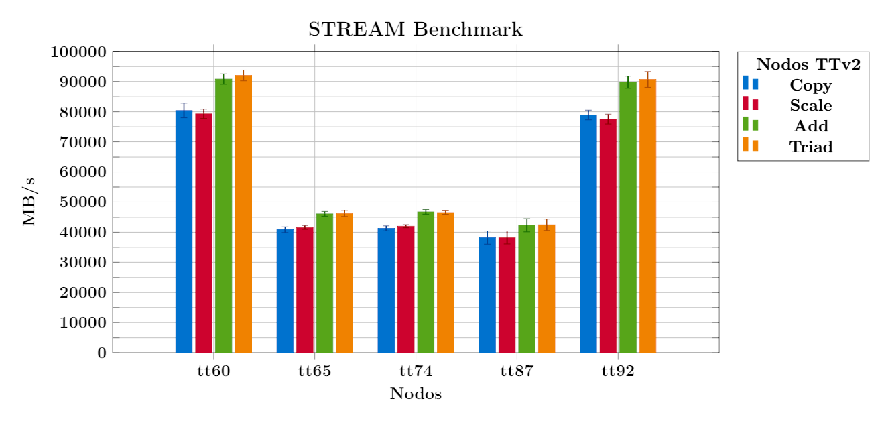
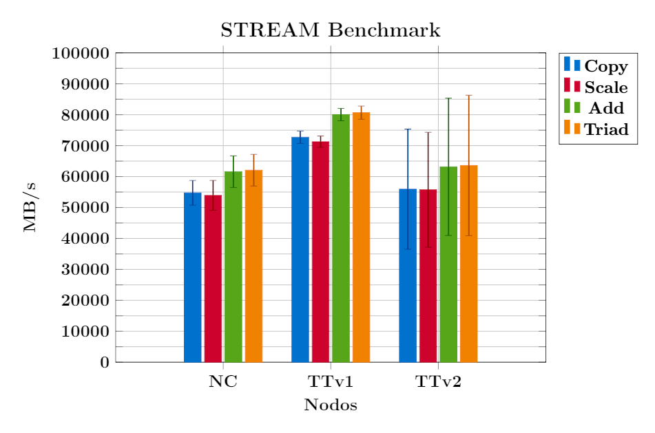

# STREAM


## Descripción

STREAM es un benchmark sintético simple que mide el ancho de banda de memoria sostenible 
(en MB/s) y la tasa de cálculo correspondiente para núcleos vectoriales simples.

STREAM está diseñado específicamente para trabajar con conjuntos de datos mucho más 
grandes que el caché disponible en cualquier sistema dado, por lo que los resultados 
son (presumiblemente) más indicativos del rendimiento de aplicaciones de estilo vectorial 
muy grandes.

STREAM mide el rendimiento de cuatro operaciones de vectores largos. Estas operaciones son:

      ------------------------------------------
                                  per iteration:
      name    kernel               bytes  FLOPS
      ------------------------------------------
      COPY:   a(i) = b(i)            16     0
      SCALE:  a(i) = q*b(i)          16     1
      SUM:    a(i) = b(i) + c(i)     24     1
      TRIAD:  a(i) = b(i) + q*c(i)   24     2
      ------------------------------------------

Cada una de estas operaciones agrega información independiente a los resultados:

- **`COPY:`** Mide las tasas de transferencia en ausencia de aritmética.

- **`SCALE:`** Agrega una operación aritmética simple.

- **`SUM:`** Agrega un tercer operando para permitir que se prueben múltiples puertos de 
carga/almacenamiento en máquinas vectoriales.

- **`TRIAD:`** Permite operaciones de multiplicación encadenada/superpuesta/fusionada y de suma.

Para obtener más información, visite el sitio oficial de [STREAM](https://www.cs.virginia.edu/stream/).


## Compilación

1.  Descargue el [código fuente](https://www.cs.virginia.edu/stream/FTP/Code/) del benchmark STREAM:

    ```bash
    [t.800@yoltla Descargas]$ wget https://www.cs.virginia.edu/stream/FTP/Code/stream.c
    --2022-08-07 20:15:23--  https://www.cs.virginia.edu/stream/FTP/Code/stream.c
    Resolving www.cs.virginia.edu... 128.143.67.11
    Connecting to www.cs.virginia.edu|128.143.67.11|:443... connected.
    HTTP request sent, awaiting response... 200 OK
    Length: 19967 (19K) [text/plain]
    Saving to: “stream.c”

    100%[===================================================================================================>] 19,967      --.-K/s   in 0.06s

    2022-08-07 20:15:24 (322 KB/s) - “stream.c” saved [19967/19967]
    ```

2.  Cargue el módulo de GCC:

    ```bash
    [t.800@yoltla Descargas]$ module load gcc/7.2.0
    ```

3.  Compile el archivo fuente:

    ```bash
    [t.800@yoltla Descargas]$ gcc -O -fopenmp -D_OPENMP stream.c -o ./stream
    <command-line>:0:0: warning: "_OPENMP" redefined
    <built-in>: note: this is the location of the previous definition
    ```

```admonish note title=" "
Para compilar STREAM, siga el siguiente formato:
    
        gcc <opciones> stream.c -o stream
    
| **Opción** | **Descripción** |
|------------|-----------------|
| -O         | Compila el código con optimizaciones.<br> Se recomienta utilizar siempre esta opción. |
| -fopenmp   | Habilita el manejo de directivas OpenMP. |
| -D_OPENMP  | Activa una combinación de MPI y OpenMP para la paralelización. |
| -DSTREAM_ARRAY_SIZE=# | Define el tamaño de la matriz.<br> El valor por defecto es 10,000,000. |
| -DNTIMES=# | Define el número de veces que se ejecutará cada kernel.<br> Se informa el mejor resultado.<br> El valor por defecto es 10. |
| -DOFFSET=# | Modifica el valor de la variable `OFFSET`.<br> Cambia la alineación relativa de las matrices.<br> El valor por defecto es 0.|

En el archivo fuente *stream.c* puede encontrar más información acerca de estas opciones.
```


## Ejecución

1.  Modifique la variable de entorno `OMP_NUM_THREADS`:

    ```bash
    [t.800@yoltla Descargas]$ export OMP_NUM_THREADS=2
    ```

2.  Ejecute el benchmark:

    ```bash
    [t.800@yoltla Descargas]$ ./stream
    ```


## Salida

A continuación se presenta la salida de una ejecución de STREAM:

```bash
-------------------------------------------------------------
STREAM version $Revision: 5.10 $                                 (1)   
-------------------------------------------------------------
This system uses 8 bytes per array element.
-------------------------------------------------------------
Array size = 10000000 (elements), Offset = 0 (elements)          (2)
Memory per array = 76.3 MiB (= 0.1 GiB).                         (3)
Total memory required = 228.9 MiB (= 0.2 GiB).                   (4) 
Each kernel will be executed 10 times.                           (5) 
 The *best* time for each kernel (excluding the first iteration)
 will be used to compute the reported bandwidth.
-------------------------------------------------------------
Number of Threads requested = 2                                  (6)
Number of Threads counted = 2                                    (7)
-------------------------------------------------------------
Your clock granularity/precision appears to be 1 microseconds.
Each test below will take on the order of 10450 microseconds.
   (= 10450 clock ticks)
Increase the size of the arrays if this shows that
you are not getting at least 20 clock ticks per test.
-------------------------------------------------------------
WARNING -- The above is only a rough guideline.
For best results, please be sure you know the
precision of your system timer.
-------------------------------------------------------------
Function    Best Rate MB/s  Avg time     Min time     Max time   (8)
Copy:           11685.7     0.013965     0.013692     0.014497
Scale:          11448.9     0.014272     0.013975     0.014857
Add:            12223.7     0.020035     0.019634     0.020522
Triad:          12459.1     0.019429     0.019263     0.019739
-------------------------------------------------------------
Solution Validates: avg error less than 1.000000e-13 on all three arrays
-------------------------------------------------------------
```

1. Versión del benchmark

2. Tamaño de la matriz / Offset

3. Memoria utilizada por matriz

4. Memoria total utilizada

5. Número de veces que se ejecutará cada kernel

6. Número de subprocesos solicitados

7. Número de subprocesos contados

8. Resultados del benchmark

    - Función
    - Mejor velocidad MB/s
    - Tiempo promedio
    - Tiempo mínimo
    - Tiempo máximo


## Nodos de cómputo

Unresolved directive in stream.adoc - include::partial\$reframe/nodos_computo.adoc\[\]


## Pruebas

La regla general para STREAM es que cada matriz debe tener al menos 4 veces el tamaño 
de la suma de todos los cachés de último nivel utilizados en la ejecución, o 1 millón 
de elementos, lo que sea mayor.

Para cada tipo de nodo se determinó un tamaño de matriz que cumpliera la condición antes 
mencionada. En las siguientas tablas se da un resumen de las pruebas realizadas:

<span style="color: #990819;">*Tabla 1. Pruebas en los nodos NC*</span>

| **Nodo** | **Tamaño de la matriz** | **Número de iteraciones** | **Número de subprocesos** |
|:--------:|:-----------------------:|:-------------------------:|:-------------------------:|
| nc1             | 40000000        | 20              | 20              |
| nc20            | 40000000        | 20              | 20              |
| nc26            | 40000000        | 20              | 20              |
| nc39            | 40000000        | 20              | 20              |
| nc41            | 40000000        | 20              | 20              |
| nc56            | 40000000        | 20              | 20              |
| nc61            | 40000000        | 20              | 20              |
| nc80            | 40000000        | 20              | 20              |
| nc81            | 40000000        | 20              | 20              |
| nc100           | 40000000        | 20              | 20              |
| nc102           | 40000000        | 20              | 20              |
| nc120           | 40000000        | 20              | 20              |
| nc121           | 40000000        | 20              | 20              |
| nc136           | 40000000        | 20              | 20              |
| nc141           | 40000000        | 20              | 20              |
| nc156           | 40000000        | 20              | 20              |

<span style="color: #990819;">*Tabla 2. Pruebas en los nodos TTv1*</span>

| **Nodo** | **Tamaño de la matriz** | **Número de iteraciones** | **Número de subprocesos** |
|:--------:|:-----------------------:|:-------------------------:|:-------------------------:|
| tt1             | 40000000        | 20              | 20              |
| tt9             | 40000000        | 20              | 20              |
| tt17            | 40000000        | 20              | 20              |
| tt25            | 40000000        | 20              | 20              |
| tt33            | 40000000        | 20              | 20              |
| tt41            | 40000000        | 20              | 20              |
| tt49            | 40000000        | 20              | 20              |
| tt58            | 40000000        | 20              | 20              |

<span style="color: #990819;">*Tabla 3. Pruebas en los nodos TTv2*</span>

| **Nodo** | **Tamaño de la matriz** | **Número de iteraciones** | **Número de subprocesos** |
|:--------:|:-----------------------:|:-------------------------:|:-------------------------:|
| tt60            | 60000000        | 20              | 20              |
| tt65            | 60000000        | 20              | 20              |
| tt74            | 60000000        | 20              | 20              |
| tt87            | 60000000        | 20              | 20              |
| tt92            | 60000000        | 20              | 20              |

```admonish note title=" "
Los nodos no fueron seleccionados bajo ningún criterio en particular, salvo su disponibilidad en el cluster, y con el objetivo de obtener una muestra representativa de cada tipo de nodo.
```


## Scripts


### Estructura de directorios

Dentro de la carpeta raíz *stream* existen tres subdirectorios, uno por cada tipo de 
nodo en el cluster Yoltla:

    stream/
    ├── nc
    │   ├── logs
    │   ├── src
    │   │   └── stream.c
    │   └── stream_nc.py
    ├── ttv1
    │   ├── logs
    │   ├── src
    │   │   └── stream.c
    │   └── stream_ttv1.py
    └── ttv2
        ├── logs
        ├── src
        │   └── stream.c
        └── stream_ttv2.py

Cada uno de estos directorios alberga una prueba de ReFrame.

```admonish note title=" "
La versión de STREAM utilizada en estos scripts es la 5.10.
```


### Lanzar pruebas


#### Individualmente

Para lanzar pruebas de forma individual, ubíquese dentro del directorio de la prueba 
de interés, y ejecute el comando:

```bash
reframe -c <nombre_script> -r
```

Por ejemplo, para lanzar la prueba de los nodos NC, ejecute el comando:

```bash
[t.800@yoltla nc]$ reframe -c stream_nc.py -r
```


#### Etiquetas

Utilizando etiquetas puede lanzar múltiples pruebas con un solo comando. Para lanzar todas las pruebas, siga los siguientes pasos:

1.  Ubíquese en el directorio raíz *stream*:

    ```
    [t.800@yoltla stream]$
    ```

2.  Cree el directorio *logs*:

    ```bash
    [t.800@yoltla stream]$ mkdir logs
    ```

3.  Ejecute el comando:

    ```bash
    [t.800@yoltla stream]$ reframe -c . -R -t stream -r
    ```

```admonish warning title=" "
Si no crea el directorio *logs* obtendrá el siguiente mensaje:

    /LUSTRE/home/uam/.../t.800/spack_scope/deps/linux-centos6-ivybridge/gcc-7.2.0/reframe-3.9.2-gqmjpwbafkinwklzww777oktqutklrfn/bin/reframe: failed to load configuration: [Errno 2] No such file or directory: '/LUSTRE/home/uam/.../t.800/.../stream/logs/rfm.out'
    /LUSTRE/home/uam/.../t.800/spack_scope/deps/linux-centos6-ivybridge/gcc-7.2.0/reframe-3.9.2-gqmjpwbafkinwklzww777oktqutklrfn/bin/reframe: Log file(s) saved in '/tmp/rfm-0mlxw3yi.log'
```


## Resultados


### Nodos NC

<span style="color: #990819;">*Tabla 4. Resultados de las pruebas de Copy y Scale en los nodos NC*</span>
```
+---------------+----------+--------------+------------+------------+---------+--------------+------------+------------+---------+
| **No. de\     | **Nodo** | **Copy**                                         | **Scale**                                        |
| ejecuciones** |          |                                                  |                                                  |
|               |          +--------------+------------+------------+---------+--------------+------------+------------+---------+
|               |          | **Promedio** | **Mínimo** | **Máximo** | **σ**   | **Promedio** | **Mínimo** | **Máximo** | **σ**   |
+---------------+----------+--------------+------------+------------+---------+--------------+------------+------------+---------+
| 5             | nc1      | 51494.16     | 49417.40   | 52352.10   | 1121.09 | 50078.68     | 48583.80   | 50677.80   | 768.16  |
+---------------+----------+--------------+------------+------------+---------+--------------+------------+------------+---------+
| 5             | nc20     | 51272.16     | 49272.30   | 52236.00   | 1056.69 | 49797.52     | 48484.70   | 50334.80   | 665.71  |
+---------------+----------+--------------+------------+------------+---------+--------------+------------+------------+---------+
| 5             | nc26     | 51856.30     | 50436.90   | 52309.30   | 719.01  | 50355.44     | 49379.20   | 50906.60   | 517.22  |
+---------------+----------+--------------+------------+------------+---------+--------------+------------+------------+---------+
| 5             | nc39     | 51810.88     | 50114.00   | 52827.10   | 917.96  | 50478.18     | 50039.20   | 50838.10   | 285.32  |
+---------------+----------+--------------+------------+------------+---------+--------------+------------+------------+---------+
| 5             | nc41     | 51949.84     | 51434.30   | 52648.90   | 476.98  | 50615.94     | 50184.20   | 50983.90   | 263.06  |
+---------------+----------+--------------+------------+------------+---------+--------------+------------+------------+---------+
| 5             | nc56     | 51983.16     | 50854.50   | 52658.20   | 605.07  | 50524.30     | 49635.80   | 51158.80   | 526.92  |
+---------------+----------+--------------+------------+------------+---------+--------------+------------+------------+---------+
| 5             | nc61     | 50638.14     | 48246.80   | 52036.50   | 1436.15 | 49347.26     | 47270.60   | 50761.20   | 1418.52 |
+---------------+----------+--------------+------------+------------+---------+--------------+------------+------------+---------+
| 5             | nc80     | 51733.72     | 49712.10   | 52666.40   | 1049.02 | 50130.96     | 49000.70   | 51012.00   | 667.47  |
+---------------+----------+--------------+------------+------------+---------+--------------+------------+------------+---------+
| 5             | nc81     | 59335.10     | 56637.90   | 60918.10   | 1447.47 | 59086.56     | 57823.80   | 59969.50   | 777.70  |
+---------------+----------+--------------+------------+------------+---------+--------------+------------+------------+---------+
| 5             | nc100    | 52222.86     | 51804.50   | 52540.70   | 238.98  | 50565.86     | 50409.50   | 50955.90   | 206.21  |
+---------------+----------+--------------+------------+------------+---------+--------------+------------+------------+---------+
| 5             | nc102    | 51754.68     | 48706.40   | 52913.50   | 1548.48 | 50031.64     | 47747.30   | 51175.40   | 1193.58 |
+---------------+----------+--------------+------------+------------+---------+--------------+------------+------------+---------+
| 5             | nc120    | 60118.82     | 59930.70   | 60286.00   | 122.53  | 60445.30     | 59976.20   | 61456.40   | 542.99  |
+---------------+----------+--------------+------------+------------+---------+--------------+------------+------------+---------+
| 5             | nc121    | 59760.54     | 57235.70   | 61209.80   | 1343.50 | 60027.98     | 58483.90   | 61033.00   | 885.15  |
+---------------+----------+--------------+------------+------------+---------+--------------+------------+------------+---------+
| 5             | nc136    | 60045.28     | 59380.50   | 60485.70   | 429.80  | 60472.38     | 60043.30   | 61062.20   | 344.31  |
+---------------+----------+--------------+------------+------------+---------+--------------+------------+------------+---------+
| 5             | nc141    | 60056.14     | 59248.10   | 60543.00   | 436.02  | 60596.66     | 60167.10   | 61051.10   | 348.98  |
+---------------+----------+--------------+------------+------------+---------+--------------+------------+------------+---------+
| 5             | nc156    | 60075.68     | 58969.60   | 60864.20   | 640.02  | 60264.42     | 59435.70   | 60992.80   | 498.72  |
+---------------+----------+--------------+------------+------------+---------+--------------+------------+------------+---------+
```
\
<span style="color: #990819;">*Tabla 5. Resultados de las pruebas de Add y Triad en los nodos NC*</span>

```
+---------------+----------+--------------+------------+------------+---------+--------------+------------+------------+---------+
| **No. de\     | **Nodo** | **Add**                                          | **Triad**                                        |
| ejecuciones** |          |                                                  |                                                  |
|               |          +--------------+------------+------------+---------+--------------+------------+------------+---------+
|               |          | **Promedio** | **Mínimo** | **Máximo** | **σ**   | **Promedio** | **Mínimo** | **Máximo** | **σ**   |
+---------------+----------+--------------+------------+------------+---------+--------------+------------+------------+---------+
| 5             | nc1      | 57490.50     | 54750.70   | 58415.60   | 1383.32 | 58051.78     | 55312.50   | 58812.40   | 1371.71 |
+---------------+----------+--------------+------------+------------+---------+--------------+------------+------------+---------+
| 5             | nc20     | 57233.14     | 53652.00   | 58539.60   | 1819.34 | 57626.12     | 54106.20   | 59084.20   | 1791.66 |
+---------------+----------+--------------+------------+------------+---------+--------------+------------+------------+---------+
| 5             | nc26     | 57921.04     | 56663.80   | 58390.20   | 647.02  | 58361.62     | 57143.10   | 58815.80   | 615.91  |
+---------------+----------+--------------+------------+------------+---------+--------------+------------+------------+---------+
| 5             | nc39     | 57945.96     | 56700.50   | 58596.70   | 651.03  | 58490.48     | 57825.10   | 59084.20   | 506.89  |
+---------------+----------+--------------+------------+------------+---------+--------------+------------+------------+---------+
| 5             | nc41     | 58033.72     | 57599.20   | 58316.70   | 240.44  | 58606.52     | 58443.60   | 58740.30   | 129.41  |
+---------------+----------+--------------+------------+------------+---------+--------------+------------+------------+---------+
| 5             | nc56     | 58105.14     | 57145.50   | 58601.00   | 504.33  | 58595.48     | 58425.80   | 58751.50   | 134.36  |
+---------------+----------+--------------+------------+------------+---------+--------------+------------+------------+---------+
| 5             | nc61     | 56662.62     | 53923.60   | 58298.90   | 1658.05 | 57114.44     | 54234.50   | 58464.80   | 1662.36 |
+---------------+----------+--------------+------------+------------+---------+--------------+------------+------------+---------+
| 5             | nc80     | 57397.56     | 54631.90   | 58287.10   | 1391.67 | 58016.82     | 55334.60   | 58798.70   | 1342.72 |
+---------------+----------+--------------+------------+------------+---------+--------------+------------+------------+---------+
| 5             | nc81     | 67367.90     | 63902.00   | 68679.30   | 1759.11 | 67969.00     | 64808.20   | 69259.40   | 1602.64 |
+---------------+----------+--------------+------------+------------+---------+--------------+------------+------------+---------+
| 5             | nc100    | 57950.18     | 57601.70   | 58255.90   | 214.24  | 58267.92     | 57810.10   | 58848.50   | 361.56  |
+---------------+----------+--------------+------------+------------+---------+--------------+------------+------------+---------+
| 5             | nc102    | 57629.76     | 54608.10   | 59029.70   | 1553.21 | 58034.74     | 54570.40   | 59124.10   | 1738.67 |
+---------------+----------+--------------+------------+------------+---------+--------------+------------+------------+---------+
| 5             | nc120    | 68542.08     | 68114.70   | 68955.70   | 358.06  | 68747.66     | 68119.30   | 69692.10   | 602.31  |
+---------------+----------+--------------+------------+------------+---------+--------------+------------+------------+---------+
| 5             | nc121    | 68027.12     | 65767.20   | 69304.70   | 1203.59 | 68361.44     | 65636.40   | 70062.00   | 1468.55 |
+---------------+----------+--------------+------------+------------+---------+--------------+------------+------------+---------+
| 5             | nc136    | 68411.12     | 67882.70   | 69034.90   | 372.90  | 69074.96     | 68318.10   | 69616.20   | 460.26  |
+---------------+----------+--------------+------------+------------+---------+--------------+------------+------------+---------+
| 5             | nc141    | 68163.58     | 67719.50   | 68424.90   | 250.67  | 68872.46     | 68420.30   | 69711.40   | 442.25  |
+---------------+----------+--------------+------------+------------+---------+--------------+------------+------------+---------+
| 5             | nc156    | 68457.28     | 67738.80   | 69069.30   | 474.93  | 68931.18     | 68502.90   | 69777.90   | 477.55  |
+---------------+----------+--------------+------------+------------+---------+--------------+------------+------------+---------+
```
\
<span style="color: #1285E3;">Resultados del benchmark STREAM en los nodos NC</span>



<span style="color: #990819;">*Figura 1. Resultados del benchmark STREAM en los nodos NC*</span>


### Nodos TTv1

<span style="color: #990819;">*Tabla 6. Resultados de las pruebas de Copy y Scale en los nodos TTv1*</span>
```
+---------------+----------+--------------+------------+------------+---------+--------------+------------+------------+---------+
| **No. de\     | **Nodo** | **Copy**                                         | **Scale**                                        |
| ejecuciones** |          |                                                  |                                                  |
|               |          +--------------+------------+------------+---------+--------------+------------+------------+---------+
|               |          | **Promedio** | **Mínimo** | **Máximo** | **σ**   | **Promedio** | **Mínimo** | **Máximo** | **σ**   |
+---------------+----------+--------------+------------+------------+---------+--------------+------------+------------+---------+
| 5             | tt1      | 69020.66     | 68238.20   | 69481.70   | 436.14  | 67902.60     | 67204.60   | 68921.50   | 590.30  |
+---------------+----------+--------------+------------+------------+---------+--------------+------------+------------+---------+
| 5             | tt9      | 74144.92     | 73429.30   | 74625.50   | 434.38  | 72630.18     | 72088.40   | 73069.50   | 331.26  |
+---------------+----------+--------------+------------+------------+---------+--------------+------------+------------+---------+
| 5             | tt17     | 73750.06     | 73487.60   | 74410.40   | 347.35  | 72575.46     | 72381.90   | 72760.50   | 128.00  |
+---------------+----------+--------------+------------+------------+---------+--------------+------------+------------+---------+
| 5             | tt25     | 74410.62     | 74186.20   | 74565.40   | 133.49  | 72823.02     | 72208.60   | 73387.10   | 488.75  |
+---------------+----------+--------------+------------+------------+---------+--------------+------------+------------+---------+
| 5             | tt33     | 73738.58     | 73193.00   | 74408.30   | 448.38  | 71758.38     | 71088.00   | 72877.10   | 661.77  |
+---------------+----------+--------------+------------+------------+---------+--------------+------------+------------+---------+
| 5             | tt41     | 69618.58     | 68020.30   | 70267.40   | 816.66  | 68524.82     | 67461.30   | 69145.20   | 571.74  |
+---------------+----------+--------------+------------+------------+---------+--------------+------------+------------+---------+
| 5             | tt49     | 73355.20     | 72007.20   | 74323.90   | 973.41  | 71528.00     | 69597.00   | 73445.40   | 1542.33 |
+---------------+----------+--------------+------------+------------+---------+--------------+------------+------------+---------+
| 5             | tt58     | 73879.80     | 71436.10   | 75011.30   | 1291.25 | 72499.12     | 70499.90   | 73479.50   | 1042.12 |
+---------------+----------+--------------+------------+------------+---------+--------------+------------+------------+---------+
```

<span style="color: #990819;">*Tabla7. Resultados de las pruebas de Add y Triad en los nodos TTv1*</span>
```
+---------------+----------+--------------+------------+------------+---------+--------------+------------+------------+---------+
| **No. de\     | **Nodo** | **Add**                                          | **Triad**                                        |
| ejecuciones** |          |                                                  |                                                  |
|               |          +--------------+------------+------------+---------+--------------+------------+------------+---------+
|               |          | **Promedio** | **Mínimo** | **Máximo** | **σ**   | **Promedio** | **Mínimo** | **Máximo** | **σ**   |
+---------------+----------+--------------+------------+------------+---------+--------------+------------+------------+---------+
| 5             | tt1      | 76139.22     | 75502.20   | 76732.40   | 389.96  | 76964.54     | 76238.40   | 77657.30   | 590.23  |
+---------------+----------+--------------+------------+------------+---------+--------------+------------+------------+---------+
| 5             | tt9      | 81575.40     | 81142.50   | 81861.70   | 274.96  | 82400.10     | 81667.40   | 82865.80   | 404.02  |
+---------------+----------+--------------+------------+------------+---------+--------------+------------+------------+---------+
| 5             | tt17     | 81184.58     | 80971.10   | 81370.40   | 145.77  | 82139.42     | 81500.50   | 82816.40   | 483.25  |
+---------------+----------+--------------+------------+------------+---------+--------------+------------+------------+---------+
| 5             | tt25     | 81500.48     | 81067.30   | 81953.30   | 285.10  | 81897.22     | 80977.60   | 82908.50   | 694.73  |
+---------------+----------+--------------+------------+------------+---------+--------------+------------+------------+---------+
| 5             | tt33     | 80889.90     | 80301.00   | 81446.10   | 467.81  | 81338.44     | 80361.90   | 82197.60   | 762.69  |
+---------------+----------+--------------+------------+------------+---------+--------------+------------+------------+---------+
| 5             | tt41     | 77164.08     | 76371.40   | 77607.90   | 423.30  | 77110.74     | 73750.10   | 78347.90   | 1695.26 |
+---------------+----------+--------------+------------+------------+---------+--------------+------------+------------+---------+
| 5             | tt49     | 80593.88     | 78837.20   | 81472.50   | 990.77  | 81267.78     | 79947.00   | 82318.60   | 999.99  |
+---------------+----------+--------------+------------+------------+---------+--------------+------------+------------+---------+
| 5             | tt58     | 81380.86     | 79005.80   | 82283.30   | 1198.40 | 82226.24     | 79772.80   | 83696.00   | 1321.99 |
+---------------+----------+--------------+------------+------------+---------+--------------+------------+------------+---------+
```
\
<span style="color: #1285E3;">Resultados del benchmark STREAM en los nodos TTv1</span> 



<span style="color: #990819;">*Figura 2. Resultados del benchmark STREAM en los nodos TTv1*</span>


### Nodos TTv2

<span style="color: #990819;">*Tabla 8. Resultados de las pruebas de Copy y Scale en los nodos TTv2*</span>
```
+---------------+----------+--------------+------------+------------+---------+--------------+------------+------------+---------+
| **No. de\     | **Nodo** | **Copy**                                         | **Scale**                                        |
| ejecuciones** |          |                                                  |                                                  |
|               |          +--------------+------------+------------+---------+--------------+------------+------------+---------+
|               |          | **Promedio** | **Mínimo** | **Máximo** | **σ**   | **Promedio** | **Mínimo** | **Máximo** | **σ**   |
+---------------+----------+--------------+------------+------------+---------+--------------+------------+------------+---------+
| 5             | tt60     | 80427.18     | 75853.50   | 82382.60   | 2419.76 | 79311.10     | 77226.90   | 80800.50   | 1550.54 |
+---------------+----------+--------------+------------+------------+---------+--------------+------------+------------+---------+
| 5             | tt65     | 40861.88     | 39745.10   | 42199.50   | 958.58  | 41616.92     | 41011.30   | 42502.20   | 648.11  |
+---------------+----------+--------------+------------+------------+---------+--------------+------------+------------+---------+
| 5             | tt74     | 41300.18     | 39738.40   | 42210.80   | 828.44  | 42017.56     | 41051.90   | 42598.70   | 521.37  |
+---------------+----------+--------------+------------+------------+---------+--------------+------------+------------+---------+
| 5             | tt87     | 38211.58     | 34471.70   | 40415.70   | 2187.64 | 38262.46     | 34698.30   | 40477.40   | 2162.27 |
+---------------+----------+--------------+------------+------------+---------+--------------+------------+------------+---------+
| 5             | tt92     | 78924.80     | 77108.60   | 81933.30   | 1612.29 | 77552.16     | 74713.40   | 79542.70   | 1648.86 |
+---------------+----------+--------------+------------+------------+---------+--------------+------------+------------+---------+
```

<span style="color: #990819;">*Tabla 9. Resultados de las pruebas de Add y Triad en los nodos TTv2*</span>
```
+---------------+----------+--------------+------------+------------+---------+--------------+------------+------------+---------+
| **No. de\     | **Nodo** | **Add**                                          | **Triad**                                        |
| ejecuciones** |          |                                                  |                                                  |
|               |          +--------------+------------+------------+---------+--------------+------------+------------+---------+
|               |          | **Promedio** | **Mínimo** | **Máximo** | **σ**   | **Promedio** | **Mínimo** | **Máximo** | **σ**   |
+---------------+----------+--------------+------------+------------+---------+--------------+------------+------------+---------+
| 5             | tt60     | 90815.30     | 88009.10   | 92551.20   | 1736.15 | 92026.66     | 88697.90   | 93476.50   | 1807.30 |
+---------------+----------+--------------+------------+------------+---------+--------------+------------+------------+---------+
| 5             | tt65     | 46129.92     | 45227.70   | 47109.70   | 780.57  | 46245.56     | 45263.00   | 47459.20   | 993.36  |
+---------------+----------+--------------+------------+------------+---------+--------------+------------+------------+---------+
| 5             | tt74     | 46772.10     | 45314.20   | 47445.00   | 749.25  | 46545.46     | 45461.60   | 47041.90   | 577.42  |
+---------------+----------+--------------+------------+------------+---------+--------------+------------+------------+---------+
| 5             | tt87     | 42337.02     | 39073.10   | 44713.90   | 2205.14 | 42485.50     | 39180.30   | 44491.10   | 1897.01 |
+---------------+----------+--------------+------------+------------+---------+--------------+------------+------------+---------+
| 5             | tt92     | 89765.46     | 87378.80   | 93035.90   | 2010.72 | 90691.46     | 87485.10   | 94209.90   | 2632.60 |
+---------------+----------+--------------+------------+------------+---------+--------------+------------+------------+---------+
```
\
<span style="color: #1285E3;">Resultados del benchmark STREAM en los nodos TTv2</span>



<span style="color: #990819;">*Figura 3. Resultados del benchmark STREAM en los nodos TTv2*</span>


### Yoltla

<span style="color: #990819;">*Tabla10. Resultados de las pruebas de Copy y Scale en el cluster Yoltla*</span>
```
+----------+--------------+------------+------------+----------+--------------+------------+------------+----------+
| **Nodo** | **Copy**                                          | **Scale**                                         |
|          +--------------+------------+------------+----------+--------------+------------+------------+----------+
|          | **Promedio** | **Mínimo** | **Máximo** | **σ**    | **Promedio** | **Mínimo** | **Máximo** | **σ**    |
+----------+--------------+------------+------------+----------+--------------+------------+------------+----------+
| NC       | 54756.72     | 48246.80   | 61209.80   | 4000.61  | 53926.19     | 47270.60   | 61456.40   | 4839.48  |
+----------+--------------+------------+------------+----------+--------------+------------+------------+----------+
| TTv1     | 72739.80     | 68020.30   | 75011.30   | 2001.14  | 71280.20     | 67204.60   | 73479.50   | 1825.40  |
+----------+--------------+------------+------------+----------+--------------+------------+------------+----------+
| TTv2     | 55945.12     | 34471.70   | 82382.60   | 19410.79 | 55752.04     | 34698.30   | 80800.50   | 18572.01 |
+----------+--------------+------------+------------+----------+--------------+------------+------------+----------+
```

<table border="1">

<tr>
<th rowspan="2">Nodo</th>
<th colspan="4">Copy</th>
<th colspan="4">Scale</th>
</tr>

<tr>
<th>Promedio</th>
<th>Mínimo</th>
<th>Máximo</th>
<th>σ</th>
<th>Promedio</th>
<th>Mínimo</th>
<th>Máximo</th>
<th>σ</th>
</tr>

<tr>
<td>NC</td>
<td>54756.72</td>
<td>48246.80</td>
<td>61209.80</td>
<td>4000.61</td>
<td>53926.19</td>
<td>47270.60</td>
<td>61456.40</td>
<td>4839.48</td>
</tr>

<tr>
<td>TTv1</td>
<td>72739.80</td>
<td>68020.30</td>
<td>75011.30</td>
<td>2001.14</td>
<td>71280.20</td>
<td>67204.60</td>
<td>73479.50</td>
<td>1825.40</td>
</tr>

<tr>
<td>TTv2</td>
<td>55945.12</td>
<td>34471.70</td>
<td>82382.60</td>
<td>19410.79</td>
<td>55752.04</td>
<td>34698.30</td>
<td>80800.50</td>
<td>18572.01</td>
</tr>
</table>

\
<span style="color: #990819;">*Tabla 11. Resultados de las pruebas de Add y Triad en el cluster Yoltla*</span>
```
+----------+--------------+------------+------------+----------+--------------+------------+------------+----------+
| **Nodo** | **Add**                                           | **Triad**                                         |
|          +--------------+------------+------------+----------+--------------+------------+------------+----------+
|          | **Promedio** | **Mínimo** | **Máximo** | **σ**    | **Promedio** | **Mínimo** | **Máximo** | **σ**    |
+----------+--------------+------------+------------+----------+--------------+------------+------------+----------+
| NC       | 61583.70     | 53652.00   | 69304.70   | 5112.20  | 62070.20     | 54106.20   | 70062.00   | 5121.30  |
+----------+--------------+------------+------------+----------+--------------+------------+------------+----------+
| TTv1     | 80053.60     | 75502.20   | 82283.30   | 2003.50  | 80668.10     | 73750.10   | 83696.00   | 2129.70  |
+----------+--------------+------------+------------+----------+--------------+------------+------------+----------+
| TTv2     | 63164.00     | 39073.10   | 93035.90   | 22202.90 | 63598.90     | 39180.30   | 94209.90   | 22715.10 |
+----------+--------------+------------+------------+----------+--------------+------------+------------+----------+
```
\
<span style="color: #1285E3;">Resultados del benchmark STREAM en el cluster Yoltla</span>



<span style="color: #990819;">*Figura 4. Resultados del benchmark STREAM en el cluster Yoltla*</span>

```admonish note title=" "
Todos los resultados mostrados en esta sección fueron obtenidos en el mes de Agosto del 2022.
```

## Sitios de interés

- [STREAM: Sustainable Memory Bandwidth in High Performance Computers](https://www.cs.virginia.edu/stream/)

- [Benchmarking Memory Bandwidth](https://www.admin-magazine.com/HPC/Articles/Finding-Memory-Bottlenecks-with-Stream)

- [Optimizing Memory Bandwidth on Stream Triad](https://www.intel.com/content/www/us/en/developer/articles/technical/optimizing-memory-bandwidth-on-stream-triad.html)

- [AMD \| STREAM Benchmark](https://developer.amd.com/spack/stream-benchmark/)
