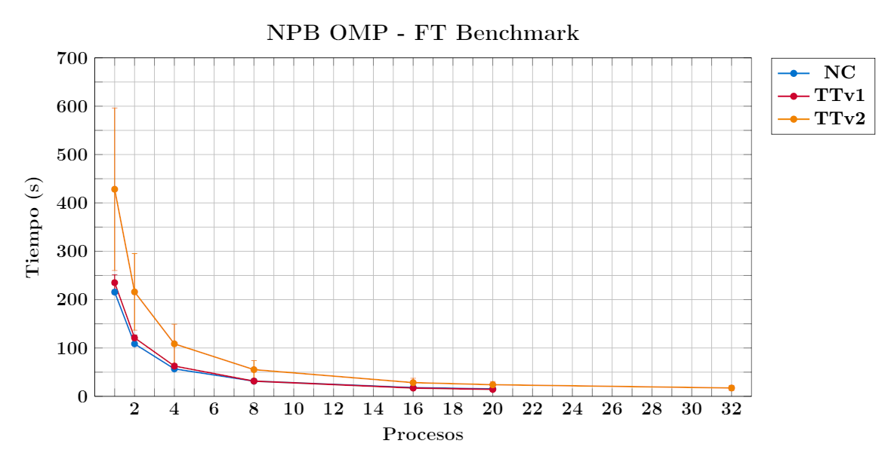

# Discrete 3D fast Fourier Transform


## Descripción

Resuelve numéricamente una ecuación diferencial parcial en 3D utilizando la 
transformada rápida de Fourier. Esta es una prueba rigurosa del rendimiento 
de la comunicación a larga distancia.


## Compilación

1.  Descargue el [código fuente](https://www.nas.nasa.gov/assets/npb/NPB3.4.2.tar.gz) de los NPB:

        [t.800@yoltla Descargas]$ wget https://www.nas.nasa.gov/assets/npb/NPB3.4.2.tar.gz
        --2022-09-04 20:42:41--  https://www.nas.nasa.gov/assets/npb/NPB3.4.2.tar.gz
        Resolving www.nas.nasa.gov... 198.9.3.30, 2001:4d0:6318:903:198:9:3:30
        Connecting to www.nas.nasa.gov|198.9.3.30|:443... connected.
        HTTP request sent, awaiting response... 301 Moved Permanently
        Location: https://www.nas.nasa.gov/assets/nas/npb/NPB3.4.2.tar.gz [following]
        --2022-09-04 20:42:41--  https://www.nas.nasa.gov/assets/nas/npb/NPB3.4.2.tar.gz
        Reusing existing connection to www.nas.nasa.gov:443.
        HTTP request sent, awaiting response... 200 OK
        Length: 442456 (432K) [application/x-gzip]
        Saving to: “NPB3.4.2.tar.gz”

        100%[===================================================================================================>] 442,456     1.15M/s   in 0.4s

        2022-09-04 20:42:42 (1.15 MB/s) - “NPB3.4.2.tar.gz” saved [442456/442456]

2.  Descomprima el archivo descargado:

        [t.800@yoltla Descargas]$ tar -xf NPB3.4.2.tar.gz

3.  Cambie al directorio *NPB3.4.2*:

        [t.800@yoltla Descargas]$ cd NPB3.4.2/
        [t.800@yoltla NPB3.4.2]$ ls
        NPB3.4-MPI  NPB3.4-OMP  Changes.log  NPB3.4-HPF.README  NPB3.4-JAV.README  NPB3.4-SER.README  README

4.  Cambie al directorio *NPB3.4-OMP*:

        [t.800@yoltla NPB3.4.2]$ cd NPB3.4-OMP/
        [t.800@yoltla NPB3.4-OMP]$ ls
        bin  BT  CG  common  config  DC  EP  FT  IS  LU  MG  SP  sys  test_scripts  UA  Makefile  README  README.install

5.  Haga una copia del archivo *make.def.template*:

        [t.800@yoltla NPB3.4-OMP]$ cp config/make.def.template config/make.def

6.  Cargue el módulo de GCC:

        [t.800@yoltlaNPB3.4-OMP]$ module load gcc/7.2.0

7.  Compile el benchmark:

        [t.800@yoltla NPB3.4-OMP]$ make FT CLASS=C
           ============================================
           =      NAS PARALLEL BENCHMARKS 3.4         =
           =      OpenMP Versions                     =
           =      Fortran/C                           =
           ============================================

        cd FT; make CLASS=C
        make[1]: Entering directory `/LUSTRE/home/uam/.../t.800/Descargas/NPB3.4.2/NPB3.4-OMP/FT'
        make[2]: Entering directory `/LUSTRE/home/uam/.../t.800/Descargas/NPB3.4.2/NPB3.4-OMP/sys'
        gcc  -o setparams setparams.c
        make[2]: Leaving directory `/LUSTRE/home/uam/.../t.800/Descargas/NPB3.4.2/NPB3.4-OMP/sys'
        ../sys/setparams ft C
        make[2]: Entering directory `/LUSTRE/home/uam/.../t.800/Descargas/NPB3.4.2/NPB3.4-OMP/FT'
        sed -e 's/=0/=32/' blk_par0.h > blk_par.h_wk
        gfortran -c  -O3 -fopenmp ft_data.f90
        gfortran -c  -O3 -fopenmp ft.f90
        cd ../common; gfortran -c  -O3 -fopenmp randi8.f90
        cd ../common; gfortran -c  -O3 -fopenmp print_results.f90
        cd ../common; gfortran -c  -O3 -fopenmp timers.f90
        cd ../common; gcc -c  -O3 -fopenmp  -o wtime.o ../common/wtime.c
        gfortran -O3 -fopenmp -o ../bin/ft.C.x ft.o ft_data.o ../common/randi8.o ../common/print_results.o ../common/timers.o ../common/wtime.o
        make[2]: Leaving directory `/LUSTRE/home/uam/.../t.800/Descargas/NPB3.4.2/NPB3.4-OMP/FT'
        make[1]: Leaving directory `/LUSTRE/home/uam/.../t.800/Descargas/NPB3.4.2/NPB3.4-OMP/FT'

8.  Verifique la creación del ejecutable:

        [t.800@yoltla NPB3.4-OMP]$ ls bin/
        ft.C.x

```admonish note title=" "
En el archivo *README.install* puede encontrar más información acerca de la compilación de los NPB.
```


## Ejecución

1.  Cambie al directorio *bin*:

        [c.553@yoltla NPB3.4-OMP]$ cd bin
        [t.800@yoltla NPB3.4-OMP]$ ls bin/
        ft.C.x

2.  Modifique la variable de entorno `OMP_NUM_THREADS`:

        [c.553@yoltla bin]$ export OMP_NUM_THREADS=16

3.  Ejecute el benchmark:

        [c.553@yoltla bin]$ ./bt.C.x

```admonish note title=" "
En el archivo *README.install* puede encontrar más información acerca de la ejecución de los NPB.
```


## Salida

A continuación se presenta la salida de una ejecución de este benchmark:

```bash
(1)
NAS Parallel Benchmarks (NPB3.4-OMP) - FT Benchmark

(2)
Size                :  512x 512x 512
Iterations                  :     20
Number of available threads :     16

(3)
T =    1     Checksum =    5.195078707457D+02    5.149019699238D+02
T =    2     Checksum =    5.155422171134D+02    5.127578201997D+02
T =    3     Checksum =    5.144678022222D+02    5.122251847514D+02
T =    4     Checksum =    5.140150594328D+02    5.121090289018D+02
T =    5     Checksum =    5.137550426810D+02    5.121143685824D+02
T =    6     Checksum =    5.135811056728D+02    5.121496764568D+02
T =    7     Checksum =    5.134569343165D+02    5.121870921893D+02
T =    8     Checksum =    5.133651975661D+02    5.122193250322D+02
T =    9     Checksum =    5.132955192805D+02    5.122454735794D+02
T =   10     Checksum =    5.132410471738D+02    5.122663649603D+02
T =   11     Checksum =    5.131971141679D+02    5.122830879827D+02
T =   12     Checksum =    5.131605205716D+02    5.122965869718D+02
T =   13     Checksum =    5.131290734194D+02    5.123075927445D+02
T =   14     Checksum =    5.131012720314D+02    5.123166486553D+02
T =   15     Checksum =    5.130760908195D+02    5.123241541685D+02
T =   16     Checksum =    5.130528295923D+02    5.123304037599D+02
T =   17     Checksum =    5.130310107773D+02    5.123356167976D+02
T =   18     Checksum =    5.130103090133D+02    5.123399592211D+02
T =   19     Checksum =    5.129905029333D+02    5.123435588985D+02
T =   20     Checksum =    5.129714421109D+02    5.123465164008D+02
Result verification successful
class = C


(4)
FT Benchmark Completed.
Class           =                        C
Size            =            512x 512x 512
Iterations      =                       20
Time in seconds =                    19.07
Total threads   =                       16
Avail threads   =                       16
Mop/s total     =                 20785.44
Mop/s/thread    =                  1299.09
Operation type  =           floating point
Verification    =               SUCCESSFUL
Version         =                    3.4.2
Compile date    =              04 Sep 2022

(5)
Compile options:
        FC           = gfortran
        FLINK        = $(FC)
        F_LIB        = (none)
        F_INC        = (none)
        FFLAGS       = -O3 -fopenmp
        FLINKFLAGS   = $(FFLAGS)
        RAND         = randi8


Please send all errors/feedbacks to:

NPB Development Team
npb@nas.nasa.gov
```

1. Versión y nombre del benchmark

2. Parámetros del benchmark:

  - 1.  Tamaño de la rejilla
  - 2.  Número de iteraciones
  - 3.  Número de subprocesos disponibles

3. Resultados obtenidos en cada iteración

4. Información detallada del benchmark y de su ejecución

5. Opciones con las que se compiló el benchmark


## Nodos de cómputo

Unresolved directive in ft.adoc - include::partial\$reframe/nodos_computo.adoc\[\]


## Pruebas

Existen diferentes [clases de problemas](https://www.nas.nasa.gov/software/npb_problem_sizes.html) 
para este benchmark, que varían en el tamaño de la rejilla y en el número de iteraciones, 
el criterio para determinar que clase elegir fue el de poder realizar pruebas rápidas 
y fiables. En todos los nodos se utilizó un problema de clase C. En las siguientas 
tablas se da un resumen de las pruebas realizadas:

<span style="color: #990819;">*Tabla 1. Pruebas en los nodos NC*</span>

<table border="1">

<tr>
<th rowspan="2">Número de nodos</th>
<th rowspan="2">Número de procesos</th>
<th colspan="3">Tamaño de la rejilla</th>
<th rowspan="2">Número de iteraciones</th>
</tr>

<tr>
<th>X</th>
<th>Y</th>
<th>Z</th>
</tr>

<tr>
<td>1</td><td>1</td><td>512</td><td>512</td><td>512</td><td>20</td>
</tr>

<tr>
<td>1</td><td>2</td><td>512</td><td>512</td><td>512</td><td>20</td>
</tr>

<tr>
<td>1</td><td>4</td><td>512</td><td>512</td><td>512</td><td>20</td>
</tr>

<tr>
<td>1</td><td>8</td><td>512</td><td>512</td><td>512</td><td>20</td>
</tr>

<tr>
<td>1</td><td>16</td><td>512</td><td>512</td><td>512</td><td>20</td>
</tr>

<tr>
<td>1</td><td>20</td><td>512</td><td>512</td><td>512</td><td>20</td>
</tr>

</table>

\
<span style="color: #990819;">*Tabla 2. Pruebas en los nodos TTv1*</span>

<table border="1">

<tr>
<th rowspan="2">Número de nodos</th>
<th rowspan="2">Número de procesos</th>
<th colspan="3">Tamaño de la rejilla</th>
<th rowspan="2">Número de iteraciones</th>
</tr>

<tr>
<th>X</th>
<th>Y</th>
<th>Z</th>
</tr>

<tr>
<td>1</td><td>1</td><td>512</td><td>512</td><td>512</td><td>20</td>
</tr>

<tr>
<td>1</td><td>2</td><td>512</td><td>512</td><td>512</td><td>20</td>
</tr>

<tr>
<td>1</td><td>4</td><td>512</td><td>512</td><td>512</td><td>20</td>
</tr>

<tr>
<td>1</td><td>8</td><td>512</td><td>512</td><td>512</td><td>20</td>
</tr>

<tr>
<td>1</td><td>16</td><td>512</td><td>512</td><td>512</td><td>20</td>
</tr>

<tr>
<td>1</td><td>20</td><td>512</td><td>512</td><td>512</td><td>20</td>
</tr>

</table>

\
<span style="color: #990819;">*Tabla 3. Pruebas en los nodos TTv2*</span>

<table border="1">

<tr>
<th rowspan="2">Número de nodos</th>
<th rowspan="2">Número de procesos</th>
<th colspan="3">Tamaño de la rejilla</th>
<th rowspan="2">Número de iteraciones</th>
</tr>

<tr>
<th>X</th>
<th>Y</th>
<th>Z</th>
</tr>

<tr>
<td>1</td><td>1</td><td>512</td><td>512</td><td>512</td><td>20</td>
</tr>

<tr>
<td>1</td><td>2</td><td>512</td><td>512</td><td>512</td><td>20</td>
</tr>

<tr>
<td>1</td><td>4</td><td>512</td><td>512</td><td>512</td><td>20</td>
</tr>

<tr>
<td>1</td><td>8</td><td>512</td><td>512</td><td>512</td><td>20</td>
</tr>

<tr>
<td>1</td><td>16</td><td>512</td><td>512</td><td>512</td><td>20</td>
</tr>

<tr>
<td>1</td><td>20</td><td>512</td><td>512</td><td>512</td><td>20</td>
</tr>

<tr>
<td>1</td><td>32</td><td>512</td><td>512</td><td>512</td><td>20</td>
</tr>

</table>


## Scripts


### Estructura de directorios

Dentro de la carpeta raíz *ft* existen tres subdirectorios principales, uno por cada 
tipo de nodo en el cluster Yoltla:

    ft
    ├── nc
    |   .
    |   .
    |   .
    ├── ttv1
    |   .
    |   .
    |   .
    └── ttv2
        .
        .
        .

Cada uno de estos directorios alberga las pruebas de ReFrame del tipo de nodo 
correspondiente:

    ft
    ├── nc
    │   ├── procesos_01
    │   │   ├── logs
    │   │   ├── npb_ft_nc_01p.py
    │   │   └── src
    │   │       └── ft.C.x
    │   ├── procesos_02
    │   │   ├── logs
    │   │   ├── npb_ft_nc_02p.py
    │   │   └── src
    │   │       └── ft.C.x
    │   ├── procesos_04
    │   │   ├── logs
    │   │   ├── npb_ft_nc_04p.py
    │   │   └── src
    │   │       └── ft.C.x
    │   ├── procesos_08
    │   │   ├── logs
    │   │   ├── npb_ft_nc_08p.py
    │   │   └── src
    │   │       └── ft.C.x
    │   ├── procesos_16
    │   │   ├── logs
    │   │   ├── npb_ft_nc_16p.py
    │   │   └── src
    │   │       └── ft.C.x
    │   └── procesos_20
    │       ├── logs
    │       ├── npb_ft_nc_20p.py
    │       └── src
    │           └── ft.C.x
    ├── ttv1
    │   ├── procesos_01
    │   │   ├── logs
    │   │   ├── npb_ft_ttv1_01p.py
    │   │   └── src
    │   │       └── ft.C.x
    .   .
    .   .
    .   .
    │   └── procesos_20
    │       ├── logs
    │       ├── npb_ft_ttv1_20p.py
    │       └── src
    │           └── ft.C.x
    └── ttv2
        ├── procesos_01
        │   ├── logs
        │   ├── npb_ft_ttv2_01p.py
        │   └── src
        │       └── ft.C.x
        .
        .
        .
        └── procesos_32
            ├── logs
            ├── npb_ft_ttv2_32p.py
            └── src
                └── ft.C.x

Estas pruebas pueden ser lanzadas de manera individual o por etiquetas.

```admonish note title=" "
La versión de los NPB utilizada en estos scripts es la 3.4.2.
```


### Lanzar pruebas


#### Individualmente

Para lanzar pruebas de forma individual, ubíquese dentro del directorio de la prueba de interés, y ejecute el comando:

```bash
reframe -c <nombre_script> -r
```

Por ejemplo, para lanzar la prueba de 20 procesos, en los nodos NC, ejecute el comando:

```bash
[t.800@yoltla procesos_20]$ reframe -c npb_ft_nc_20p.py -r
```

#### Etiquetas

Utilizando etiquetas puede lanzar múltiples pruebas con un solo comando. Por ejemplo, para lanzar todas las pruebas de los nodos NC, siga los siguientes pasos:

1.  Ubíquese en el directorio raíz *ft*:

    ```bash
    [t.800@yoltla ft]$
    ```

2.  Cree el directorio *logs*:

    ```bash
    [t.800@yoltla ft]$ mkdir logs
    ```

3.  Ejecute el comando:

    ```bash
    [t.800@yoltla ft]$ reframe -c . -R -t nc -r
    ```

Para lanzar todas las pruebas:

1.  Ubíquese en el directorio raíz *ft*:

    ```bash
    [t.800@yoltla ft]$
    ```

2.  Cree el directorio *logs*:

    ```bash
    [t.800@yoltla ft]$ mkdir logs
    ```

3.  Ejecute el comando:

    ```bash
    [t.800@yoltla ft]$ reframe -c . -R -t npb -t ft -r
    ```

```admonish warning title=" "
Si no crea el directorio *logs* obtendrá el siguiente mensaje:

    /LUSTRE/home/uam/.../t.800/spack_scope/deps/linux-centos6-ivybridge/gcc-7.2.0/reframe-3.9.2-gqmjpwbafkinwklzww777oktqutklrfn/bin/reframe: failed to load configuration: [Errno 2] No such file or directory: '/LUSTRE/home/uam/.../t.800/.../ft/logs/rfm.out'
    /LUSTRE/home/uam/.../t.800/spack_scope/deps/linux-centos6-ivybridge/gcc-7.2.0/reframe-3.9.2-gqmjpwbafkinwklzww777oktqutklrfn/bin/reframe: Log file(s) saved in '/tmp/rfm-v8hp4ky9.log'
```


## Resultados


### Nodos NC

<span style="color: #990819;">*Tabla 4. Resultados del benchmark FT en los nodos NC*</span>

<table border="1">

<tr>
<th rowspan="2">No. de ejecuciones</th>
<th rowspan="2">Número de procesos</th>
<th colspan="3">Tamaño de la rejilla</th>
<th colspan="4">Tiempo (s)</th>
</tr>

<tr>
<th>X</th>
<th>Y</th>
<th>Z</th>
<th>Promedio</th>
<th>Mínimo</th>
<th>Máximo</th>
<th>σ</th>
</tr>

<tr>
<td>10</td><td>1</td><td>512</td><td>512</td><td>512</td><td>215.59</td><td>210.69</td><td>222.27</td><td>4.36</td>
</tr>

<tr>
<td>10</td><td>2</td><td>512</td><td>512</td><td>512</td><td>108.55</td><td>107.46</td><td>109.52</td><td>0.59</td>
</tr>

<tr>
<td>10</td><td>4</td><td>512</td><td>512</td><td>512</td><td>56.82</td><td>56.17</td><td>57.87</td><td>0.44</td>
</tr>

<tr>
<td>10</td><td>8</td><td>512</td><td>512</td><td>512</td><td>31.45</td><td>30.95</td><td>32.18</td><td>0.38</td>
</tr>

<tr>
<td>10</td><td>16</td><td>512</td><td>512</td><td>512</td><td>18.11</td><td>17.35</td><td>18.63</td><td>0.56</td>
</tr>

<tr>
<td>10</td><td>20</td><td>512</td><td>512</td><td>512</td><td>15.34</td><td>14.54</td><td>16.04</td><td>0.59</td>
</tr>

</table>


### Nodos TTv1

<span style="color: #990819;">*Tabla 5. Resultados del benchmark FT en los nodos TTv1*</span>

<table border="1">

<tr>
<th rowspan="2">No. de ejecuciones</th>
<th rowspan="2">Número de procesos</th>
<th colspan="3">Tamaño de la rejilla</th>
<th colspan="4">Tiempo (s)</th>
</tr>

<tr>
<th>X</th>
<th>Y</th>
<th>Z</th>
<th>Promedio</th>
<th>Mínimo</th>
<th>Máximo</th>
<th>σ</th>
</tr>

<tr>
<td>10</td><td>1</td><td>512</td><td>512</td><td>512</td><td>235.11</td><td>198.26</td><td>245.32</td><td>16.26</td>
</tr>

<tr>
<td>10</td><td>2</td><td>512</td><td>512</td><td>512</td><td>121.02</td><td>105.35</td><td>124.56</td><td>5.81</td>
</tr>

<tr>
<td>10</td><td>4</td><td>512</td><td>512</td><td>512</td><td>62.67</td><td>57.81</td><td>66.89</td><td>2.09</td>
</tr>

<tr>
<td>10</td><td>8</td><td>512</td><td>512</td><td>512</td><td>31.49</td><td>30.59</td><td>31.89</td><td>0.43</td>
</tr>

<tr>
<td>10</td><td>16</td><td>512</td><td>512</td><td>512</td><td>17.06</td><td>16.80</td><td>17.75</td><td>0.28</td>
</tr>

<tr>
<td>10</td><td>20</td><td>512</td><td>512</td><td>512</td><td>14.27</td><td>14.03</td><td>15.13</td><td>0.30</td>
</tr>

</table>


### Nodos TTv2

<span style="color: #990819;">*Tabla 6. Resultados del benchmark FT en los nodos TTv2*</span>

</style>

<table class="tabla-rendimiento">

<tr>
<th rowspan="2">No. de ejecuciones</th>
<th rowspan="2">Número de procesos</th>
<th colspan="3">Tamaño de la rejilla</th>
<th colspan="4">Tiempo (s)</th>
</tr>

<tr>
<th>X</th>
<th>Y</th>
<th>Z</th>
<th>Promedio</th>
<th>Mínimo</th>
<th>Máximo</th>
<th>σ</th>
</tr>

<tr>
<td>10</td><td>1</td><td>512</td><td>512</td><td>512</td><td>428.25</td><td>220.20</td><td>584.73</td><td>167.99</td>
</tr>

<tr>
<td>10</td><td>2</td><td>512</td><td>512</td><td>512</td><td>216.00</td><td>114.45</td><td>281.52</td><td>79.15</td>
</tr>

<tr>
<td>10</td><td>4</td><td>512</td><td>512</td><td>512</td><td>108.55</td><td>58.34</td><td>142.87</td><td>40.59</td>
</tr>

<tr>
<td>10</td><td>8</td><td>512</td><td>512</td><td>512</td><td>55.24</td><td>31.65</td><td>70.81</td><td>18.73</td>
</tr>

<tr>
<td>10</td><td>16</td><td>512</td><td>512</td><td>512</td><td>28.36</td><td>17.00</td><td>35.92</td><td>9.00</td>
</tr>

<tr>
<td>10</td><td>20</td><td>512</td><td>512</td><td>512</td><td>24.04</td><td>15.38</td><td>30.27</td><td>6.64</td>
</tr>

<tr>
<td>10</td><td>32</td><td>512</td><td>512</td><td>512</td><td>17.27</td><td>10.89</td><td>24.86</td><td>5.33</td>
</tr>

</table>


### Yoltla

<span style="color: #1285E3;">Resultados del benchmark FT en el cluster Yoltla</span>



<span style="color: #990819;">*Figura 1. Resultados del benchmark FT en el cluster Yoltla*</span>

```admonish note title=" "
Todos los resultados mostrados en esta sección fueron obtenidos en el mes de Agosto del 2022.
```

## Sitios de interés

- [NAS Parallel Benchmarks](https://www.nas.nasa.gov/software/npb.html)
