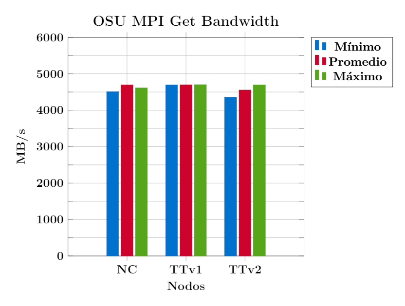

# Bandwidth


## Descripción

Las prueba de ancho de banda se lleva a cabo de la siguiente manera:

1.  El emisor envía un número fijo (igual al tamaño de la ventana) de mensajes 
consecutivos al receptor y luego queda en espera de su respuesta respuesta.

2.  El receptor envía la respuesta solo después de recibir todos estos mensajes.

Este proceso se repite durante varias iteraciones y el ancho de banda se calcula en 
función del tiempo transcurrido (desde el momento en que el emisor envía el primer 
mensaje hasta el momento en que recibe la respuesta del receptor) y la cantidad de 
bytes enviados por el emisor. El objetivo de esta prueba es determinar la \"tasa de 
datos sostenida máxima\" que se puede lograr a nivel de red.


## Salida

A continuación se presenta la salida de una ejecución de esta prueba:
```bash
# OSU MPI_Get Bandwidth Test v5.9
# Window creation: MPI_Win_allocate
# Synchronization: MPI_Win_flush
# Size      Bandwidth (MB/s)
1                       1.88
2                       3.76
4                       7.67
8                      15.69
16                     29.97
32                     59.40
64                    118.04
128                   227.68
256                   490.82
512                   934.32
1024                 1630.65
2048                 2582.71
4096                 3618.24
8192                 4310.20
16384                4415.04
32768                3766.10
65536                4501.53
131072               4514.98
262144               4245.78
524288               4471.87
1048576              4594.08
2097152              4659.69
4194304              4695.76
```


## Nodos de cómputo

Unresolved directive in bandwidth.adoc - include::partial\$reframe/nodos_computo.adoc\[\]


## Pruebas

Durante la prueba de ancho de banda el emisor envía al receptor diferentes cantidades 
de bytes, desde 1 hasta 4194304. Para determinar la \"tasa de datos sostenida máxima\" 
se tomó el valor obtenido al enviar la cantidad máxima de bytes, es decir, 4194304. 
En todos los nodos se utilizó el mismo criterio. En las siguientas tablas se da un 
resumen de las pruebas realizadas:

<span style="color: #990819;">*Tabla 1. Pruebas en los nodos NC*</span>

| **Nodo A** | **Nodo B** | **Size** |
|:----------:|:----------:|:--------:|
| nc1                  | nc20                 | 4194304               |
| nc20                 | nc26                 | 4194304               |
| nc26                 | nc39                 | 4194304               |
| nc39                 | nc41                 | 4194304               |
| nc41                 | nc56                 | 4194304               |
| nc56                 | nc61                 | 4194304               |
| nc61                 | nc80                 | 4194304               |
| nc80                 | nc81                 | 4194304               |
| nc81                 | nc100                | 4194304               |
| nc100                | nc102                | 4194304               |
| nc102                | nc120                | 4194304               |
| nc120                | nc121                | 4194304               |
| nc121                | nc136                | 4194304               |
| nc136                | nc141                | 4194304               |
| nc141                | nc156                | 4194304               |
| nc156                | nc1                  | 4194304               |


<span style="color: #990819;">*Tabla 2. Pruebas en los nodos TTv1*</span>

| **Nodo A** | **Nodo B** | **Size** |
|:----------:|:----------:|:--------:|
| nc1                  | nc9                  | 4194304               |
| nc9                  | nc17                 | 4194304               |
| nc17                 | nc25                 | 4194304               |
| nc33                 | nc41                 | 4194304               |
| nc41                 | nc49                 | 4194304               |
| nc49                 | nc58                 | 4194304               |


<span style="color: #990819;">*Tabla 3. Pruebas en los nodos TTv2*</span>

| **Nodo A** | **Nodo B** | **Size** |
|:----------:|:----------:|:--------:|
| nc60                 | nc65                 | 4194304               |
| nc65                 | nc74                 | 4194304               |
| nc74                 | nc82                 | 4194304               |
| nc82                 | nc87                 | 4194304               |
| nc87                 | nc92                 | 4194304               |
| nc92                 | nc60                 | 4194304               |


```admonish note title=" "
Los nodos no fueron seleccionados bajo ningún criterio en particular, salvo su 
disponibilidad en el cluster, y con el objetivo de obtener una muestra representativa 
de cada tipo de nodo.
```


## Scripts


### Estructura de directorios

Dentro de la carpeta raíz *bandwidth* existen tres subdirectorios, uno por cada tipo de 
nodo en el cluster Yoltla:

    bandwidth
    ├── nc
    │   ├── logs
    │   ├── osu_bw_nc.py
    │   └── src
    │       └── osu_get_bw
    ├── ttv1
    │   ├── logs
    │   ├── osu_bw_ttv1.py
    │   └── src
    │       └── osu_get_bw
    └── ttv2
        ├── logs
        ├── osu_bw_ttv2.py
        └── src
            └── osu_get_bw

Cada uno de estos directorios alberga una prueba de ReFrame.

```admonish note title=" "
La versión de los OSU Micro-Benchmarks utilizada en estos scripts es la 5.9.
```


### Lanzar pruebas


#### Individualmente

Para lanzar pruebas de forma individual, ubíquese dentro del directorio de la prueba de interés, y ejecute el comando:

```bash
reframe -c <nombre_script> -r
```

Por ejemplo, para lanzar la prueba de los nodos NC, ejecute el comando:

```bash
[t.800@yoltla nc]$ reframe -c osu_bw_nc.py -r
```

#### Etiquetas

Utilizando etiquetas puede lanzar múltiples pruebas con un solo comando. Para lanzar todas las pruebas, siga los siguientes pasos:

1.  Ubíquese en el directorio raíz *bandwidth*:

    ```bash
    [t.800@yoltla bandwidth]$
    ```

2.  Cree el directorio *logs*:

    ```bash
    [t.800@yoltla bandwidth]$ mkdir logs
    ```

3.  Ejecute el comando:

    ```bash
    [t.800@yoltla bandwidth]$ reframe -c . -R -t osu -t bw -r
    ```

```admonish warning title=" "
Si no crea el directorio *logs* obtendrá el siguiente mensaje:

    /LUSTRE/home/uam/.../t.800/spack_scope/deps/linux-centos6-ivybridge/gcc-7.2.0/reframe-3.9.2-gqmjpwbafkinwklzww777oktqutklrfn/bin/reframe: failed to load configuration: [Errno 2] No such file or directory: '/LUSTRE/home/uam/.../t.800/.../bandwidth/logs/rfm.out'
    /LUSTRE/home/uam/.../t.800/spack_scope/deps/linux-centos6-ivybridge/gcc-7.2.0/reframe-3.9.2-gqmjpwbafkinwklzww777oktqutklrfn/bin/reframe: Log file(s) saved in '/tmp/rfm-5ng64m81.log'
```


## Resultados


### Nodos NC

<span style="color: #990819;">*Tabla 4. Ancho de banda de los nodos NC*</span>

<table>
<thead>

<tr>
<th rowspan="2">No. de ejecuciones</th>
<th rowspan="2">Nodo A</th>
<th rowspan="2">Nodo B</th>
<th colspan="4">MB/s</th>
</tr>

<tr>
<th>Promedio</th>
<th>Mínimo</th>
<th>Máximo</th>
<th>σ</th>
</tr>

</thead>
<tbody>

<tr>
<td>5</td><td>nc1</td><td>nc20</td><td>4603.34</td><td>4602.36</td><td>4603.87</td><td>0.52</td>
</tr>

<tr>
<td>5</td><td>nc20</td><td>nc26</td><td>4600.44</td><td>4599.44</td><td>4601.35</td><td>0.71</td>
</tr>

<tr>
<td>5</td><td>nc26</td><td>nc39</td><td>4592.22</td><td>4584.25</td><td>4598.70</td><td>6.00</td>
</tr>

<tr>
<td>5</td><td>nc39</td><td>nc41</td><td>4603.34</td><td>4602.59</td><td>4603.84</td><td>0.42</td>
</tr>

<tr>
<td>5</td><td>nc41</td><td>nc56</td><td>4595.54</td><td>4590.85</td><td>4597.01</td><td>2.35</td>
</tr>

<tr>
<td>5</td><td>nc56</td><td>nc61</td><td>4606.09</td><td>4600.14</td><td>4608.06</td><td>3.00</td>
</tr>

<tr>
<td>5</td><td>nc61</td><td>nc80</td><td>4595.96</td><td>4582.66</td><td>4599.45</td><td>6.65</td>
</tr>

<tr>
<td>5</td><td>nc80</td><td>nc81</td><td>4594.12</td><td>4591.60</td><td>4595.22</td><td>1.29</td>
</tr>

<tr>
<td>5</td><td>nc81</td><td>nc100</td><td>4693.86</td><td>4686.17</td><td>4696.25</td><td>3.86</td>
</tr>

<tr>
<td>5</td><td>nc100</td><td>nc102</td><td>4688.17</td><td>4667.65</td><td>4695.81</td><td>10.37</td>
</tr>

<tr>
<td>5</td><td>nc102</td><td>nc120</td><td>4602.11</td><td>4594.39</td><td>4604.27</td><td>3.86</td>
</tr>

<tr>
<td>5</td><td>nc120</td><td>nc121</td><td>4600.60</td><td>4598.53</td><td>4602.80</td><td>1.91</td>
</tr>

<tr>
<td>5</td><td>nc121</td><td>nc136</td><td>4694.92</td><td>4694.17</td><td>4695.81</td><td>0.63</td>
</tr>

<tr>
<td>5</td><td>nc136</td><td>nc141</td><td>4600.00</td><td>4591.76</td><td>4603.04</td><td>4.19</td>
</tr>

<tr>
<td>5</td><td>nc141</td><td>nc156</td><td>4608.08</td><td>4603.54</td><td>4609.62</td><td>2.28</td>
</tr>

<tr>
<td>5</td><td>nc156</td><td>nc1</td><td>4520.19</td><td>4509.16</td><td>4558.89</td><td>19.39</td>
</tr>

</tbody>
</table>


### Nodos TTv1

<span style="color: #990819;">*Tabla 5. Ancho de banda de los nodos TTv1*</span>

<table>
<thead>

<tr>
<th rowspan="2">No. de ejecuciones</th>
<th rowspan="2">Nodo A</th>
<th rowspan="2">Nodo B</th>
<th colspan="4">MB/s</th>
</tr>

<tr>
<th>Promedio</th>
<th>Mínimo</th>
<th>Máximo</th>
<th>σ</th>
</tr>

</thead>
<tbody>

<tr>
<td>5</td><td>nc1</td><td>nc9</td><td>4698.04</td><td>4696.31</td><td>4699.52</td><td>1.07</td>
</tr>

<tr>
<td>5</td><td>nc9</td><td>nc17</td><td>4700.35</td><td>4700.18</td><td>4700.47</td><td>0.10</td>
</tr>

<tr>
<td>5</td><td>nc17</td><td>nc25</td><td>4700.91</td><td>4700.73</td><td>4701.17</td><td>0.16</td>
</tr>

<tr>
<td>5</td><td>nc33</td><td>nc41</td><td>4697.00</td><td>4695.93</td><td>4697.75</td><td>0.61</td>
</tr>

<tr>
<td>5</td><td>nc41</td><td>nc49</td><td>4698.58</td><td>4696.74</td><td>4699.87</td><td>1.09</td>
</tr>

<tr>
<td>5</td><td>nc49</td><td>nc58</td><td>4701.03</td><td>4700.80</td><td>4701.39</td><td>0.20</td>
</tr>

</tbody>
</table>


### Nodos TTv2

<span style="color: #990819;">*Tabla 6. Ancho de banda de los nodos TTv2*</span>

<table>
<thead>

<tr>
<th rowspan="2">No. de ejecuciones</th>
<th rowspan="2">Nodo A</th>
<th rowspan="2">Nodo B</th>
<th colspan="4">MB/s</th>
</tr>

<tr>
<th>Promedio</th>
<th>Mínimo</th>
<th>Máximo</th>
<th>σ</th>
</tr>

</thead>
<tbody>

<tr>
<td>5</td><td>nc60</td><td>nc65</td><td>4494.39</td><td>4463.87</td><td>4525.49</td><td>24.54</td>
</tr>

<tr>
<td>5</td><td>nc65</td><td>nc74</td><td>4602.99</td><td>4602.85</td><td>4603.07</td><td>0.08</td>
</tr>

<tr>
<td>5</td><td>nc74</td><td>nc82</td><td>4485.55</td><td>4478.19</td><td>4491.67</td><td>5.23</td>
</tr>

<tr>
<td>5</td><td>nc82</td><td>nc87</td><td>4695.20</td><td>4694.79</td><td>4695.50</td><td>0.26</td>
</tr>

<tr>
<td>5</td><td>nc87</td><td>nc92</td><td>4690.50</td><td>4687.66</td><td>4693.70</td><td>1.92</td>
</tr>

<tr>
<td>5</td><td>nc92</td><td>nc60</td><td>4363.30</td><td>4355.94</td><td>4367.53</td><td>4.03</td>
</tr>

</tbody>
</table>


### Yoltla

<span style="color: #990819;">*Tabla 7. Ancho de banda del cluster Yoltla*</span>

<table>
<thead>

<tr>
<th rowspan="2">Nodos</th>
<th colspan="4">MB/s</th>
</tr>

<tr>
<th>Promedio</th>
<th>Mínimo</th>
<th>Máximo</th>
<th>σ</th>
</tr>

</thead>
<tbody>

<tr>
<td>NC</td><td>4612.43</td><td>4509.16</td><td>4696.25</td><td>43.58</td>
</tr>

<tr>
<td>TTv1</td><td>4699.32</td><td>4695.93</td><td>4701.39</td><td>1.68</td>
</tr>

<tr>
<td>TTv2</td><td>4555.32</td><td>4355.94</td><td>4695.50</td><td>119.87</td>
</tr>

</tbody>
</table>

\
<span style="color: #1285E3;">Ancho de banda del cluster Yoltla</span>





<span style="color: #990819;">*Figura 1. Ancho de banda del cluster Yoltla*</span>

```admonish note title=" "
Todos los resultados mostrados en esta sección fueron obtenidos en el mes de Agosto del 2022.
```


## Sitios de interés

- [MVAPICH: MPI over InfiniBand, Omni-Path, Ethernet/iWARP, and RoCE](http://mvapich.cse.ohio-state.edu/benchmarks/)

- [UL HPC MPI Tutorial: Building and Runnning OSU Micro-Benchmarks](https://ulhpc-tutorials.readthedocs.io/en/latest/parallel/mpi/OSU_MicroBenchmarks/)
